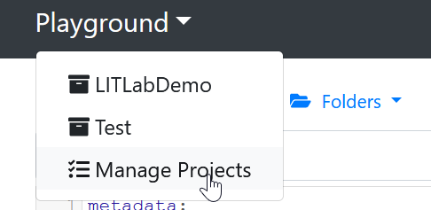
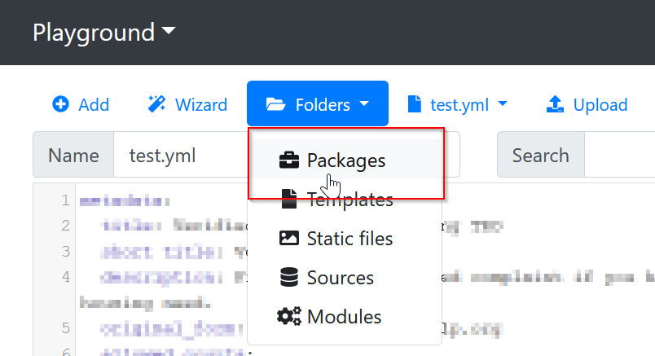

## Edit your completed draft interview in the Docassemble playground

While the Weaver is a menu-driven, step-by-step process, you'll make further
edits in the Playground. In the playground, you can directly edit the
[YAML](../docassemble_intro/yaml) text to:

1. Change the wording of questions
1. Change the datatype of questions and add show/hide logic
1. Edit the order screens appear in
1. Add conditional and branching logic
1. Add new variables, such as variables calculated by code

Save your work frequently, and don't be intimidated. For the most part,
many changes can be understood by reading the text and then experimenting.

This pages offers information about making some common, simple edits.
You may also want to take this time to read through the materials in
[Introduction to Docassemble](../docassemble_intro/introduction-to-docassemble)
about the underlying Docassemble platform and how it works.

## Double-check that you got things right in the Weaver stage

Some common mistakes, like typos in the labels, can lead to a lot of extra work. 
If you see "extra" questions appear, it's possible that you didn't get the names 
quite right, perhaps something as simple as a typo.

## Work towards a readable, usable interview

You should also take this chance to review our guidance about
[writing good questions](../style_guide/question_style_overview.md). While you edit
your interview, work steadily to make it better.

## Getting the draft into your playground

When you have finished using the Weaver, download your package. This will put a
.zip file in the Downloads folder on your computer.

:::warning If you are using Safari on a Mac OS computer
Safari, by default, will turn your downloaded package into
a folder on your PC.

Before downloading the package, turn off that behavior:

1. open Safari 
1. click Preferences
1. under the General tab, uncheck the option **Open 'safe' files after downloading**
:::

First, create a new "Project" in your playground. Using projects will
help you keep your Docassemble code organized.



Next, upload this file to the Docassemble playground's `Packages` folder.



## How to edit your interview

Navigate back to the main Playground window. You should see the YAML file
with your interview's draft code.

Scroll through and take a look at the code. You will see:

* code blocks setting defaults for your interview
* a `main order` and `interview order` block which list some of the variables
  that your interview uses, in order.
* `question:` blocks that contain the text of questions and the list of fields
  that are asked on each screen

You do not need to understand all of the code. Absorb what you can, and feel free
to experiment. Save your code often, preferably to a [GitHub](../authoring/github.md) repository.

You will likely start by clicking the "Save and Run" button to try running your
interview through to the end. Note any awkward wording or changes you want to make.

Use the `id` that is on the top of each screen to find the screen that you want to change.
Then, change the text that you want to change, or change the order of fields.


Below we describe some of the most common starting customizations you will make,
especially changes that interact with an Assembly Line convention.
You can use any [Docassemble feature](https://docassemble.org/docs/fields.html)
in your interview.

## Marking a field as optional (not required)

Add the `required: False` modifier to mark a field as optional.
For usability purposes, you might want to also add the phrase (optional)
to the label.

```yaml
---
id: Tell me more about Respondent
question: |
  Tell me more about the ${ other_parties[0] }.
fields:
  - Name: user_name       
  - Attorney bar number (optional): bar_number
    required: False
```

## Controlling the order of questions

Locate the `interview_order` block in your YAML file.
Move the variable name that you want to ask earlier in your interview to
the place you want it to be asked.

It usually looks something like this:

```yaml
---
#################### Interview order #####################
comment: |
  Controls order and branching logic of questions in the interview
id: interview_order_Guardianship_Assistant
code: |
  other_parties[0].name.first
  if not last_option: 
    all_done
  users[0].name.first
  other_parties[0].birthdate  
```

In the example above: if you wanted the other party's birthdate to be asked before 
you get the name of the user, you would simply switch the order of those 2 lines.

:::note Learn more about interview order
This section mentions a bit about interview order, but if you want to learn more,
you can read it on the [Legal Tech Class](../docassemble_intro/controlling-interview-order) site.
:::

### Order is usually determined by the first variable on the screen

When the Weaver creates the interview order block, it adds the first (and only the first)
variable on each screen to the interview order block. This lets you change the order
quickly.

For example, if we wanted to add this question to the interview order block below,
you would add the variable `temporary_needed` to the interview order block because
`temporary_needed` is the first variable on this screen. When Docassemble tries to 
define `temporary_needed`, it will show this screen and ask all of the questions
mentioned on it.


```yaml
---
id: Temporary Guardianship
question: | 
  Do you need to the court to decide on this case in the next 90 days?
subquestion: |
  ${ collapse_template(when_temporary_guardianship_possible_template) }
fields: 
  - I need a temporary guardianship: temporary_needed
    datatype: yesnoradio    
  - Do you need it right now?: need_now
    datatype: yesnoradio
    show if: temporary_needed
```


## Adding conditional logic to the screen order

If a screen is conditional, you can add an `if` statement so that it only
appears when the condition is satisfied.

Example:

```python
id: interview_order_Guardianship_Assistant
code: |
  users[0].name.first
  users.gather()
  if has_co_petitioner:
    users[1].address.address
  else:
    users[0].address.city
```

The syntax inside your interview order block is written in Python. You
can write more complex logic, including `elif` (for else if), use `and`, `or`
and comparisons with `==`, `in` etc.

`if` statements can also be nested, using additional levels of indentation.

```python
id: interview_order_Guardianship_Assistant
code: |
  users[0].name.first
  users.gather()
  if has_co_petitioner:
    users[1].address.address
    if users[1].has_separate_mailing_address:
      users[1].mailing_address.address
  else:
    users[0].address.city
```

## Showing and hiding fields on an individual screen

To make a single field show or disappear on a screen that asks for some optional
information, use the [`show
if`](https://docassemble.org/docs/fields.html#show%20if) modifier.

Example:

```yaml
---
id: Tell me more about Respondent
question: |
  Tell me more about the ${ other_parties[0] }.
fields:
  - Date of Birth: other_parties[0].birthdate
    datatype: date        
  - Primary Language: primary_language
    choices:
      - English
      - Spanish
      - Other
  # You can check if the option is equal to an exact value
  - Other language: primary_language_other
    show if:
      variable: primary_language
      is: Other
  - Is ${ other_parties[0] } a veteran?: op_is_veteran
    datatype: yesno
  # Or use the shorter syntax to check only if it is True
  - What branch of the military?: armed_forces_branch
    show if: op_is_veteran
  # Or use the `code` option to check for a value defined on another screen
  - Where does ${ other_parties[0] } work?: op_employer
    show if:
      code: |
        op_is_employed
```

`show if` only allows with one variable at a time. If you need to check the value of
multiple variables in one **if** statement, you need to use the more complex
[`js show if`](https://docassemble.org/docs/fields.html#js%20show%20if).

When you use `js show if`, you need to use a JavaScript expression that uses the
function `val()` at least once. `val()` is a JavaScript function that returns
the value of a variable name that is visible on screen. It takes the name of the
Docassemble variable in quotes as its only parameter.

Here is a small example of a `js show if` expression:

```yaml
---
id: Tell me more about Respondent
question: |
  Tell me more about the ${ other_parties[0] }.
fields:
  - Is ${ other_parties[0] } employed?: other_parties[0].is_employed
    datatype: yesnoradio
  - Is ${ other_parties[0] } a parent of your child?: other_parties[0].joint_parent
    datatype: yesnoradio
  - ${ other_parties[0] }'s monthly income: other_parties[0].income
    datatype: currency
    js show if: |
      val("other_parties[0].is_employed") && val("other_parties[0].joint_parent")
```

Check the [`js show if`
documentation](https://docassemble.org/docs/fields.html#js%20show%20if) to learn
how to use different combinations of values in a `js show if` expression. The
key is that you'll use ordinary JavaScript keywords to do any comparisons.
JavaScript is its own language, and keywords such as "or", "and" and even "=="
work slightly differently, as explained in the Docassemble documentation. You
can also use a general resource that documents JavaScript to learn more.

## Adding conditional logic inside an attachment block

If you would like to make the display of a variable in the attachment conditional,
you can use a multi-line Mako statement right inside the attachment block:

```yaml
attachment:
  variable name: my_document[i]
  pdf template file: my_document.pdf
  fields:
    - "signature": |
        % if i == "final":
        ${ users.signature }
        % endif
```

It is a good habit to use these multi-line blocks so that the logic is easy to
read and understand later.

You can use exactly the [same Mako
syntax](https://docassemble.org/docs/markup.html#mako) in the attachment block
that you would use inside a `question` or `subquestion` modifier.

## Adding new screens

### Adding questions to the interview

When you add a new question, it should go in at least 2, and possibly 3 places:

1. The new screen that asks the question
1. The interview order block
1. The review screen block, so it can be edited later

The simplest option is probably to find a question that is a good model for your
new question, copy and paste it, and change the text, `id`, and variable names.

For example:

```yaml
---
id: any unique id to help you find this question later
question: |
  Your question
subquestion: |
  The subquestion
fields:
  - Prompt 1: variable_1
```

Then you would need to make sure the interview order block mentioned `variable_1`:

```yaml
---
id: interview_order_Guardianship_Assistant
code: |
  other_parties[0].name.first
  if not last_option: 
    all_done
  # highlight-start
  variable_1
  # highlight-end
  users[0].name.first
  other_parties[0].birthdate  
```

You should also find the `review:` block in your
interview, and add a way for your user to change
their answer.

```yaml
  - Edit: variable_1
    button: |
      **Variable 1**:
      ${ variable_1 }
```

Learn more about [review screens](https://docassemble.org/docs/fields.html#review).

### Adding new informational screens

Informational screens are like screens that ask questions,
but instead of a `fields` statement, you can identify them
using `continue button field`.

```yaml
---
id: an informational screen
continue button field: variable_identifying_my_info_screen
question: |
  Here is some important information
subquestion: |
  I wanted to tell you that ...
```

You can add the informational screen to the interview order
block by adding the variable from the `continue button field` keyword:

```yaml
---
id: interview_order_Guardianship_Assistant
code: |
  other_parties[0].name.first
  if not last_option: 
    all_done
  variable_1
  # highlight-start
  variable_identifying_my_info_screen
  # highlight-end
  users[0].name.first
  other_parties[0].birthdate  
```

## Adding help

You can add help to most questions and options with
the `help: |` modifier, like this:

```yaml
fields:
  - What are your pronouns?: users[0].pronouns
    help: |
      We ask for your pronouns so we can address you
      the way you prefer in court.
  - What kind of car do you drive?: user_car
    datatype: radio
    choices:
      - Honda
        help: |
          Honda makes Civics and Accords
      - Ford
        help: |
          Ford makes the F150
```

These add a (?) bubble near the option or question.

For longer text, we find that the **progressive disclosure** element has tested well with users.

You can use this in your interview by adding a `template` block and using the `collapse_template`
function with it, like this:

```yaml
---
id: example question
question: |
  What is your favorite fruit?
subquestion: |
  ${ collapse_template(fruit_explanation) }
---
template: fruit_explanation
subject: |
  What is a fruit?
content: |
  Fruit is the fleshy or dry ripened ovary of a flowering plant, enclosing the seed or seeds.
```

We usually don't recommend using the other options,
which include help for the whole page (it comes too late) or `terms` (they get very cluttered very quickly).

A more complete guide to [helping your user](../coding_style/yaml_interface.md#adding-help-in-context).

## Why is this question getting asked?!!!

Here are a few reasons that a question may be getting 
asked that you did not expect:

1. You may have referenced a built-in question from the question library.
2. The question might be needed to ask another question, such as a name to personalize a question, or an address to locate a court.
3. You may have made a typo or mistake with your variable names, and ended up asking something that is also defined by an Assembly Line question. This could lead to 2 or more very similar questions.
4. You might not have defined something, like the party roles, that your interview now needs to know in order to make sense.

### Understanding the question library

Assembly Line interviews almost always have some questions
that come from the "question library." The question library
is just a YAML file named `ql_baseline.yml`.

It contains questions about people's names, addresses, 
birthdates, gender and pronouns, and party roles.

1. **You can always write your own version of a question in the library.**  Docassemble reads your YAML file from top
to bottom, so if you add your question that defines the same
variables after the include block, Docassemble will always use your version.
1. **You maybe shouldn't write your own version.** The question library questions are tested by real users. Some customization is to be expected, but be sure you have a clear
reason for your choice.

Question library questions don't appear in your own YAML file.
But you can copy them when your interview is running.

Here's how:

1. In the top navigation bar, click the "source" button (it looks like `</>`).
1. Scroll down until you see the question text. 
1. Copy it into your own YAML file. Near the other `question`
   blocks in your interview is the best place. Add the `---`
   separator at the beginning of the block you copy.
1. Make the changes that you want.


:::note About `generic object`
The [`generic object`](https://docassemble.org/docs/modifiers.html#generic%20object) modifier is a special way to make one question work for many different objects, like people or lists of people.
:::

When you customize a question from the question library,
you may want to make it specific to one variable in your interview, rather than replace the generic version of the question for any person.

To make it specific:

1. Remove the `generic object` line.
1. Replace `x` with your variable name.
1. Customize the `question` and `subquestion` as needed.

For example, suppose your interview asks for a list of `guardians`. There is no special question about `guardians` in the question library, so your interview will use the `generic object` version of the question, which looks like this:

```yaml
---
id: name of the first person
sets:
  - x[0].name.first
  - x[0].name.last
  - x[0].name.middle
  - x[0].name.suffix
# highlight-start
generic object: ALPeopleList
# highlight-end
question: |
  % if hasattr(x, 'ask_number') and x.ask_number and x.target_number == 1:
  Name of ${ noun_plural(x.object_name(),1) }
  % else:
  Name of your first ${ noun_plural(x.object_name(),1) }
  % endif
fields:
  - code: |
      x[0].name_fields()
```

Here is a version made specific to `guardians`:

```yaml
---
id: name of the first person
sets:
  - guardians[0].name.first
  - guardians[0].name.last
  - guardians[0].name.middle
  - guardians[0].name.suffix
question: |
  What is the name of the first person you want to name as guardian?
fields:
  - code: |
      guardians[0].name_fields()
```

A **specific** version of a question is always used
before the **generic object** version.

:::note About the variable `i` 
Just like `generic object` works for any object, the variable `i` (and other [index variables](https://docassemble.org/docs/fields.html#index%20variables)) lets you write a question for any item  in a list. Using a **specific** number (typically, just the first, or 0th item is treated specially) overrides the one that uses the letter `i`.
:::

<details>
  <summary>More  about `i` and `x`</summary>

  Learn more about `i` and `x` and how they work in Docassemble code in this Document Assembly Line workshop:

  <iframe width="560" height="315" src="https://www.youtube.com/embed/sRfo3ZhbbnY?si=YLwmuxwi4qb3DZLo" title="YouTube video player" frameborder="0" allow="accelerometer; autoplay; clipboard-write; encrypted-media; gyroscope; picture-in-picture; web-share" referrerpolicy="strict-origin-when-cross-origin" allowfullscreen></iframe>
</details>


### Learning why a question got asked

Every screen in Docassemble is asked for a reason, and you can
always find out why.

1. Click the "source" `</>` icon in the top navigation bar.
1. Scroll down, or search on the page for the text "needed definition of"
1. Click through a few times, as you might get a few misleading answers first. Typically the one on the bottom of the page is the most relevant.

Typically, a question is asked because:

1. The interview order block mentions it.
1. It is mentioned in an attachment.
1. A mandatory `code` block or `question` uses the answer to the question.

If you don't want the question to get asked, you'll need to modify
whatever screen, code block, or attachment is requiring it.

### Identifying and fixing problems caused by typos

Here is a relatively common beginner mistake:

1. You added a variable likes `users1_first_name` to your PDF, instead
of the correct name, which would have been `users1_name_first`.
1. You also have a question later that needs the definition of `users`,
which is true for almost every interview (we use the first name on the download screen by default).

This may look like the interview is asking the **same** question twice. 
But in fact, by using a unique way to ask for the user's name, you 
are asking for two pieces of information. Most likely, the best way for
you to fix this is to remove the references to `users1_first_name` in
your YAML file.

You don't need to run the PDF through the Weaver again! You can just delete the incorrect references
and update the `attachment` block to link the correct variable with
the incorrect name in the PDF.

1. Find and delete the reference to `users1_first_name` in the 
`interview_order` block
1. Delete the `question` block that mentions `users1_first_name`
1. Delete the `review` block that mentions `users1_first_name`
1. Find the `attachment` block in your interview. Keep the reference
to `users1_first_name` on the **left**, but replace it on the right
with the correct name, `users[0].name.first` (or whatever it should be).

Example:

```yaml
attachment:
  pdf file name: my_file.pdf
  fields:
    # highlight-start
    - "users1_first_name": ${ users[0].name.first }
    # highlight-end
```

If you want to, you could also edit the PDF and upload it 
back to your playground. If you do fix the name in the PDF,
make sure you also update it in the `attachment` block:

```yaml
attachment:
  pdf file name: my_file.pdf
  fields:
    # highlight-start
    - "users1_name_first": ${ users[0].name.first }
    # highlight-end
```

### Questions that are needed for other questions, like `user_role` or the number of people in a list

A common scenario for beginners is surprise that one of the
first questions in their interview is something like:

"Are you the person who started the case, or was it started by someone else?"

Or:

"Is there a defendant in this case?"

There is a good reason for these questions. Every interview has at least
one person who is using it. Most have someone on the other side. We
try to help people understand who each question asks about by defining
both of these roles early on.

When you ran the Weaver, you were asked if the person was the plaintiff,
defendant, or could be either. If you answered "could be either" your
interview will ask for this information.

Fix this by customizing the [form type](#form-type).

Similarly, you were asked early in the Weaver if there could be one,
any number, or at least one for every list of people in your interview.
If you didn't answer this at the time, you'll get asked it when you run
the interview each time.

Fix this by editing the [definition of the list](#list-definition) so Docassemble knows
there is at least one, more than one, or any number of people in
the list.

## Customizing settings that you overlooked in the Weaver

### Setting the form type {#form-type}

If you are prompted to specify if the user is the plaintiff or defendant but
the user **always** is starting a new action, customize the value of 
`al_form_type`.

Look in your interview for a code block that sets the value of `al_form_type`.
If you do not see it, copy and modify the block below:

```yaml
---
code: |
  al_form_type = 'starts_case'
```

The valid values are:

- Starts a new court case: `'starts_case'`
- Filed in or responding to an existing court case: `'existing_case'`
- Part of an appeal of a court case: `'appeal'`
- Form that is not filed in a court: `'other_form'`
- Letter: `'letter'`
- Other: `'other'`

If the "form type" is not `starts_case` but the party using the form
is always the plaintiff or defendant, you can also set that directly:

```yaml
code: |
  user_ask_role = 'plaintiff'
```

Valid values are either `"plaintiff"` or `"defendant"`. Use these exact values
even if the form user is called "petitioner" or "respondent".

### Setting the number of people in a group, such as the number of `users` {#list-definition}

If you are prompted to specify whether there is another user or opposing party
in a case but your form **always** allows only one user or other party,
customize the definition of `users` and `other_parties` in the `objects` block.

For example:

```yaml
---
objects:
  - attorneys: ALPeopleList # Uses the default `there_are_any` question, no minimum number
  - users: ALPeopleList.using(there_are_any=True) # Will prompt one at a time, but asks for at least one
  - other_parties: ALPeopleList.using(ask_number=True, target_number=1) # Tells Docassemble there is exactly one other_party
 ```

#### Placing a limit on the number of items gathered in a list

If you want to limit the number of items in a list, but there isn't a minimum number,
you can add a code block that answers the `there_is_another` question rather than allowing
the user to answer it interactively.

```yaml
---
objects:
  - users: ALPeopleList # Use the default there_are_any/there_is_another loop gathering method
---
code: |
  # This block only is reached if they added 2 people the normal way
  if users.number() >= 2: 
    users.there_is_another = False
```

## How to make changes safely

You can always:

1. change question and subquestion text
1. change the order of fields and questions
1. change any of the settings called out above

Avoid:

1. changing the name of variables until you know what you are doing
1. deleting code until you have first tried commenting it out

"Comment out" code by adding a single `# ` at the beginning of each line, like this:

```yaml
# question: |
#  I don't think this question is used any more
# fields:
#  - Field 1: variable_1
```

:::note Tip
To comment out many lines at once, hold the ALT key and click and drag a line
with your mouse. If you do it correctly you will see a long blinking cursor.
Now you can type on multiple lines at once. Type a `#` and a space to comment out the lines
with the blinking cursor.
:::

If you want to discard your changes and start over, upload the package .ZIP file
to your playground again. This will wipe out all of your changes.

Use [GitHub](../authoring/github.md) regularly to let you restore your work from a point in time.
