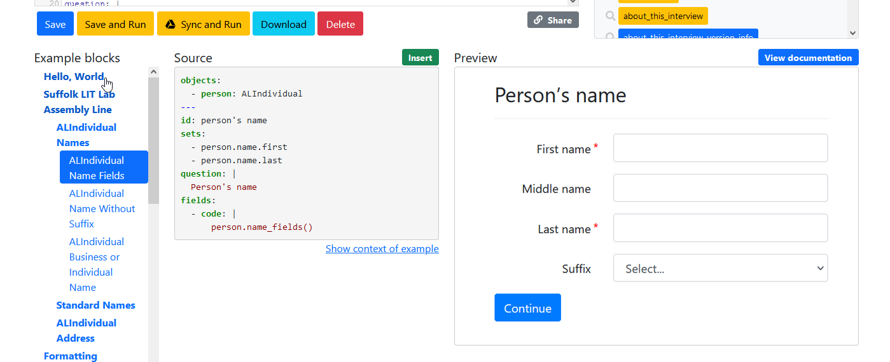

This repository includes two groups of recipes, one group contains examples for the Document Assembly Line project, the other group contains generic docassemble interviews addressing specific needs.

## Live demos 

To get a hands-on experience on any of these recipes, you can go to [ALRecipes' introduction page](https://apps-dev.suffolklitlab.org/start/ALRecipes/Introduction) to run the demo recipes you are interested in.

The introduction page also provides instructions for those who want to contribute to ALRecipes.

## Generic docassemble recipes

These examples are created to handle scenarios that are currently unavailable in the docassemble recipes. For example, recipe **Multi-user signatures - require login** differs from the docassemble original recipe in that it lets one party preview a form filled with the other party’s input; recipe **Web Data Extraction** shows you how to extract a piece of data from an external web, then display it in your own interview. 

## AssemblyLine examples

These recipes are ready to be inserted into your interview. You can access them either from the live demo page, or more conveniently from your Playground's **Example blocks** area. 



## Add AssemblyLine examples to your Playground

docassemble allows you to add customized examples to the Playground's **Example blocks** area, see [List of examples in the Playground](https://docassemble.org/docs/config.html#playground%20examples). 

In order to add our examples to your playground, you need to install ALRecipes and add the following in the config file on your server:

```yaml
playground examples:
  - docassemble.ALRecipes:data/questions/examples.yml
  - docassemble.base:data/questions/example-list.yml  
``` 