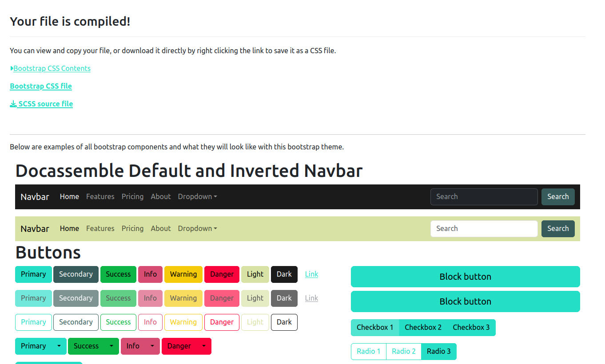

## Sharing a custom look and feel across multiple Assembly Line interviews

The [ALThemeTemplate](https://github.com/SuffolkLITLab/docassemble-ALThemeTemplate)
repository is a template for a "brand" package that you can use for your own organization.

## Visual customization

You can customize Docassemble, and Assembly Line interviews, with a Bootstrap 5 theme.

### Customizing the logo and title for Assembly Line interviews

You should also customize the:
* [Title](framework/magic_variables.md#al_organization_title)
* [Home page](framework/magic_variables.md#al_organization_homepage)
* and [logo](framework/magic_variables.md#al_logo)

### Creating a custom CSS theme with Bootstrap.build

If you want to build a custom theme, encompassing colors, fonts, button styles and other
options that are configurable with css, you can:

1. build one from Bootstrap 5 source
1. start with a theme generator tool like [bootstrap.build](https://bootstrap.build/)
  and in some cases, add some custom CSS to make it work with Docassemble.

Using bootstrap.build is the simplest option for most authors.

1. Visit the [bootstrap.build](https://bootstrap.build/) website.
1. Click the button to open the Builder
1. Customize the options that you want to customize. Typically those will include:
    * Under color system, the $gray/$blue/etc. colors, if you use a matching color in your theme
    * Under color system, almost always the variables `primary`, `secondary`, `success`, `info`, `warning`, `danger`,
      `light` and `dark`
    * Under Typography, customize any fonts that you wish to use
    * Under forms, you may want to customize button size and rounded edges
1. Click the "export theme" button (it may be hidden behind a banner at the top of the page) and choose the
  "bootstrap.min.css" option. Rename this theme to be more specific. Optionally, download the `_variables.scss` file
  so that you can easily load and adjust your settings in future.

Next, you will need to make a small adjustment to the theme generated by bootstrap.build.
Copy and paste the code below into the `bootstrap.min.css` file (or your new file name).

```css
.visually-hidden {
    clip: rect(0 0 0 0);
    clip-path: inset(50%);
    height: 1px;
    overflow: hidden;
    position: absolute;
    white-space: nowrap;
    width: 1px;
}
  
.bg-dark {
  background-color: #1a73e8!important;  /* replace with your desired nav bar color */
}
```

Add this theme to your Docassemble playground using the Folders | Static menu.

You can then reference your new file by adding a bootstrap theme feature to your interview:

```yaml
features:
  bootstrap theme: bootstrap.min.css
```

### Creating a custom theme from source instead of with a theme generator

While the above instructions to use bootstrap.build can work well in most
circumstances, you may run into small interface bugs introduced by the theme
generator. If you prefer more control over building the theme, you can create
a custom theme from the bootstrap source code. The Bootstrap documentation
[covers the details of theming](https://getbootstrap.com/docs/5.1/customize/overview)
if you want to take this approach.

Create a new `custom.scss` file anywhere on your computer to contain the SASS/CSS styles for your branding.
Detailed instructions on what this file can contain are in the [Bootstrap
documentation](https://getbootstrap.com/docs/5.1/customize/sass/#importing).

You can use a [color theme generator](https://huemint.com/bootstrap-basic/) like
[Huemint.com](https://huemint.com/bootstrap-basic/) to make sure that you have a
consistent set of all 9 Bootstrap variables. When you use the color theme
generator, at the bottom of the page, you will see a small snippet of code that
you can copy into the `customs.scss` file.

For example, your new `custom.scss` might look like this:

```scss
// Custom.scss
// Option A: Include all of Bootstrap

// Include any default variable overrides here (though functions won't be available)

$white: #ffffff;

$theme-colors: (
    "light":      #d8e2a5,
    "dark":       #1b1b1b,
    "primary":    #25dec6,
    "secondary":  #375b5a,
    "info":       #d74d72,
    "success":    #0cb545,
    "warning":    #f4ca0b,
    "danger":     #fa043c,
);

// Note: we placed our custom.scss file in the bootstrap path for simplicity,
// so we use a different path than in the bootstrap documentation
// @import "../node_modules/bootstrap/scss/bootstrap";
@import "bootstrap";

// Then add additional custom code here
```

Once you have written your `custom.scss` file, you can use the
[ALDashboard](https://github.com/SuffolkLITLab/docassemble-ALDashboard) (which you can [install on
your docassemble server](https://assemblyline.suffolklitlab.org/docs/installation#install-aldashboard))
to compile a custom Bootstrap theme. If you are associated with the Suffolk LIT Lab and have an account on
the Suffolk Development server, you can visit a [live version of the tool](https://apps-dev.suffolklitlab.org/start/ALDashboard/compile_bootstrap)
to try it out.

At the end of the tool, you can view what all of the different bootstrap components will look like with your theme.
If you want to change any of the colors, you can go back and edit your "custom.scss" file and regenerate the bootstrap theme.



Once you like the colors you've chosen, download the compiled file, and then add it
a docassemble project, in the `static` folder. You can then reference your new file
by adding a [bootstrap theme feature](https://docassemble.org/docs/initial.html#bootstrap%20theme) to your interview:

```yaml
features:
  bootstrap theme: my_bootstrap_theme.css
```

#### Running node and npm to build a Bootstrap config (optional)

If you don't have access to a docassemble server yourself, you can
also compile a bootstrap theme from source using node and npm.

Use a computer with a [current version of Node](https://nodejs.dev/en/).
The instructions on this page
assume you are using an Ubuntu Linux computer with Node installed, but they
should be the same on any workstation. They were tested on a machine running
Windows 11 with Ubuntu running under Windows Subsystem for Linux (WSL).

It also assumes that you have VS Code installed, but you can use any text
editor of your choice.

First, [download the Bootstrap source](https://getbootstrap.com/docs/5.1/getting-started/download/),
and install its dependencies. As of this writing, the latest version you should use is 5.1.3.

```bash
wget https://github.com/twbs/bootstrap/releases/download/v5.1.3/bootstrap-5.1.3-dist.zip
unzip bootstrap-5.1.3-dist.zip
cd bootstrap-5.1.3
npm install
```

Place the `custom.scss` file you wrote from [the above section](#creating-a-custom-theme-from-source-instead-of-with-a-theme-generator)
in the unzipped bootstrap-5.1.3 folder, and use `npm` to compile the theme file.

```bash
cd ~/bootstrap-5.1.3
npm run css-compile
```

Your new `custom.css` file is in the
`~/bootstrap-5.1.3/dist/css` directory. Copy this file to your Docassemble
`static` folder and reference it as a `bootstrap theme`.

### Using dark mode

Docassemble by default will show an alternate "dark mode" version of your interview to
users who request it, usually with a browser or OS setting. You can set your browser
or OS to use dark mode by following [these instructions](https://support.google.com/chrome/answer/9275525?hl=en&co=GENIE.Platform%3DDesktop#zippy=) to see what your interview looks like.


### Using custom fonts in the frontend

You can use custom webfonts with Docassemble, just like you can with any other web
product.

This [Mozilla guide about web
fonts](https://developer.mozilla.org/en-US/docs/Learn/CSS/Styling_text/Web_fonts)
is a good place to start.

If you do not already have a .woff or .woff2 file but you do have a TrueType
(TTF) or OpenType (OTF) file that you are licensed to distribute, you can create
one with a [free online web font
tool](https://www.fontsquirrel.com/tools/webfont-generator).

1. Once you have a .woff file, upload it to the /static folder of a Docassemble playground.
1. Add an `@font-face` directive to your bootstrap.css file (or a separate CSS file that you
reference in the `features` block of your interview)

You cannot include Mako tags in your CSS file, so in order to use the new font face, you should
add it to a Docassemble package and then install the package on your server.

Example:

```css
@font-face {
    font-family: 'my_font';
    src: url('/packagestatic/docassemble.MyTheme/my_font.woff2') format('woff2'),
         url('/packagestatic/docassemble.MyTheme/my_font.woff') format('woff');
    font-weight: normal;
    font-style: normal;
}
```

In the example above, MyTheme is a Docassemble package that is installed
server-wide. my_font is both the name of a web font and the name of the WOFF file.

### Using custom fonts when creating PDF files from DOCX templates

If you would like to use a font **other than** the Microsoft fonts popular in
the late 1990s-2000 era (Arial, Times New Roman, Courier) then you will need to
install the fonts on your Docassemble server.

Make sure that you have a license for each font you want to install.

1. Locate the .otf or .ttf file representing the font that you want to use
   inside your Word template (note that these are often in c:\windows\fonts\)
1. Copy the font to your docassemble server
1. Copy the font inside the docker container
1. reset the font cache
1. restart the docassemble supervisor processes

```bash
scp ~/myfont.ttf apps.example.com:
ssh apps.example.com
docker cp myfont.ttf mycontainer:/usr/share/fonts
docker exec mycontainer /bin/bash
fc-cache -f -v
supervisorctl restart uwsgi
supervisorctl start reset
supervisorctl -s http://localhost:9001 restart unoconv
```

Instead of copying the fonts to /usr/share/fonts, you could likely copy
them to `/var/www/.fonts`. This has the advantage of being writable by the
web process from a Python module.

If the font still does not appear to be installed (try generating a PDF with the
custom font),you may need to do a `docker stop -t 600 mycontainer` followed by a
`docker start mycontainer`.
