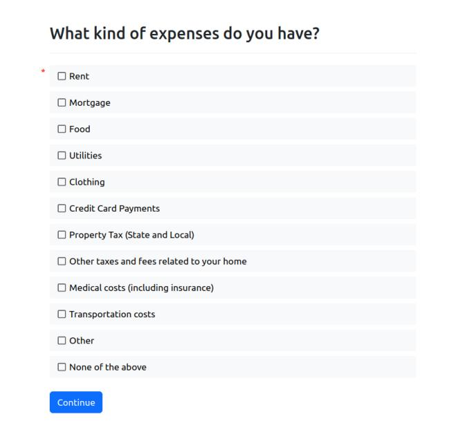

The `ALExpenseList` is a class that helps you ask a user about their different expenses.

## Guiding Philosophy

Certain court forms ask for a person's expenses as a proof of hardship or burden.
In designing this feature, we tried to reduce the number of questions a user needs
to answer while still asking for specific enough expenses. We don't want to burden the user, but also
don't want the user forget to list any significant expenses they would have
that could prove financial burden.

What expenses you want to initially ask about will depend on your community's needs.
For example, if your community lives in northern rural areas, they might have alternative
heating needs, like wood or oil, and might not immediately associate those costs with
standard "utilities". If your community is in a flood plain, you might want to include flood
insurance as an option.

## ALExpense

If you want to jump right in, check out a [live demo of the ALExpense feature](https://apps-test.suffolklitlab.org/start/ALToolbox/al_income_demo?use_feature=ALExpense).


`ALExpense` is a class that represents an amount that re-occurs periodically, like a monthly
utility bill, or weekly grocery expenses. It has a few attributes:

* `expense.value` is the actual amount that is reoccurring. For example, someone's rental insurance
  might always be $50 each month.
* `expense.times_per_year` is the number of times each year that this amount occurs. If someone has to pay their landlord twice a month, `times_per_year` would be 24. This value can also be fractional if need be; an expense that only needs to be paid once every two years would have a `times_per_year` of 0.5.
* `expense.source` is the source, or name, of the expense. Food expenses could have a source of `"food"`.
  * `expense.display_name` is the name of the source that you want to display to the user. This helps with multi-lingual interviews, where you can show the user the name of the expense, but your interview logic can still refer to a single canonical language name. It also helps add or change additional context to the name that you don't want to write out in your interview logic. For example, `expense.source` could be `"medical insurance"`, but `expense.display_name` could be `"Medical Insurance (including health, dental, and vision)"`.

You won't be using `ALExpense` by itself often though; you'll need a list of expenses from the user, which we'll discuss next.


## ALExpenseList Tutorial

Let's make a short interview that just asks for someone's expenses. These some pieces
of code can be used in longer interviews as well.

### Before

Before you start, we'll assume that you:

* have access to a [developer account on a docassemble server](https://suffolklitlab.org/legal-tech-class/docs/classes/assembly-line/2020-assembly-line-assignment-1#before-you-get-started)
* have the [`AssemblyLine` package installed on your server](https://assemblyline.suffolklitlab.org/docs/installation#run-the-installation-script), or have installed the [`ALToolbox` package](https://github.com/SuffolkLITLab/docassemble-ALToolbox) separately.
* know [what the playground is](https://suffolklitlab.org/legal-tech-class/docs/classes/docacon-2020/hello-world#introduction-to-the-docassemble-playground) and [how to use it to develop a docassemble interview](https://suffolklitlab.org/legal-tech-class/docs/classes/docacon-2020/hello-world#hello-world)
* know [what "blocks" are](https://suffolklitlab.org/legal-tech-class/docs/yaml#documents) in docassemble

### Writing the interview

First, include the `al_income.yml` YAML file in your interview. This will
let you use the al_income questions and python code.

```yml
include:
  - docassemble.ALToolbox:al_income.yml
```

Then, create an `ALExpenseList` using a `objects` block.

```yml
objects:
  - expenses: ALExpenseList.using(auto_gather=False, complete_attribute="exists")
```

:::tip Other objects
You can also associate these expenses with [another object](https://docassemble.org/docs/objects.html#how), say the main user of a form, like `users[0]`, depending on how you organize your interview.

```yml
objects:
  - users[0].expenses: ALExpenseList.using(auto_gather=False, complete_attribute="exists")
```

:::

Then to trigger gathering expenses, add the following [interview order code block](https://suffolklitlab.org/legal-tech-class/docs/practical-guide-docassemble/controlling-interview-order#the-interview-order-block) into your tutorial interview.

```yml
mandatory: True
code: |
  expenses.gathered
```

This will ask the user a few questions:

* First, they will be asked what types of expenses they have. You can customize the options shown to the user by including
  a definition of an `expense_terms` variable in your interview. Since the default list is pretty long, we'll make it
  shorter in this tutorial by copying the below variable definition block:

  ```yml
  # "!!omap" makes these terms ordered: 
  # their order here will be their same order when shown to users.
  variable name: expense_terms
  data: !!omap
    - rent: "Rent"
    - mortgage: "Mortgage"
    - food: "Food"
    - utilities: "Utilities"
    - clothing: "Clothing"
    - credit cards: "Credit Card Payments"
    - property tax: "Property Tax (State and Local)"
    - other taxes: "Other taxes and fees related to your home"
    - medical: "Medical costs (including insurance)"
    - transportation: "Transportation costs"
    - other: "Other"
  ```

  Here is what this question screen will look like:

  

  :::tip `display_name`

  As mentioned in the previous section, `expense_terms` provides the `ALExpense` objects in your `ALExpenseList` with the values for `source` and for `display_name`; everything to the left of the colon on each line is `source` and everything to the right is the longer `display_name`.

  :::

* For each expense that the user said they have, there will be one question screen,
  asking for how often they pay for that expense, and how much they pay. If they selected "other", they will also
  be prompted to enter the name of that expense.

  If you want to change the options for how often they pay the amount, you can define a `times_per_year_list`,
  similarly to the `expense_terms` above. By default, the list contains "weekly", "once every two weeks", "twice per month",
  "monthly", "once every 3 months", "once every 6 months", and "yearly". For this tutorial, let's make that list a little shorter.
  Add the below block to your code:

  ```yml
  variable name: times_per_year_list
  data:
    - [52, "Weekly"]
    - [26, "Once every two weeks"]
    - [24, "Twice per month"]
    - [12, "Monthly"]
    - [1, "Yearly"]
  ```

You can show let the user review the expenses they've entered
with the following question block:

```yml
id: expenses review
question: |
  Review your expenses
subquestion: |
  Here is what you've told us about your monthly expenses. You can add more or continue
  to the next question.

  ${ expenses.table }

  ${ expenses.add_action() }
field: review_expenses_screen
```

:::tip Review screens
You can also add the expense list to a [review screen](https://docassemble.org/docs/fields.html#review) with the below code:

```yml
review:
  - Edit: expenses.revisit
    button: |
      **Expenses**:

      % for item in expenses:
      * ${ item.display_name }: ${ currency(item.value) }
      % endfor
```

:::

That's all you need to gather the information, but the ALExpenseList class also
gives you many ways to display the info. This is the same way of displaying the `ALIncomeList` class, so if you've used `ALIncomeList` before feel free to skim through this section.

Let's add one last screen to display our information. We'll
describe what each line of code is doing on the screen.

```yml
event: final_screen
question: Summary of your expenses
subquestion: |
  All of the types of expenses, which we call "sources": ${ expenses.sources() }

  Sum of all of the expenses (by default, this is annually): ${ currency(expenses.total()) }

  Sum of all of the expenses over a month: ${ currency(expenses.total(times_per_year=12)) }

  Value of expenses with the source "rent": ${ currency(expenses.total(source="rent")) }

  Sum of just some expenses: ${ currency(expenses.total(source=["rent", "food", "mortgage"])) }

  Sum of all expenses except a specific source: ${ currency(expenses.total(exclude_source="food")) }
```

With that last screen, we can change our mandatory code block above to now be:

```yml
mandatory: True
code: |
  expenses.gathered
  review_expenses
  final_screen
```

Now you can run through the interview!

<details>
<summary>Click this section to see the whole interview</summary>

```yml
include:
  - docassemble.ALToolbox:al_income.yml
---
objects:
  - expenses: ALExpenseList.using(auto_gather=False, complete_attribute="exists")
---
variable name: expense_terms
data: !!omap
  - rent: "Rent"
  - mortgage: "Mortgage"
  - food: "Food"
  - utilities: "Utilities"
  - clothing: "Clothing"
  - credit cards: "Credit Card Payments"
  - property tax: "Property Tax (State and Local)"
  - other taxes: "Other taxes and fees related to your home"
  - medical: "Medical costs (including insurance)"
  - transportation: "Transportation costs"
  - other: "Other"
---
mandatory: True
code: |
  expenses.gathered
  review_expenses
  final_screen
---
id: expenses review
question: |
  Review your expenses
subquestion: |
  Here is what you've told us about your monthly expenses. You can add more or continue
  to the next question.

  ${ expenses.table }

  ${ expenses.add_action() }
field: review_expenses
---
event: final_screen
question: Last screen!
subquestion: |
  All of the types of expenses, which we call "sources": ${ expenses.sources() }

  Get the sum of all of the expenses (by default, this is annually): ${ currency(expenses.total()) }

  Get the sum of all of the expenses over a month: ${ currency(expenses.total(times_per_year=12)) }

  Get just the value of one expense: ${ currency(expenses.total(source="rent")) }

  Get the sum of all of the expenses, of just some sources: ${ currency(expenses.total(source = ["rent", "food", "mortgage"])) }

  Get the sum of all of the expenses, of everything but a specific source: ${ currency(expenses.total(exclude_source="food")) }
```

</details>


You'll likely want to display this information in a PDF or word template as well. [This section describing the Attachment block](https://assemblyline.suffolklitlab.org/docs/generated_yaml#attachment-block) will help with displaying information in the PDF, and [this page about working with DOCX files](https://assemblyline.suffolklitlab.org/docs/docx) will help DOCX users.
