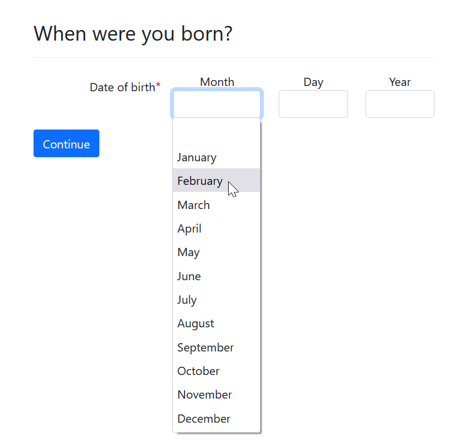
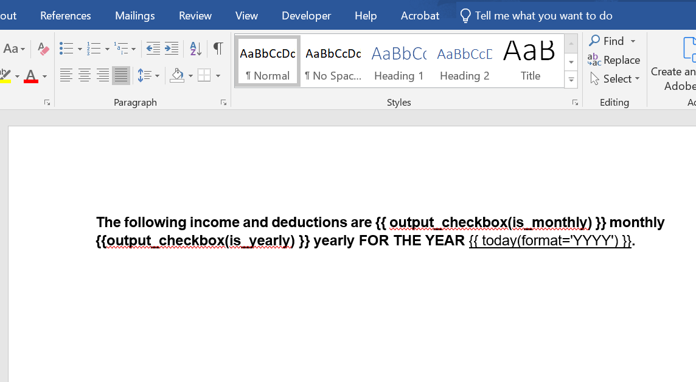

import Tabs from '@theme/Tabs';
import TabItem from '@theme/TabItem';

The functions and classes listed on this page can be used without the Assembly
Line framework. Follow the instructions to include each component in your
interview, which may involve including a single YAML file or a module, CSS, and
JavaScript file.

The **ALToolbox** repo is constantly expanded to add new functions. As this page provides only some samples, you can see more in [the "Live demos" section](#live-demos) below. You can also see more details about each individual function in the ALToolbox API reference for each module:

* [`ALToolbox.business_days`](business_days)
* [`ALToolbox.copy_button`](copy_button)
* [`ALToolbox.misc`](misc)
* [`ALToolbox.save_input_data`](save_input_data)

## Live demos

To get a hands-on experience on any of these functions, you can go to [ALToolbox's overview page](https://apps-dev.suffolklitlab.org/start/ALToolbox/altoolbox_overview) to run the demo interview you are interested in.

The overview page also provides instructions for those who want to contribute to ALToolbox.

## Collapsible help text

Use `collapse_template()` to display an accordion-style information box that
starts out hidden but expands when the user clicks on it. The contents of the
information box come from a Docassemble [`template`
block](https://docassemble.org/docs/initial.html#template). The `subject` will
display with an arrow, and the `content` of the template will be shown when the
`subject` is clicked on.

We [recommend using this for help
text](../../style_guide/question_style_help_your_user.md#provide-help-information-in-context) in
your interviews.

It works a lot like this `details` element:

<details>
  <summary>Like this</summary>
  Context-specific help goes here.
</details>

To include this in your interview:

```yaml
---
include:
  - docassemble.ALToolbox:collapse_template.yml
```

Example usage:

```yaml
---
id: example question
question: |
  What is your favorite fruit?
subquestion: |
  ${ collapse_template(fruit_explanation) }
---
template: fruit_explanation
subject: |
  Like this
content: |
  Context-specific help goes here.
```

[API for `collapse_template`](misc#collapse_template), and [Code for `collapse_template`](https://github.com/SuffolkLITLab/docassemble-ALToolbox/blob/main/docassemble/ALToolbox/misc.py)

## Display markdown template with a scroll bar

`display_template()` displays a Docassemble
[`template`](https://docassemble.org/docs/initial.html#template) with a scroll bar to save screen space if the content is long.

It also displays the subject line along with the content, and allows you to add styles to the display. You can turn the scroll bar on and off.

Example: `display_template(my_template, scrollable=True, class_name="my_color")`.

Include this in your interview:

```yaml
---
include:
  - docassemble.ALToolbox.display_template.yml
```

## Display a series of tabs

`tabbed_templates_html()` displays a series of Docassemble
[`template`s](https://docassemble.org/docs/initial.html#template) with Bootstrap
tabs.

Example: `tabbed_templates_html('unique_name_of_tab_group', tab_template1, tab_template2)`.

Include this in your interview:

```yaml
---
modules:
  - docassemble.ALToolbox.misc
```

## Format telephone numbers as clickable links

This `tel` function just makes a string representing a telephone number
clickable, which opens the dialer on mobile.

For example: `tel('617-555-5555')`

Include this in your interview:

```yaml
---
modules:
  - docassemble.ALToolbox.misc
```

## Total a list of values that may not be defined

`sum_if_defined()` returns the total of a list of values that may or may not be
defined. Each variable's name should be passed as a string as a separate
parameter.

Use it like this:

`sum_if_defined('value1', 'value2', 'value3')`. Using `sum_if_defined()` will
not error if any of the values are undefined. If no value is defined,
`sum_if_defined()` will return `0`.

It is usually a better pattern to put the values into a list and use the
built-in Python function
[`sum`](https://docs.python.org/3/library/functions.html#sum), but this provides
an alternative that may require less effort depending on how your form is
labeled.

## Provide a button that allows a user to copy text to the clipboard

Use `copy_button_html()` to display an HTML input with a button
that allows the user to copy the text to their device's clipboard.

Parameters:

* `text_to_copy`: text you want the user to be able to copy.
* `text_before`: the prompt that will appear to the left of the HTML input
* `label`: defaults to "Copy"
* `tooltip_inert_text`: defaults to "Copy to clipboard" when hovered over
* `tooltip_copied_text`: defaults to "Copied!" when the text is placed on the clipboard


```python
include:
  - docassemble.ALToolbox:copy_button.yml
```

## Escape button

The `escape_button.yml` file adds a red "Escape" button in the
top navigation area that takes you to [https://google.com/](https://google.com) when you click
on it.

You may choose to use this if you have vulnerable clients, such as those living
with a domestic abuser.

To include in your interview:

```yaml
---
include:
  - docassemble.ALToolbox:escape_button.yml
```  

## International phone number input validation

Use the custom datatype `al_international_phone` field to define the phone number input, and it will validate the country code for you. Run [the demo interview](https://apps-dev.suffolklitlab.org/start/ALToolbox/phone_number_validation_demo)
to see how it works and detailed implementation instruction.

To include in your interview:

```yaml
---
include:
  - docassemble.ALToolbox:phone-number-validation.yml
```

## BirthDate and ThreePartsDate custom data types

Use the custom datatype `BirthDate` or `ThreePartsDate` to ask the user
to enter a date that might be very far in the past or in the future,
where the standard calendar picker can slow the user down. This input
will display a separate month, day, and year input. The Month input will
be a dropdown menu with a list of months.

Example:

<Tabs>
  <TabItem value="Preview" label="Preview" default>



  </TabItem>
  <TabItem value="Code" label="Code">

```yaml
---
question: |
  When were you born?
fields:
  - no label: users[0].birthdate
    datatype: BirthDate
```

  </TabItem>
</Tabs>

`BirthDate` and `ThreePartsDate` are exactly the same, except that a `BirthDate`
is limited to a date in the past.

Both `BirthDate` and `ThreePartsDate` will be available for you to use in your
interview if the `docassemble-ALToolbox` repository is installed on your server.
You do not need to explicitly include any code in your interview YAML file to
use them.

## Shorthand function to display a checkbox in replace of a True/False boolean value in a DOCX template

Use the `output_checkbox()` function to display a checked or unchecked value in a DOCX template.
It can reduce the risk of typos and make your templates slightly easier to read.

By default, the "checkbox" will be the literal value `[  ]` or `[X]` rather than a Word form control.

Example:

<Tabs>
  <TabItem value="DOCX Template" label="DOCX Template" default>
The following income and deductions are \{\{ output_checkbox(is_monthly) \}\} monthly \{\{ output_checkbox(is_yearly) \}\} yearly FOR THE YEAR \{\{ today(format='YYYY') \}\}.


  </TabItem>
  <TabItem value="Docassemble Code" label="Docassemble Code">

```yaml
---
modules:
  - docassemble.ALToolbox.misc
---
code: |
  is_monthly = True
  is_yearly = False
---
mandatory: True
question: View Example DOCX
subquestion: |
  ${ example_doc }
---
attachment:
  variable name: example_doc
  filename: example_docx
  docx template file: example_checkboxes.docx
```

  </TabItem>
  <TabItem value="Output DOCX" label="Output DOCX">

![The following income and deductions are [X] monthly [  ] yearly FOR THE YEAR 2023.](../../assets/output_checkbox_post_pic.png)

  </TabItem>
</Tabs>

`output_checkbox()` has two optional keyword parameters:

* `checked_value (str)`: defaults to `[X]` but can be set to any string or even
  a `DAFile` or `DAStaticFile` with the image of a checkbox
* `unchecked_value (str)`: opposite meaning of `checked_value` and defaults to `[  ]`.

`output_checkbox()` is contained in `misc.py` which means it is already included
if you use the AssemblyLine framework. If you do not use the AssemblyLine framework, you
can include it as follows:

```yml
modules:
  - docassemble.ALToolbox.misc
```
