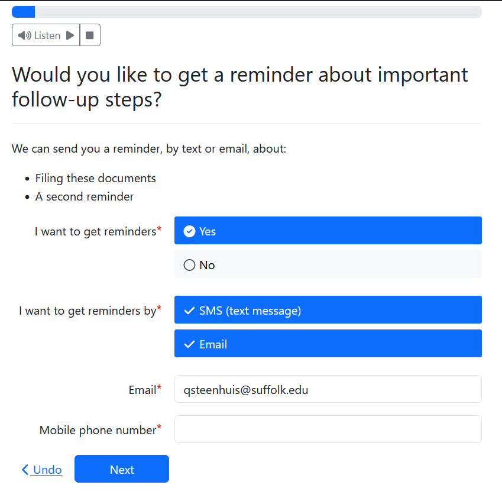

A guided interview is always an intervention into one part of a larger process.

One way to help the user after the main interview is over is to send them reminders
at scheduled times.

You can use scheduled reminders to:

* Remind the user to show up in court
* Provide a link to the interview so they can perform a follow-up step (like sending in a motion)
* Provide affirmations
* Provide helpful information "just in time" around important milestones in their case

The Assembly Line's reminder system supports both:

1. Email reminders, and
1. SMS text messages

This is simply a light API with basic use of Docassemble's built-in 
[cron](https://docassemble.org/docs/background.html#scheduled) system. If it doesn't
fit your needs, you may want to use our example for inspiration and build your own.

## Prerequisites

To send reminders by SMS, you will need an SMS provider set up in your docassemble configuration.
Currently, Docassemble's only supported provider is Twilio.

To send reminders by **email** you will need email configured on your server.


## Getting started with the Assembly Line's reminders system

The Assembly Line reminder system is an optional part of the Assembly Line.
It was added in Assembly Line version `2.23.0`.
To add it to your interview, add the following line:

### Include the YAML file
```yaml
include:
  - docassemble.AssemblyLine:al_reminders.yml
```

:::warning Warning
The Assembly Line reminder system uses Docassemble's scheduled task system.
If you want to use reminders but have an existing scheduled task in your interview, you need
to configure your scheduled tasks so that they work together. 
:::

### Integrate it into your interview order block

You need to integrate the Assembly Line reminder system in two places:

1. Ask your user if they want to receive reminders, with `al_user_wants_reminders`
1. Send a confirmation message to the user letting them know they've successfully subscribed, with `al_reminders_sent_initial_test_message`

Because the Assembly Line reminder system evaluates the list of reminders just once by default,
you should wait to ask the user if they want reminders until after any questions that can change
the date of the reminders gets sent out.

Example:

```yaml
---
id: interview order
code: |
  users[0].name.first
  eviction_answer_date
  # ... Ask other interview questions
  al_user_wants_reminders
  al_reminders_sent_initial_test_message
  interview_order_eviction_answer = True
```

### Customize the list of times and reminders

To use the reminder system, you will need to customize 
the `al_reminders` dictionary and add any email and SMS 
templates that you want to use.

`al_reminders` is a dictionary. Each entry is a dictionary
with the following keys:

1. `description`, a short plain language description of the reminder
1. `date`, a date the reminder will be sent. Should be in ISO format and will be calculated only once. You can use `mako` to calculate with variables.
1. `email template`: the name of a `template` block in your YAML file that will be used for email reminders
1. `sms template`: same as the `email template`, but for SMS reminders

In the examples below, we define `al_reminders` with Docassemble's `data` block. But you
can define it any way that makes sense for you. All entries should be strings. If you use
a `code` block instead of a `data` block, make sure you put the names of templates in quotes.

Note that when `al_user_wants_reminders` is triggered,
at least the `description` key for each entry in `al_user_wants_reminders`
will be evaluated.

Here is what the default `al_user_wants_reminders` question looks like:



Here is a complete example:

```yaml
---
variable name: al_reminders
use objects: True
data:
appear_in_court:
    description: Show up in court
    date: ${ eviction_answer_date.plus(days=3).format("yyyy-MM-dd") }
    email template: eviction_email_reminder_template
    sms template: eviction_sms_reminder_template
---
template: eviction_email_reminder_template
subject: |
  ${ users }, you may have a court date coming up
content: |
  When you used the eviction answer interview at Court Forms Online, you asked
  us to send you reminders about important dates.
  
  According to the information you told us, your court date should be on 
  ${ eviction_answer_date.plus(days=4) }. That's tomorrow!

  This is not a message from the court. Make sure to double-check if something
  changed in your court case.

  You can [unsubscribe](${ interview_url_action('al_reminders_unsubscribe_emails') }) if you no longer want to get reminders.
---
template: eviction_sms_reminder_template
content: |
  ${ users }, you may have court tomorrow!

  According to the information you told us when you used Court Forms Online, your court date should be on 
  ${ eviction_answer_date.plus(days=4) }. That's tomorrow!

  This message is from Court Forms Online. This is not a message from the court.

  Click to unsubscribe ${ interview_url_action('al_reminders_unsubscribe_emails') } to stop reminders from this
  interview or reply STOP if you no longer want any reminders from ${ AL_ORGANIZATION_TITLE }.
```

#### Allowing the user to unsubscribe

The event `al_reminders_unsubscribe_emails` triggers a screen that lets the user
turn off reminders.

You should add this to the bottom of every email and SMS message. You can do so like this:

`${ interview_url_action('al_reminders_unsubscribe_emails') }`

#### The STOP keyword in Twilio

If your user replies STOP to an SMS message, it will stop them from receiving any messages
from the Twilio phone number that they get the message on.

### Customize other screens

The reminder system provides several other screens, code blocks and templates you may wish to customize:

1. `id: wants reminders`: the screen that lets the user ask to get reminders and choose the method and provide email and phone
1. `template: al_reminder_initial_sms_template`, the confirmation message sent to the user's phone when they first sign up
1. `template: al_reminder_initial_email_template`, same but for emails
1. `al_reminders_cron_daily = True`: if you need to allow your user to edit the date reminders 
will get sent after they first sign up for reminders, you may want to customize the code in this code block.

Take a look at 
[al_reminders.yml](https://github.com/SuffolkLITLab/docassemble-AssemblyLine/blob/main/docassemble/AssemblyLine/data/questions/al_reminders.yml)
to find and customize the blocks that you need.

## Caveats and warnings

### `al_reminders` takes over docassemble's `cron` system

If you use `cron` for anything else, you will need to customize a few blocks
to make sure they work together.

Specifically:

1. Combine any `cron_daily` tasks with the [Assembly Line's version](https://github.com/SuffolkLITLab/docassemble-AssemblyLine/blob/main/docassemble/AssemblyLine/data/questions/al_reminders.yml) (search for `cron_daily` in this file and copy the relevant block). Docassemble only evaluates one per interview.
1. Make sure you define `al_reminders_evaluate_stop_cron` so that it doesn't stop
cron before **your** tasks are finished.

### Dates are only calculated once

If you need more flexible calculation of dates, you might want to 
customize the block that defines `al_reminders_cron_daily = True` to insert a 
`reconsider("al_reminders")` at an appropriate place.

We don't do that by default for you because you may want to calculate a date
based on `today()`.

### `cron` resets the `modified` date of your interview

Whenever the `cron` system runs, it updates the `modified` date of the interview.
This will bump the interview up on the user's list of recent interviews. It also
means that it will extend the date that the session is on the server. By default,
docassemble deletes unused sessions after 90 days. The 90 days won't start running
until `cron` is explicitly stopped in the interview.

By default, the Assembly Line reminders system shuts off `cron` (for the specific
user's session) after all reminders have been sent.

This is just good to keep in mind when you describe your data retention policies to users.