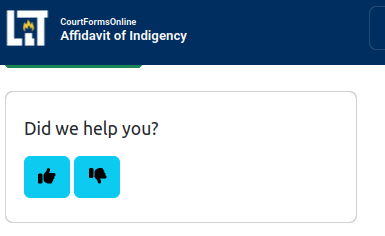

When testing your interviews and after you go live, you'll want a way to for users to tell you their thoughts
about your interviews. There are few different types of feedback you'll want to be able to handle:

* feedback done during testing, sometimes by a subject matter expert. Usually this
  is directly actionable ("I think we should change the wording here")
* a score or rating of the interview, like a thumbs-up or thumbs down
* feedback made by real users, from the production interview. This may or may not
  be actionable ("I don't understand this page"), but it's extremely valuable to have.

The Assembly Line has a [Feedback package](https://github.com/SuffolkLITLab/docassemble-GithubFeedbackForm) that handles some potential workflows for feedback.

## Feedback Philosophy

The standard feedback cycle for a software product is the following:

1. Release product
2. Users use product, and have feedback: bug reports, specific feature requests, or general emotions about using the product
3. They submit this feedback to you, the owner of the software product.
4. You triage the feedback, looking for common trends and deciding if the feedback is worth implementing.
5. You implement the pieces of feedback that you decided to implement.
6. Repeat back to 1.

This tool helps you solve steps 3 and 4; users submitting feedback to you, and you being able to triage that feedback.
Since much docassemble development [already involves GitHub](../../authoring/github.md), the AssemblyLine uses [GitHub's issues](https://docs.github.com/en/issues) to handle and triage feedback.
GitHub issues let you tag user feedback as such, link issues to PRs that fix the code, and track
when the fix has been added to the code.

GitHub is more developer focused, but it's a good tool to use if you don't currently track interview issues. The [Feedback package](https://github.com/SuffolkLITLab/docassemble-GithubFeedbackForm) started off focused on the GitHub workflow, but has since evolved to handle manual workflows that are less dependant on GitHub. If your organization has a different software system used to triage feedback, you'll have to write your own code to automatically integrate with it.

## How to use Feedback in an Assembly Line interview

This how-to-guide will cover the simplest way to get feedback from an interview. By the end you'll have:

* a link to give feedback in the footer of your interviews
* a separate interview that will show either a tester feedback form or a general public feedback form
* will save that feedback locally and, if desired, will make a GitHub issue with the information

It won't:

* tell you how to customize how you ask for feedback or what the interview looks like
* integrate with other systems besides the current docassemble server and GitHub

Before you start, we'll assume that you:

* have access to an [admin account on a docassemble server](https://suffolklitlab.org/legal-tech-class/docs/classes/assembly-line/2020-assembly-line-assignment-1#before-you-get-started)
* have the [`GithubFeedbackForm` package installed on your server](../../get_started/installation.md#run-the-installation-script)
* know how to [edit the docassemble configuration (config) file](https://docassemble.org/docs/config.html#edit)
* know [what the playground is](https://suffolklitlab.org/legal-tech-class/docs/classes/docacon-2020/hello-world#introduction-to-the-docassemble-playground) and [how to use it to develop a docassemble interview](https://suffolklitlab.org/legal-tech-class/docs/classes/docacon-2020/hello-world#hello-world)
* know [what "blocks" are](https://suffolklitlab.org/legal-tech-class/docs/yaml#documents) in docassemble

### Configuration

Though this package, no longer needs GitHub to function, many of the configurations will contain "github" in their name. If you don't plan on using GitHub, we'll describe which of these Configuration options you can skip.

In your docassemble Configuration, you'll add a `github issues` attribute, like the below:

```yml
github issues:
  username: "YOUR_NEW_DEDICATED_ISSUE_CREATION_ACCOUNT"
  token: "..." # A valid GitHub personal access token associated with the username above
  default repository owner: YOUR_GITHUB_USER_OR_ORG_HERE
  allowed repository owners: # List the repo that your account will be allowed to create issues on
    - YOUR_GITHUB_USER_OR_ORG_HERE 
    - SECOND_GITHUB_USER_OR_ORG
  feedback session linking: True
  ask panel: True
```

If you want to automatically send all issues to GitHub, you need to have:

* `username` should be an account that you use to create GitHub issues. This should *not* be your primary GitHub account,
  as it is possible for other developers on the server to see this token and use it to preform actions as you. The MassAccess
  project uses the `suffolklitlab-issues` account to make issues, as seen [in this example issue](https://github.com/SuffolkLITLab/docassemble-AssemblyLine/issues/544).
* `token` should be a GitHub personal access token associated with the user given in `username`. See [the instruction for making a personal access token](https://docs.github.com/en/authentication/keeping-your-account-and-data-secure/creating-a-personal-access-token) for more info.

The feedback interview will save the feedback on the server with or without the above information, so you don't
have to setup a GitHub account to get feedback from users.

* `default repository owner` should be your main GitHub organization or account that owns most of your interviews. For example, [SuffolkLITLab](https://github.com/SuffolkLITLab), which owns MassAccess's repositories, and [Illinois Legal Aid Online's GitHub account](https://github.com/IllinoisLegalAidOnline).
* `allowed repository owners` is optional, but necessary if your `default repository owner` doesn't own all of the repositories that you need to provide feedback for. If you want to be able to make
  issues on repositories from different organizations, you'll need to list each of them here. For example, Suffolk additionally hosts interviews made by [MassLegalHelp](https://github.com/MassLegalHelp). This is so users can't use your tool to spam issues on other organizations' GitHub repos.
* `feedback session linking` helps you as the server administrator debug tricky bugs. If this is set to `True` and if the user agrees, the feedback interview will save the session ID of their current interview on the server and link it to their feedback issue on github. This means that you can see the state of their interview when the user ran into their problem, making it easier to reproduce and fix their bug. You can [browse the linked sessions in `browse_feedback_sessions.yml`](#how-to-browse-feedback-on-the-server).
* `ask panel` will add a question to the feedback interview, asking users if they want to be in a panel for user testing. If the user wants to be in a panel, it will ask for their email and save it in the server. You can also [view these linked sessions in `browse_feedback_sessions.yml`](#how-to-browse-feedback-on-the-server).

### Footer feedback

Next, open the interview that you want to add feedback to in docassemble's playground.

If you include `assembly_line.yml` in your interview already, all you need to do is add the following block to set the `github_repo_name` variable, which `assembly_line.yml` uses to setup the feedback interview correctly.

```yml
code: |
  github_repo_name = "YOUR_REPO_NAME" # i.e. "docassemble-MyInterview"
```

:::tip Duplicate blocks

Use [docassemble's playground search](https://docassemble.org/docs/playground.html#interview_files) to make sure that you only have one block defining the `github_repo_name` variable. If you have more than one, only the last block will be used, which can be confusing.
:::

If you aren't using `assembly_line.yml`, you can
add the two blocks below to add a footer to every page of your interview:

```yml
---
modules:
  - docassemble.GithubFeedbackForm.github_issue
---
default screen parts:
  footer: |
    [:comment-dots: Feedback](${ feedback_link(user_info(), github_repo=YOUR_REPO_NAME) } ){:target="_blank"}
```

You can then start your interview, and select the Feedback link in the footer. Fill in the feedback interview, and submit the feedback. If
you setup [`github issues` in the config block above](#configuration), there should be a link to the newly-created GitHub issue. Otherwise, you can view the feedback [using the feedback browsing interview](#how-to-browse-feedback-on-the-server).


## How to get reviews in an interview

While having a feedback link in the footer is useful for users who are specifically seeking to give feedback, you can take a more proactive approach and let users
give quick feedback with an in-interview review widget. The final product of this guide will look like the below screenshot:



This review information is stored only on the docassemble server, and isn't sent out to GitHub.

First, find an interview you'd like to add a feedback widget to. Where exactly you want to ask for feedback is up to you, but we'd recommend doing it where a user has reached an end point.

For this how-to, we'll make a short example interview from scratch. The entire interview is below:

```yml
include:
  - docassemble.GithubFeedbackForm:embedded_review.yml
---
mandatory: True
question: |
  First screen
subquestion: |
  Welcome to this example interview.

  ${ only_once_review_widget() }
```

The key lines in the above are:

* adding `docassemble.GithubFeedbackForm:embedded_review.yml` to the `include` block. You will have to do this even if you are using `assembly_line.yml`.
* `${ only_once_review_widget() }` in the `subquestion` attribute of a question block

The `only_once_review_widget` will ask two questions, one is a simple "Did we help you?" with thumbs up and thumbs down options, and the second is an open text box for users to write more. If they answer the first question and refresh the screen or continue through the interview, the feedback widget won't be shown again, given that the user
doesn't go back past the widget's screen in the interview.

You can change several aspects of the review widget. For more information, see [the API reference of `review_widget` in ALToolbox](../ALToolbox/misc.md#review_widget). That is the function `only_once_review_widget` is using.

The `only_once_review_widget` review information is only stored on the docassemble server, and can be viewed [using the feedback browsing interview](#how-to-browse-feedback-on-the-server).

## How to browse feedback on the server

You can view feedback for all interviews on a server if you are logged in as an admin. If your server name is `apps.myserver.com`, you can visit `apps.myserver.com/start/GithubFeedbackForm/browse_feedback_sessions` to view the feedback.

First, the interview will ask what type of feedback you want to view. If you set up GitHub integration, you can see a full list of feedback associated with some GitHub issue. If the user agreed to provide you access to their full answers, you'll be able to see the session id, and have a button that lets you enter a shared session of that user's interview.

The other option is for reviews, which will show all of the scores given to an interview, and all of the written feedback for an interview as well.


:::note Under development

The browsing feature is actively under development. If you have suggestions for improvements, [let us know on Teams](../../get_started/intro.md).

:::
