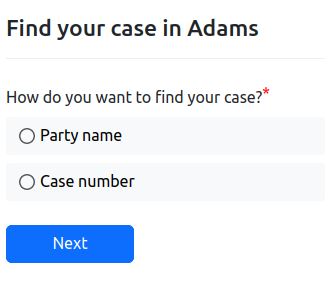
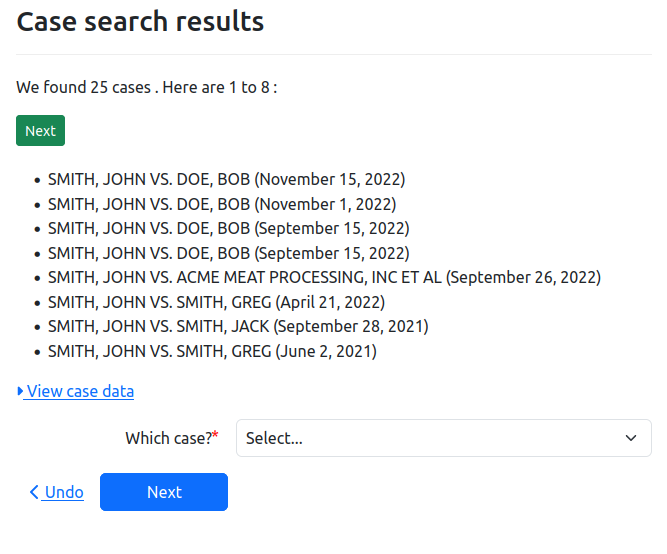

This guide will help you integrate a case search feature into
your interview, helping your users find their cases in their
court's e-filing system.

:::warning
This e-filing functionality is being updated often, so this documentation might be out of date.
If anything is incorrect or doesn't work as expected, feel free to email us at
[massaccess@suffolk.edu](mailto:massaccess@suffolk.edu).
:::

This example interview will be straight-forward; it will allow users
to search for a case, and will display all of the available information
about the found case. You will want to use that data to automatically
fill in information for the user in your interview later, but that won't be covered here.

## Before starting

Before staring this guide you should:

* have access to a docassemble server for developing docassemble interviews
  * the [EFSPIntegration package](https://github.com/SuffolkLITLab/docassemble-EFSPIntegration) should be installed on the server
* have setup your server to be able to e-file
  * first, you can contact us for access to the EFSP server.
      We aren't yet making access publicly available, but
      will include an interest form here when we do.
  * second, you can follow the instructions in ["Server Setup"](efiling_through_docassemble.md#server-setup) to setup your server's
    configuration.
* know about [Tyler e-filing codes](efiling_codes.md)
  * Note: this tutorial is only partially written, but it will be completed soon!

## Steps

### Creating a interview

Let's first start out with the simplest possible interview:

```yaml
include:
  - docassemble.AssemblyLine:assembly_line.yml
  - docassemble.EFSPIntegration:case_search.yml
---
objects:
  - case_search:  EFCaseSearch.using(court_id="adams")
---
code: |
  jurisdiction_id = 'illinois'
  trial_court = "Adams"
---
event: show_all_info
question: The found case
subquestion: |
  ${ pretty_display(case_search.found_caseas_serializable()) }
---
mandatory: True
code: |
  tyler_login
  case_search.case_was_found
  show_all_info
```

Start off by hard coding a few pieces of information:

* use the `illinois' jurisdiction. Currently, the E-file proxy server is only running in production in Illinois, but we have access to the staging servers in Massachusetts and Texas.
* file in the "adams" county court in Illinois. Handling court
  hierarchies is a complicated task, and something that the AssemblyLine can't do for you. You'll need to make your own way to let users select what court they want to file in depending on your jurisdiction. See [our documentation for `al_courts`](../reference/AssemblyLine/al_courts.md) for some possible ideas.

You should be able to run the interview now. If this is the first time you're running the interview on the server, you will be asked to log in to eFileIL. If you don't yet have an account, you should be able to make a new pro-se user account with eFileIL by following the links to make a new account on the page. Once you've logged in on the server, subsequent runs of the interview won't ask you to log in, until the eFileIL token expires and you have to log in again, in about 1-2 hours.

The next page will ask if you want to search by party name or by case number.




For now, let's search by case number. If you select "case number", and then enter the case number "2022SC9",
you should find a case, John Smith vs. Bob Doe, a small claims case.

:::info
This case search worked at the time of writing (February 28th, 2023). However,
courts have removed older cases from their staging servers before, and it is
possible that this search won't work in the future. You can try searching
common names like "John Brown" or "John Smith", or you could ask a court
official if they are able to provide you with some testing case numbers from
their staging server.

We recommend that you build a working relationship with your local courts so
they can help you with details like this.
:::

You can also go back and search by "Party name" instead. You can enter the name "John Smith",
press continue, and wait. Searching by party name takes longer on eFileIL's server, especially on the staging server, you might have to wait around 30 seconds. Once the search completes, you
will see that there are many cases involving John Smith. For speed purposes, the EFSP library
only gets information about the first 8, and let's you click the next button to see the next 8.



If you select the John Smith vs. Bob Doe case, you then see the last page in the interview YAML; `show_all_info`. This page shows all of the information that you, the interview author, can use
from the `case_search.found_case`, the variable for the found case. The `details` and
`case_details` attributes aren't stable APIs, but you might find the following attributes useful:

* `court_id`, the court that this case came from. Some courts have sub-courts that handle
  specific case types, so even though you searched for cases in the "adams" court, you
  should use this value for the rest of the interview.
* `participants`, an ALPeopleList object that has all of the participants in the case on both sides.
  * each participant has a `party_type` and `party_type_name`, i.e. `participants[0].party_type_name` might be "Plaintiff/Petitioner". These values are [Tyler e-filing codes](efiling_codes.md) that are set by the court.
* `attorneys` is a dictionary that contains any attorneys that are a part of the case.
* `efile_case_type` is the Tyler e-filing code for the type of case. This is useful if your interview
  is only relevant for certain case types. If users don't or can't fill out your form for their case, you can send users to a page that says they don't need this form and why.
* `docket_number` has the case number of the court. "Docket number" is the term that Massachusetts
  uses for a unique number assigned to each case by the court. You might know it as "case number".
  You might see it by either name in the `EFSPIntegration` package.

### Using case search data in your Assembly Line interview

You are likely using the [ALWeaver](../weaver_overview.md) and the rest of the Assembly Line framework
in your docassemble interview, and you will want to put this information from the case search into
variables that your interview knows about, like `users` and `other_parties`. To do this, we can add
some more code to the above example:

```yaml
---
code: |
  target_case = case_search
---
event: show_user_info
question: The found participants
subquestion: |
  Users: ${ users }

  Other parties: ${ other_parties }
---
```

You can then change the mandatory block to the following:

```yaml
mandatory: True
code: |
  tyler_login
  case_search.case_was_found
  show_all_info
  add_existing_users
  show_user_info
```

Setting the `target_case` variable lets the system know that this case search is the one you want to use to fill in `users` and `other_parties` (in an appeals court, you could be searching in a lower court, or searching for existing appeals
court cases). Including the `add_existing_users` line triggers code in the EFSPIntegration package that asks the user which participant they are in the case,
and then fills in `users` and `other_parties` based on that information.

If your form generally deals with party types other than "defendant" and "plaintiff", you will likely want to look at the `is_defendant_filters` and `is_plaintiff_filters` variables in [`docassemble-EFSPIntegration:case_search.yml`](https://github.com/SuffolkLITLab/docassemble-EFSPIntegration/blob/main/docassemble/EFSPIntegration/data/questions/case_search.yml)
which you can override to sort participants by their codes from a case into your typical
ALPeopleLists in your form.
