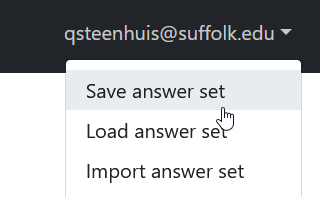
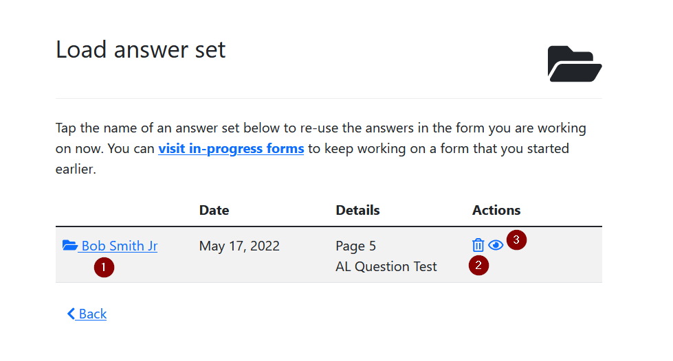
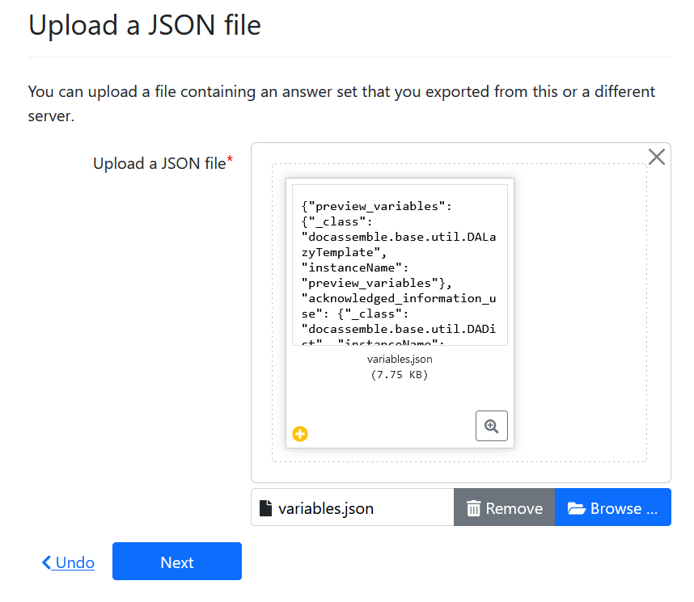

## Overview

Answer sets are a flexible system that permits interview users to re-use their
information in multiple interviews. For example: an organization might use a single
intake interview that asks the user several questions, such as address and name of 
family members. The answer set feature could help the organization populate documents
such as client letters or court pleadings without requiring those basic fields to be
re-typed.

## End-user guide to answer sets

Docassemble automatically saves your progress, whether you are logged in or not.
Answer sets are a special feature that lets you copy your answers to a new interview.
You do not need answer sets to save your progress and complete an interview later.

Answer sets make a **copy** of your answers at a single point in time that
cannot be edited until you copy them back into a new interview.

Use answer sets when:

* You need to fill in multiple forms over time. For example: a complaint
  followed by a motion or affidavit
* Each form has shared information that doesn't change, such as your name,
  address, and the names and addresses of family members

Answer sets may not work well when copying complex information from one
interview to a completely different interview. At times, you may still need to
answer questions that are very similar to questions that you already answered.

### Saving your answers

To copy your answers from the current interview into an answer set, use the main
menu located in the top right of the browser and select the option "Save answer
set". In a desktop browser, the main menu will display your email address. In a
mobile browser, it will be three horizontal lines (sometimes called a
"hamburger" menu).

Now, choose a name for your answer set. The default name is your name and the
name of the opposing party in your case, but you can give the answer set
any memorable name of your choice.

Tap "Save answer set" to save the answer set or "undo" if you change your mind.

### Loading answers

Before you load an answer set, start the interview that you want to use your
saved answers in.

Next, use the main menu located in the top right of the browser and select the
option "Load answer set."

You will see a table that displays each answer set that you created on this
server. Currently, only the most recent 500 answer sets that you authored are
displayed. Click the name of the answer set (1) that you want to load to copy the
answers into your current interview.

You also have the option to delete or view more information about each answer
set.

### Renaming answers

To rename an answer set, first visit the answer set's information page:

1. Find the answer set in the "My interviews" page and click to open
2. Or, use the "Load answer set" menu and then click the "view" icon. (3)

On the answer set's information page, use the "Rename" button (1) at the top of the
screen to give the answer set a new name.

### Deleting unneeded answer sets

To delete an answer set that you no longer need:

1. Use the "delete" button on the "My interviews" page, or
1. Use the "Load answer set" menu and click the "delete" icon (2)

### Exporting and importing answers

You can export your answers in [JSON](https://www.json.org/json-en.html) format.

To export an answer set, visit the answer set's information page:

1. Find the answer set in the "My interviews" page and click to open
2. Or, use the "Load answer set" menu and then clicking the "view" icon.

Next, click the "Export in JSON format" button (2). Save the "variables.json" file in
a location of your choice.

If your server administrator has enabled the import feature, you can import an
answer set by using the "Import answer set" menu item on the main menu.

You will be shown a dialog where you can upload a valid JSON file. After you
click "Next", the answers in the JSON file will be loaded into the current
interview session.

The JSON file should follow [Docassemble
conventions](https://docassemble.org/docs/api.html#session_post) and is expected
to be a dictionary where each key represents the name of a variable that will be
created in the interview. 

The "import" feature is designed to allow you to
import files that were created with the "export answers" feature. While you can manually
edit the JSON file, use this feature with caution as it may produce unexpected results.

## Limitations

### Answer sets depend on shared variable names

Answer sets rely on the design of interviews on the server. If the interviews
use the same variable names for the same concepts, the answer set feature allows
a seamless reuse of variables from one interview into another. There is no
built-in facility that allows "mapping" a variable from one interview to another.

Despite that limitation, if the interview authors both make use of the Assembly
Line framework, the most common variables will share names.

### Images, uploaded documents and signatures are not saved in answer sets

Answer sets cannot contain files, including signature images. If you create an
answer set from an interview that contains files or signatures, the files will
not be copied into the answer set.

### Answer sets do not have a built-in "edit" feature

A common situation is that a user wants to re-use answers in an interview where
**most** of the variables are the same, but the user wants to change a few
things.

The answer set does not provide any special features that allow users to edit
their existing answers. Editing answers is a feature that must be built-in to
each interview by its author.

## Technical details

### Enabling answer sets

Answer sets are not enabled by default. Enable the [configuration
options](magic_variables.md#enable-or-disable-answer-sets) to turn on Answer
sets for your server.

### How answer sets are stored on the server

Answer sets are stored as ordinary user sessions. The interview path for an
answer set will be `docassemble.AssemblyLine:al_saved_session_store.yml`. They also
get the tag `answer_set`.

When you save an answer set, the data is copied into a new session of the
`al_saved_session_store.yml` interview. This allows the server administrator to
configure a different retention time than the default server-wide interview
retention time for answer sets.

When you load an answer set, the data is copied from the saved session into the
currently running session. Any duplicate values will be overwritten. Attributes
of objects may be erased, although this is not completely predictable.
Therefore, it is recommended to load an answer set into a new session rather
than in the middle of using it.

### Not all variables are saved in answer sets

The answer set feature does not store files, including signature images created
during the interview.

In addition, the Assembly Line authors have created a long [list of
variables](https://github.com/SuffolkLITLab/docassemble-AssemblyLine/blob/cf74a161d35f754d754aedc0456e055c6726b0a6/docassemble/AssemblyLine/sessions.py#L57)
that have a special meaning inside Assembly Line interviews or inside
Docassemble. This list of variables will always be removed when you either save
or load an answer set. It is not likely that you will use these variable names
unintentionally inside your own interview.