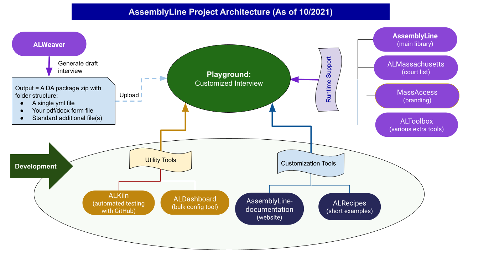

This page provides a bird's-eye view of how various repositories of the **Document AssemblyLine Project** work together. This information is intended for those who want to take full advantage of the Project for their interviews, and for those who potentially want to adopt our Project for their own state or country.  

Below is a snapshot of the Project's overall architecture as of **June 2022**. We will periodically update this page, as the Project is still under active development to add new functionality and enhance the performance.

## Overall architecture

## Components

| Component | Description | GitHub Repository |
|:----------|:------------|:------------------|
| [AssemblyLine](https://github.com/suffolkLITLab/docassemble-AssemblyLine) | Utility library that makes it easier to use certain Docassemble features in an interview. | [SuffolkLITLab/docassemble-AssemblyLine](https://github.com/SuffolkLITLab/docassemble-AssemblyLine) |
| [ALWeaver](../authoring/weaver_overview.md) | Helps create a draft interviews from PDF and DOCX forms. | [suffolkLITLab/docassemble-ALWeaver](https://github.com/SuffolkLITLab/docassemble-ALWeaver) |
| [ALToolbox](https://github.com/SuffolkLITLab/docassemble-ALToolbox) | Utility functions and components that are used in AssemblyLine but that can be easily used by Docassemble developers who use other platforms. | [SuffolkLITLab/docassemble-ALToolbox](https://github.com/SuffolkLITLab/docassemble-ALToolbox) |
| [ALKiln](../components/ALKiln/intro.mdx) | Automated testing framework that acts like a user, following your instructions to do things like fill in fields, upload files, sign in, and check your PDFs for accuracy. | [SuffolkLITLab/ALKiln](https://github.com/SuffolkLITLab/ALKiln) |
| [ALDashboard](/docs/components/ALDashboard/overview) | A collection of tools to help administer a Docassemble server and debug interviews. | [SuffolkLITLab/docassemble-ALDashboard](https://github.com/SuffolkLITLab/docassemble-ALDashboard) |
| [ALRecipes](../components/ALRecipes/alrecipes_overview.md) | Examples for Document Assembly Line interviews, plus generic Docassemble examples addressing specific needs. | [SuffolkLITLab/docassemble-ALRecipes](https://github.com/SuffolkLITLab/docassemble-ALRecipes) |
| [InterviewStats](https://github.com/SuffolkLITLab/docassemble-InterviewStats/) | A docassemble interview that lets you view statistics from other saved interview responses. | [SuffolkLITLab/InterviewStats/docassemble-InterviewStats](https://github.com/SuffolkLITLab/docassemble-InterviewStats/) |
| Documentation | This website. | [SuffolkLITLab/docassemble-AssemblyLine-documentation](https://github.com/SuffolkLITLab/docassemble-AssemblyLine-documentation) |
| E-Filing Proxy Server |  | [SuffolkLITLab/EfileProxyServer](https://github.com/SuffolkLITLab/EfileProxyServer) |
| E-Filing Integration |  | [SuffolkLITLab/docassemble-EFSPIntegration](https://github.com/SuffolkLITLab/docassemble-EFSPIntegration/) |

## GitHub Repositories for Projects

### Massachusetts
Due to the LIT Lab's extensive work with the Massachusetts Appeals Court, these repositories help model court, venue, and jurisdiction information in Docassemble for Massachusetts and as a possible starting point in other jurisdictions.

1. [ALMassachusetts](https://github.com/suffolkLITLab/docassemble-ALMassachusetts)
1. [MassAccess](https://github.com/suffolkLITLab/docassemble-MassAccess)
1. [MACourts](https://github.com/GBLS/docassemble-MACourts)