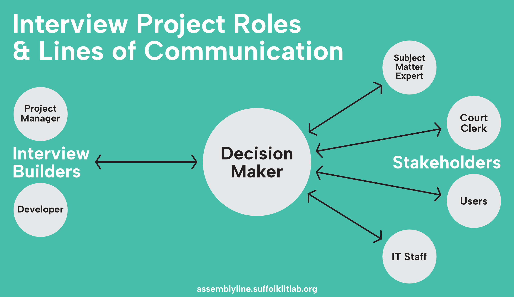

Whether you are a LIT Clinic student, a recent [Forms Camp](https://www.ncsc.org/consulting-and-research/areas-of-expertise/access-to-justice/forms-camp) graduate, or anyone else getting started on an interview project—whether it is your first or fiftieth—this page will guide you through the stages of an interview-building project, from concept to launch.

<!-- 

Audience/who is using this page: Forms Camp grads. In other words, someone at a court or legal aid org who is going to start building an interview.
Planning an interview/[working with a team](https://suffolklitlab.org/docassemble-AssemblyLine-documentation/docs/authoring/working_with_teams/)
Project board overview and usage
Show the pain of merging first—as a way to persuade people to use GitHub well earlier
Creating issues
  Use to track questions for decisionmaker meetings.
-->

## Identify Roles

There are three essential roles on an interview building project, and two of them may have sub-roles.

1. **Interview builders.** The person or team responsible for building the actual interview, including at least one developer and a project manager.
2. **Decisionmaker.** One person who is responsible for managing stakeholders and converting their feedback into clear decisions.
3. **Stakeholders.** Anyone who needs to have a say in the interview project, such as managers, judges, clerks, subject matter experts, IT staff, and users (self-represented litigants and lawyers).

:::note
One person may have multiple roles, and there may be multiple people in any role other than the decisionmaker. You may have a team of interview builders and dozens of stakeholders, or you may be the only person working on this project.
:::

**The decisionmaker is probably the most important role for a successful interview project.** Most interview projects have multiple stakeholders, which can result in confusing or conflicting feedback.

Without a decisionmaker, interview builders must try to interpret the feedback they receive, then seek further feedback on their proposed solution, which often results in more confusing feedback, and so on. This dramatically slows progress. 

With a decisionmaker, interview builders should have clarity in order to keep moving forward. In order to be successful an interview project should have a single decisionmaker whose job includes:

* Being a single point of contact and single source of decisions
* Regular meetings with the interview building team
* Timely responses to requests for feedback
* Gathering feedback from stakeholders and converting it to clear decisions
* Making the go/no-go decision to launch the interview

## Kickoff Meeting

As early as possible after you have identified the roles above, schedule a kickoff meeting for the interview building project. The interview building team, the decisionmaker, and the key stakeholders should attend.

Kickoff meeting agenda:

* Introduce the development process (you can use this page)
* Define roles and responsibilities
* Identify the single decisionmaker (most important)
* Define the requirements—including things we'll need in the future
* Discuss MVPs and select the maturity model level
* Discuss "change orders"—establish a process for changing the scope of the process
* Identify the source documents
* What does success look like? How do we measure it?
* How do we know if this project isn't going to work? Failure states
* Schedule a regular check-in with the decisionmaker to keep them, ask and answer questions, and get decisions when you need them to move forward.

How does this look different when you are your own stakeholder? (All this stuff still needs to happen!)

## Building the Interview

What the building workflow/cadence/whatever looks like 

* Coding (incl. collaboration—link to GH workflow)
* Getting support: community meetings/posting questions to DAL Teams/Slack
* Testing
* Regular stakeholder check-ins

## Get Feedback on the Draft Interview

## Get a Go/No-Go Decision

## Launch the Interview

============

## Prepare the Court Form for the Weaver

Before you can use the Weaver you must prepare each PDF or DOCX document with fields and labels for the Weaver to recognize. These pages will help:

* ["Weaving" your form into a draft interview](../generating_code)
* [Working with PDF Files](../pdfs)
* [Working with DOCX Files](../docx)
* [Field labels to use in template files](../label_variables)

If you don't have much experience with the Weaver, ask someone with more experience to review your prepared documents before you run them through.

While you prepare your document(s) for the Weaver, get set up in GitHub and start using our project template.

## Use Our GitHub Project Template

https://github.com/orgs/SuffolkLITLab/projects/22