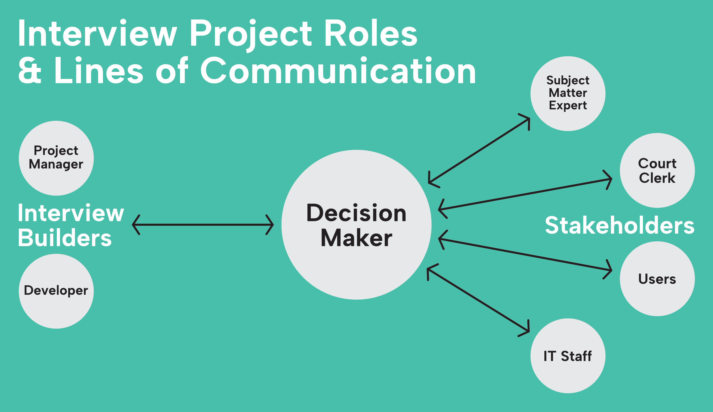

Whether you are a LIT Clinic student, a recent [Forms Camp](https://www.ncsc.org/consulting-and-research/areas-of-expertise/access-to-justice/forms-camp) graduate, or anyone else getting started on an interview-building project, this page will guide you through the stages of a successful project.

This roadmap reflects the procedures, templates, and tools the LIT Lab uses on our own interview-building projects, which you can adapt to your projects.

:::tip
If this is your first interview-building project, it may help to read more about [planning and building your first expert system](https://projects.suffolklitlab.org/legal-tech-class/docs/interview-structure/building-an-app-outline).
:::

## Identify Key Roles & Responsibilities

Every interview project has:

1. **Interview builders.** The person or team responsible for building the actual interview.
2. **Decisionmaker.** One person who is responsible for managing stakeholders and converting their feedback into clear decisions for the interview builders.
3. **Stakeholders.** Anyone who needs to have a say in the interview project, such as managers, judges, clerks, subject matter experts, IT staff, and users (self-represented litigants and lawyers).

:::note
You may have a team of interview builders and dozens of stakeholders, or you may be the only person working on this project. Even if this is a solo project, it helps to keep your different roles in mind.
:::

### The Decisionmaker

**While a successful interview project needs all these roles, the decisionmaker is especially important.** Most interview projects involve multiple stakeholders. When the interview building team requests guidance or feedback, multiple stakeholders may give multiple responses that may be confusing or conflicting and dramatically slow progress.

The decisionmaker's job is to gather and clarify stakeholders' feedback so that interview builders have clear decisions to work from. The decisionmaker's responsibilities also include:

* Being a single point of contact and single source of decisions
* Regular meetings with the interview building team
* Timely responses to requests for decisions and feedback
* Gathering feedback or approvals from stakeholders and converting it to clear decisions
* Making the go/no-go decision to launch the interview

The decisionmaker must either (1) have the authority necessary to carry out these responsiblities, or (2) be responsible for getting authority when necessary.

## Kickoff Meeting

Schedule a kickoff meeting for the project as early as possible. The interview building team, the decisionmaker, and the key stakeholders should attend.

The goal of a kickoff meeting is to get everyone on the same page when it comes to roles, expectations, and timeline. A good kickoff meeting sets the stage for a successful project.

Here is a sample kickoff meeting agenda:

* Introductions
* Identify the decisionmaker
* Development process overview (use this page)
* Schedule regular check-ins with the decisionmaker and one or two key stakeholders
* Introduce the source form/document, its context, and its users. In other words:
  * Who can use this interview? In which language(s) will they be able to read and write? (Consider creating a couple of [user personas](https://en.wikipedia.org/wiki/Persona_(user_experience)) together.)
  * What are they called (i.e., plaintiff, respondent, or appellee)?
  * What can/can't this interview be used to do?
  * Explain the court process leading up to someone using this interview.
  * Identify the substantive laws or procedural rules the interview builders should be familiar with.
  * Where and how must the completed documents be filed, served, or delivered?
* Agree on a [minimum viable product (MVP)](#stick-to-an-mvp)
* Define the requirements for this interview
* Agree on a process for changing the scope of the project (i.e., adding features)
* Discuss the timeline. Key dates:
  * Start date
  * Draft interview completed
  * Preliminary feedback
  * Decisionmaker/stakeholder feedback
  * Interview finalized and ready for go/no-go decision
  * Launch
* Discuss what success looks like for this project, and how you will measure it
* Consider doing a [pre-mortem](https://en.wikipedia.org/wiki/Pre-mortem)—imagine this project has failed and discuss why

:::tip
### Stick to an MVP
A minimum viable product (MVP) is the essence of of iterative, incremental development—first make something that works, then make it better.

Consider [Henrik Kniberg's skateboard analogy](https://blog.crisp.se/2016/01/25/henrikkniberg/making-sense-of-mvp):

Different projects will have different MVPs/"skateboards". The [legal form maturity model](https://suffolklitlab.org/legal-tech-class/docs/legal-tech-overview/maturity-model/#quick-summary) can help you identify the MVP for your project (interviews built for the general public should usually target level 2+). Once you decide what this project's MVP is, stick to it. Don't add to the MVP without a compelling justification.
:::

## Complete the Draft Interview

After the kickoff meeting it is time to get to work! As you work on the interview, follow the [GitHub workflow](../github.md#workflow). If you get stuck on a problem for more than twenty minutes, ask for help. (Use the [Resources](resources.md) page to find options.)

:::tip
The LIT Lab's [interview project template](https://github.com/orgs/SuffolkLITLab/projects/22) can help you keep your project organized and on track. Just click the **Use this template** button to use it. (You'll need a free [GitHub](../github.md) account.)
:::

## Meeting Cadence

Two recurring meetings will help you keep the project moving forward. These are short, 5–15 minute "standup" meetings to share progress and identify and remove blockers—anything preventing someone from making progress.

### Interview-Building Team Meetings

The interview-building team should meet frequently. Daily check-ins are common on active projects, and anything less than weekly is unlikely to be effective.

:::tip
Consider incorporating our Monday community meetings into your standup schedule. We run them standup-style, with time for solving blockers as a group. If this is a solo project, the Document Assembly Line community can be part of your interview-building team!
:::

These meetings should follow a straightforward standing agenda. Each person on the team should share:

1. **Progress:** what they worked on or accomplished since the last meeting
2. **Plan:** what they are working on now
3. **Blockers:** issues that are preventing them from making progress

The reason for sharing your progress and plan for the day or week is so that everyone has an idea what everyone else is working on. This is necessary for the project manager, and can help interview builders avoid code conflicts or identify when it's time to merge branches.

The reason for sharing blockers is to get help. Some teams reserve a larger block of time and use it to solve blockers together, like we do in our Monday community meetings. Other teams prefer to solve blockers separately. And sometimes a blocker is a question you need answered by the decisionmaker.

### Decisionmaker Meetings

Weekly or every-other week meetings with the decisionmaker and one or two key stakeholders are a chance to keep them informed of your progress and get decisions when you need them to move forward. The standing agenda is similar to the one above:

1. **Progress:** what the interview-building team worked on or accomplished since the last meeting
2. **Plan:** what the interview-building team plans to work on between now and the next meeting
3. **Questions:** oustanding questions that are preventing the interview-building team from making progress

When sharing progress and the current plan, it can help to give a percentage estimate. Something like: "We think we are about 30% of the way to a complete draft interview, and by our next meeting we hope to be at 50%."

:::tip
Use [GitHub issues](../github.md#use-issues) to keep track of your questions for the decisionmaker. If you add a **question** label to issues, it is easy to pull up the list of your questions during a meeting.
:::

To get better answers, ask questions better. Here are some tips for asking questions:

* Only ask for a decisions when you can't make it yourself. Before you pose a question to the decisionmaker, ask your interview-building team (or the community).
* Avoid open-ended questions. When you decide to pose a question to the decisionmaker, give them two or three options and explain the pros, cons, and implications of each.
* If you do ask an open-ended question, explain that you are trying to generate ideas, not decide on a solution.
* Don't ask the decisionmaker to design the interview. It is usually better to ask for goals ("Do you need the attorney's ID number?"), not details ("Do you want the ID number field to show up right under the attorney's name field?").

**Remember: if you ask a question you will get an answer.** If you don't need an answer, asking for one is not likely to help and may complicate the project.

Finally, when showing the relevant part of the interview as part of asking a question, remind the decisionmaker and stakeholders that the interview is a work in progress and you are not ready for feedback beyond the answer to your question.

## Get Feedback on the Interview

Once the interview works from start to finish and you have closed all the issues that are in scope for the [MVP](#stick-to-an-mvp), it is ready for feedback. Start by getting preliminary feedback from someone with Document Assembly Line experience. After you have made revisions based on the preliminary feedback, give the interview to the decisionmaker and stakeholders for their feedback.

:::tip
For complex interviews that involve multiple forms/templates, consider doing this in stages. Start with the simplest form and get preliminary and stakeholder feedback early. Then move on to the most complex form to confirm the shape and logic of the overall interview. Then continue with the remaining forms.
:::

### Preliminary Feedback

Before you show the interview to the decisionmaker and stakeholders, get someone with Document Assembly Line experience to test it with you. This will help you identify issues you may have missed and questions you still need to ask the decisionmaker.

:::tip
If you aren't sure where to find someone to give you preliminary feedback, try asking [the community](http://localhost:3000/docs/get_started#join-the-community)! Come to one of the Monday community meetings or ask in the Microsoft Teams forum.
:::

Schedule a video meeting with the tester so you can watch them go through the interview. Or they can watch you demonstrate it. Record the test if you can so you can focus on the test instead of taking notes.

During the demonstration or testing:

* Encourage the tester to comment on all aspects of the interview
* Ask them to follow different branches of the interview logic
* Listen carefully to their feedback and ask follow-up questions to make sure you understand it

### Stakeholder Feedback

Once you have closed all the issues that are in scope for the [MVP](#stick-to-an-mvp) and tested the interview yourself, it should be ready to hand off to the decisionmaker and stakeholders for their testing and feedback.

Share the interview with the decisionmaker and give them a few tips for giving helpful feedback:

* The feedback should come in the form of a written list of requested changes
* If there is confusing or conflicting feedback from stakeholders it is the decisionmaker's responsiblity to clarify it before presenting it to the interview building team
* Change requests should be specific. For example, if the text of a question should be changed, the change request should include the new text.
* At the top of each page of the interview is an ID. This ID is a reliable identifier when referring to an interview page. (For example, the "fifth page" might be different depending on the interview logic.)

## Revise the Interview

After getting feedback, create a [GitHub issue](../github#use-issues) for each change request from the tester or decisionmaker. Consider this your "punch list" to finish the project. Then get back to work on those issues!

When you have closed all the issues/items on your punch list, send it back to the decisionmaker for further feedback. Each round of feedback should result in fewer change requests and move the project closer to completion.

:::info
Two rounds of feedback and revision are usually enough. It it takes more than three, consider ways to improve your process going forward.
:::

## Get a Go/No-Go Decision

When the interview is complete, there is one last decision for the decisionmaker to make: whether the interview is ready to go live.

If the answer is yes, launch the interview!

If the answer is no, find out if further revision would result in a yes. If not, [do a retrospective](#do-a-retrospective) and try to understand what happened.

## Launch the Interview

When you are ready to launch, add the interview to your production server and make sure it works as intended.

Once the interview is live, consider how people who need it will find it.

* You should have a dedicated page on your website that tells people about the interview and links to it. Put some thought into this page so people can find it by searching Google.
* Others might want to direct people to the interview, like courts, legal aid organizations, and other advocates. Ask them to link to your landing page from their own websites.
* Paid advertising can help spread awareness, if you have a budget for it.

You can also set up [collect analytics](../analytics/tracking_usage) to learn how people are finding and using the interview.

## Do a Retrospective

Before you start another interview-building project, pause briefly for a retrospective on how this one went. The retrospective format comes from [Agile software development](https://en.wikipedia.org/wiki/Agile_software_development), and it is a way to embrace continuous improvement by taking a moment to reflect on the project you just finished in order to improve the next one.

To do a retrospective, gather the group and discuss three questions:

1. What went well that we should keep doing?
2. What did not go well that we should stop doing?
3. What should we try going forward?

Retrospectives are generally more effective when the team is together in real time—on Zoom, for example. Depending on the group dynamics you can do a retrospective as a group or meet with one person at a time.

:::tip
Insist that everyone give at least one answer to each question. Even if someone insists nothing went badly, ask if they found themselves confused or struggling at any point during the project. Their answer may lead to an area that could be improved.
:::

Use what you learn from the retrospective when planning your next interview-biulding project.