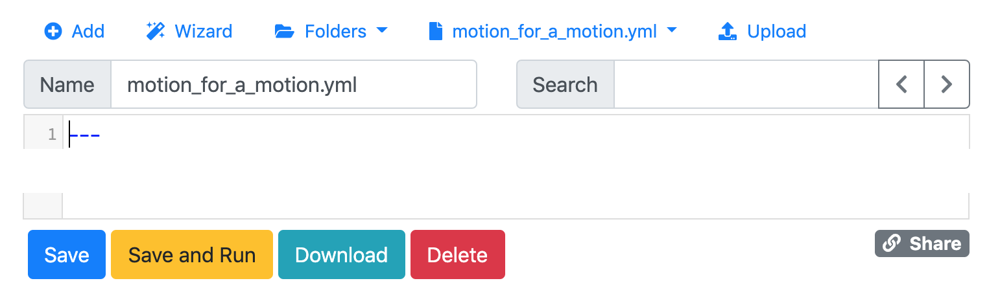
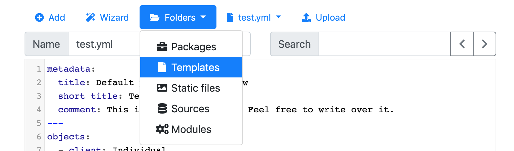
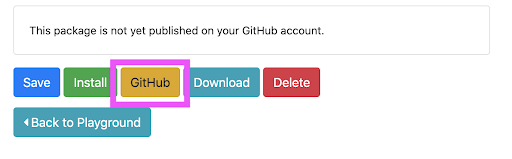
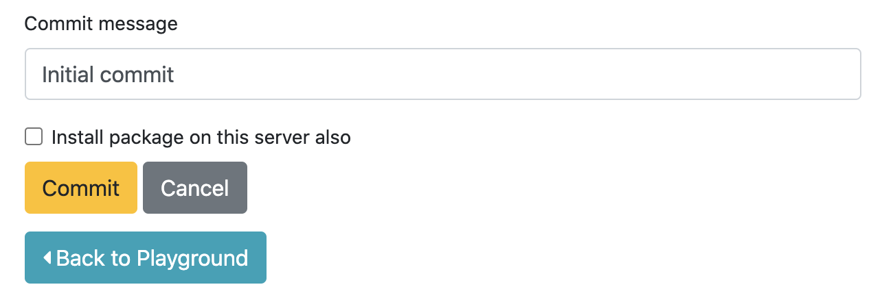
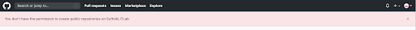
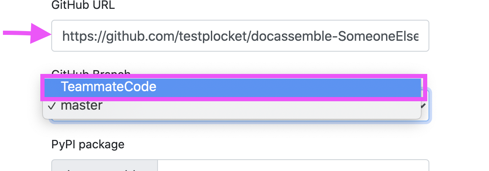

We strongly recommend using [GitHub](https://github.com/) with Docassemble. GitHub is a version control system. It lets you save a snapshot of your interview that you can revert to an earlier version if you need to and see changes over time. GitHub also makes it easier to build interviews as a team, get help, and hand off your code to future interview builders and maintainers.

Here are some more reasons to use GitHub with Docassemble:

* Save versions of the interview code you are working on so you can back up to an earlier version/save point if new edits break something.
* Collaborate with others to build Docassemble interviews, get help, and hand off your code to future interview builders and maintainers.
* Share your code with others who might want to build similar interviews.
* Create branches to work on specific issues, or create multiple branches to keep different issues isolated from each other while you work on them.
* Track and discuss issues with your code, like tasks, bugs, feature requests, etc. Issues can be assigned, tagged, and attached to commits and pull requests that complete or fix them.
* Use projects to gather issues from multiple repositories and organize them on a Kanban-style project board.

:::info
This page covers how to use GitHub with Docassemble. Refer to the [GitHub documentation](https://docs.github.com/en) if you have questions about its features. The [Git documentation](https://git-scm.com/doc) may also be helpful if you want to understand GitHub's underlying version control software.
:::

## Workflow

Here is what we recommend for a workflow for using GitHub with the Docassemble playground. Repeat these steps each time you start working on a new task or issue:

1. Create a new project in your Docassemble playground, then pull the `main` branch of your interview from GitHub.
2. When you commit from that playground project, commit to a new branch.
3. When you finish working on the branch, commit it one last time. Then go to the repository in GitHub and create a pull request. If you are working with someone on the interview, request a review from them.
4. Once you have resolved any conflicts and any reviewers have signed off, merge the pull request.
5. Decide on the next task or issue you want to work on and start over at #1.

For more detail on these steps, see below.

## Set Up GitHub in the Docassemble Playground

In order to use GitHub with Docassemble you will need two things:

1. Developer privileges on a Docassemble development server with the [GitHub integration configured](https://docassemble.org/docs/installation.html#github). (If you don't have access to a Docassemble development server, [contact us](mailto:litlab@suffolk.edu).)
2. A [GitHub](https://github.com/) account. If this is a new account, you may want to [keep your email address private](https://docs.github.com/en/account-and-profile/setting-up-and-managing-your-personal-account-on-github/managing-email-preferences/setting-your-commit-email-address#setting-your-commit-email-address-on-github) and [avoid sharing your email address on commits](https://docs.github.com/en/account-and-profile/setting-up-and-managing-your-personal-account-on-github/managing-email-preferences/blocking-command-line-pushes-that-expose-your-personal-email-address).

Then, follow the [Docassemble instructions for publishing an interview package to GitHub](https://docassemble.org/docs/packages.html#github).

## Best Practices

### Commit Early & Often

A commit is a save point. It saves your progress and creates a snapshot of the current state of your interview code. It also helps you find old, working code when something breaks or you need to track down a bug.

GitHub can't help you if you don't use it, so **commit early and often**!

:::tip
When you first start working with Docassemble it can be hard to remember to stop and commit. Try creating a daily reminder on your phone.
:::

You can commit to a branch as often as you want. Developers often wait to commit code until they have it working, but they also might commit broken code so other people can help them troubleshoot, or to save their progress. If you are concerned about ruining working code, [make a new branch](#making-a-new-branch-for-a-new-goal-or-bug-fix) for the broken code and commit it to that branch.

#### Commit Your Interview Code

1. In the Playground, select **Packages** from the **Folders** menu.

1. Scroll to the bottom of the page.
1. Review the **README file** text to make sure it mentions the jurisdiction the interview applies to and describes the documents generated by the interview.
1. Click on the **GitHub** button.
1. Select the branch you want to commit to, or create a new branch.
1. Enter a [commit message](#commit-messages).
1. Click the **Commit** button. 
1. That's it! Your commit should show up on GitHub!

#### Commit Messages

A commit message is required to make a commit. Commit messages are more helpful if they describe the specific change(s) you just made. You can write commit messages like a task on a to-do list. For example: "Updates cash income question" or "Fixes broken address field." That way, when you look back over your list of commits you can reconstruct the work you did. If you need to undo (revert) a commit, your commit messages can help you find the specific commit.

Commit messages can also link to or close issues, just like [pull request messages](#close-an-issue-with-a-pr).

### Use Branches

Make a new branch when you start working on a new feature or fixing an error. The new branch keeps your previous work separate and lets other people see the changes before they are merged into the `main` branch with a pull request.

It preserves your previous work so that it isn't affected by these changes and lets other people see the changes before they're completely added in. This is very similar to committing changes, but has a couple additional steps.

1. Make at least one change. Edit code or include a new file with cmd/ctrl + click.
1. [Go to "Packages"](#go-to-the-package) and tap "GitHub".  <!-- TODO: Should we break these paths out into their own sections? A section on menus? Does docassemble have that documentation already? -->
1. In the branches dropdown, select `New Branch`.
1. Give the branch a [snake_case](naming#snake_case) name.
1. Commit your changes with a [commit message](#commit-messages).

You will now be able to see your new branch on GitHub! If you want, you can [compare your branch to any other branch](https://docs.github.com/en/github/committing-changes-to-your-project/comparing-commits) and see the exact differences.

<!-- TODO: Move the naming conventions here to the name formats doc? -->
:::note Branch name
A branch name reminds you and your collaborators, at a glance, what topic, problem, or feature the branch is for. 1 to 3 words separated by underscores is usually a good guideline. Example: `income_questions` or `income_calculations`
 
**More advanced:** Include the issue number and type of goal of the branch - a feature, a fix, etc. Example: `116_fix_income_calculations` or `42_feature_deductibles`.
:::

#### Branches vs. commits
**Branches** should encapsulate specific goals, like adding a set of questions or creating automated tests for one path in your interview.

**Commits** should encapsulate one particular action in a branch. One commit might be adding one question or getting one part of the code working, even if other parts still need some work. Together, individual commits add up to the complete feature. A commit might fix typos, improve readability of the first three questions, or add the question about debt.

<!-- Here's where we left off. This is the code we pushed in our first commit.  -->
<!-- 
:::note
Our convention for formatting: All lowercase alphanumeric separated by underscores.

One convention for branch names: They're to remind you and your collaborators basically what it's for at a glance, so one to three words separated by underscores is usually a good guideline. Example: income_questions or income_calculations.

**More advanced:** The issue number and type of action you're doing and. Example: 116_fix_income_calculations or 42_feature_deductibles.
:::

*This is an example of creating a new branch that relates to an "issue" created in GitHub, (issue 12). This branch is created to work on the task in issue 12, develop review screens, which is a late stage part of the interview development. *
 -->
<!-- A similar message should appear at the top of the page when you have successfully commit the package to GitHub.  -->

### Use Issues

Keywords: Tasks, todo lists, bugs, features, documentation, milestones

<!-- TODO: Add link to maturity model? -->

#### When to make an issue

You can make an issue to:
1. Document a decision. It is useful to include who was involved in the discussion and why that decision was made. Some example decisions might be about language choices, question-type, order, and flow. When new people come to work on the form we don't want to duplicate work that's already been done or to re-interrogate old decisions without the context of why they were made.
1. Add a new task. For example, problems that needs to be researched or programmed. Research could involve consulting a specific SME (subject matter expert) and you, or someone commenting on the issue, could note their name.
1. Categorize and organize tasks. For example, MVP items, version 2 improvements, and bugs.

Give all the links possible! All context!

#### What to do with issues

See the GitHub docs about:
1. [Making an issue](https://docs.github.com/en/github/managing-your-work-on-github/creating-an-issue).
1. [Assigning the task to yourself or another member](https://docs.github.com/en/github/managing-your-work-on-github/assigning-issues-and-pull-requests-to-other-github-users).
1. [Adding labels](https://docs.github.com/en/github/managing-your-work-on-github/managing-labels).
1. [Creating milestones](https://docs.github.com/en/github/managing-your-work-on-github/creating-and-editing-milestones-for-issues-and-pull-requests).
1. [Adding a milestone to an issue](https://docs.github.com/en/github/managing-your-work-on-github/associating-milestones-with-issues-and-pull-requests) (you can only have one milestone one per issue).

## New forms

### Prepare a new Project

You can also see [the docassemble docs on how to create new Projects](https://docassemble.org/docs/playground.html#projects).

:::warning
Follow [the Project naming rules](name_formats.md#docassemble-projects-and-packages-pascalcase) or you will get an error: a unique name that starts with an alphabetical letter and uses only alphanumeric characters.
:::
<!-- (TODO: Add link to creating a package) -->
<!-- (TODO: Add link to pushing the package) -->

**Summary**

1. [Go to "Playground"](#go-to-the-playground) > "Manage Projects", create a new Project, and [name it appropriately](name_formats.md#docassemble-projects-and-packages-pascalcase).
1. Go back to "Playground" and upload your files or make a new file. The name of the YAML file should be the [name of your form](name_formats.md#form-files-stored-in-docassemble-snake_case).
1. [Go to Packages](#go-to-the-package) and save your package. Its name should be based on the form name and [follow conventions](name_formats.md#docassemble-projects-and-packages-pascalcase).
1. [Commit/push the package to GitHub](https://docassemble.org/docs/packages.html#github).

**Details**

In the Playground, tap the top left dropdown and select "Manage Projects".

[Make a new Project](https://docassemble.org/docs/playground.html#projects) and [name it appropriately](name_formats.md#docassemble-projects-and-packages-pascalcase).

Tap your new Project's name.

The Playground will open the Project with a default "test.yml" file. Either [add a new file](#create-a-new-yaml-file) or upload your generated `.yml` file by tapping "Upload".

[Create your Package and push it to GitHub](#create-a-new-repository).

### Create a new YAML file
**Summary**

[Go to the Playground](#go-to-the-playground), tap "Add", and give the file [an appropriate name](name_formats.md#form-files-stored-in-docassemble-snake_case).

**Details**

[Go to the Playground](#go-to-the-playground) and tap "Add".

Give the file [an appropriate name](name_formats.md#form-files-stored-in-docassemble-snake_case). Then save the file.

Your save options should change below the code area to indicate the save was successful.

### Upload a YAML file
See the [docassemble docs about Playground YAML files](https://docassemble.org/docs/playground.html#interview_files).

### Upload a package
See the docassemble docs to [use a zip file to upload a package](https://docassemble.org/docs/playground.html#packages).

### Template Files: Upload the PDF or DOCX file that your code fills out
See the docassemble docs about [uploading template files](https://docassemble.org/docs/playground.html#templates).

**Summary**

[Navigate to Playground](#go-to-the-playground) > "Folders" > "Templates" and upload your file.

**Details**

[Go to the Playground](#go-to-the-playground) and make sure you're in the right Project.

Tap "Folders" and then "Templates".

Your file will be in the list below of available templates.

### Create a new repository
aka. Create a new Package, commit or upload a new Package to GitHub for the first time.

This is about creating a brand new Package from new files. If you are creating a new Package from the files of an old Package, we hope to develop a section for that in the future.

A docassemble **Package** bundles code, metadata, dependencies, and your PDF's or DOCX files into one place for you and others to access. You get to pick and choose the files that you want to go into that particular Package.

Also see docassemble docs about [pushing a Package to GitHub by committing](https://docassemble.org/docs/packages.html#github) and [about Packages in general](https://docassemble.org/docs/packages.html).

:::warning
Sometimes docassemble will not create a new repository on GitHub. If your Package name matches the name of a Package that is already in your GitHub repository or in a repository of an organization you belong to, docassemble will try to push to that repository instead of creating a new repository.

In most cases, you will get a "merge conflict" error when this happens.
:::

**Summary**

1. [Go to "Packages"](#go-to-the-package).
1. Give your new Package a name.
1. Save it.
1. Commit to GitHub.

<!-- TODO: use pic where project name is different than form name. -->
<!-- TODO: Advanced note: If you make changes to the files or re-upload your PDF or DOCX to your Templates folder, as long as you use the same name, everything updates by itself. If you change the name, you will need to select that file in here again.  -->
<!-- Advanced note: A good commit message also helps you find your place when you need look back through your code -->
<!-- TODO: Add... note?: Avoid the "install package" checkbox. Leave it alone. -->
<!-- TODO: Add... caution?: Never hit "Install". Leave it alone. -->
<!-- TODO: Add advanced: One convention for commit messages is to write them as if they were an item in a todo list. Example: "Fix #19, update income question" - start with a verb (link to committing and to issues sections) -->

**Details**

[Switch to the correct Project](https://docassemble.org/docs/playground.html#projects) if you need to. [Go to the Project's Packages folder](#go-to-the-package). [Name your Package](name_formats.md#docassemble-projects-and-packages-pascalcase) based on your document file name. Example: The name of the marriage_without_delay.pdf package would be "MarriageWithoutDelay".

Scroll down to the boxes further down the page. Use cmd/ctrl + click to select the YAML files and documents you want to have in your repository. For example, here we would select plaintiff_s_motion_to_modify.yml and plaintiff_s_motion_to_modify.pdf.

Scroll down to the bottom and tap Save.

If you have [configured your GitHub account](#connect-github-to-your-docassemble-account), once your package saves and the page reloads the GitHub button will appear near the Save button. Tap GitHub.

You **must** write a message describing what this commit is for. [Read more about commit messages here](#commit-messages). This is the first commit message, though, and a common first commit message is "Initial commit". When your message is ready, tap "Commit".

Look at the bottom of the Package screen again. Just above the Github button will be links to your new repository.

You can also read the [docassemble docs on pushing your package to GitHub by committing](https://docassemble.org/docs/packages.html#github)

### Transfer ownership to your organization

After the repository's ownership is transferred, only people who have permissions in your organization will be able to work on the code. Your organization can [give people permissions through GitHub](https://docs.github.com/en/github/setting-up-and-managing-organizations-and-teams/repository-permission-levels-for-an-organization).

Read the GitHub docs on [transferring ownership of your repository](https://docs.github.com/en/github/administering-a-repository/transferring-a-repository#transferring-a-repository-owned-by-your-user-account).

<!-- TODO: Transferring before divorcing a fork from upstream will cause an error -->

If your organization has teams, pick which teams can have access to this repository.

Check your organization's GitHub page to make sure your project appears there. You may have to ask give the administrator the new link to the repository and ask them to [give the rest of the team permissions on it](https://docs.github.com/en/github/setting-up-and-managing-organizations-and-teams/managing-team-access-to-an-organization-repository).

:::warning
If you get a pink error message that says you don't have permissions, you have not been [added as a member of that GitHub organization](#join-your-organization).

:::

## Sharing code

Mistakes will happen. You will accidentally include changes you didn't mean to include or push to the wrong branch. The great thing is that you can't break things permanently. GitHub uses `git` for version control and it's specifically made for rolling back changes. Docassemble does not give full access to its features and its a complex ecosystem, so someone more experienced may need to lend a hand, but it's all there. Your gut won't believe it right now, but you will come to trust the process.

### Request others test your code

<!-- TODO: Consider adding procedure with an intermediate branch -->

aka. Getting a review, making a PR, a pull request, a merge request.

You can see [a list of your repository's branches in GitHub](https://docs.github.com/en/github/administering-a-repository/viewing-branches-in-your-repository) and you can make a pull request from there to merge a branch's changes into your [default branch](https://docs.github.com/en/github/collaborating-with-issues-and-pull-requests/about-branches#about-the-default-branch).

1. [Create a pull request](https://docs.github.com/en/github/collaborating-with-issues-and-pull-requests/creating-a-pull-request#creating-the-pull-request).
1. If this PR is related to an issue, edit the description to link to the issue. You can use the same format as described in [the section about closing an issue with a PR](#close-an-issue-with-a-pr).
1. Edit the description to [add a checklist](https://docs.github.com/en/github/managing-your-work-on-github/about-task-lists#creating-task-lists) of things the reviewer needs to check or test.
1. [Request a review from another member](https://docs.github.com/en/github/collaborating-with-issues-and-pull-requests/requesting-a-pull-request-review).
1. Send a message to that person to let them know you've assigned them as a reviewer.

### Merge conflicts

aka. Errors combining two branches, trouble merging, trouble combining, resolve merge conflicts, fixing merge conflicts between two branches, branches diverged

Sometimes when you start to [make a pull request](#request-others-test-your-code), GitHub will tell you that you have a [merge conflict](https://docs.github.com/en/github/collaborating-with-issues-and-pull-requests/about-merge-conflicts). This means that while you were making changes to your branch, changes were also made to the branch you are trying to merge with and they changed the same lines of code. Git will not decide which bits of code to keep where - you have to decide that.

These are unavoidable and a pain to deal with. Everyone runs into them now and again and they are tricky to resolve without introducing bugs.

:::tip
Ways to reduce the likelihood of merge conflicts:

1. If possible, make the goals of your branches small so that you only make a few changes on a branch before making a pull request with it.
1. Merge pull requests in the order they were made.
1. Avoid editing the same sections of code at the same time.
1. If you are working with collaborators, try to make sure you are working on tasks that do not edit the same lines.
:::

You can still make your pull request, but GitHub will prohibit merging. There are two ways GitHub might handle merge conflicts:

1. GitHub allows you to ['resolve' the conflict in GitHub itself](https://docs.github.com/en/github/collaborating-with-issues-and-pull-requests/resolving-a-merge-conflict-on-github) by editing the files in GitHub.
1. GitHub is unable to help you resolve the issue (it doesn't offer the option).

Either way, the most reliable way to deal with this situation is, unfortunately, to redo your changes on top of the new code:

1. Make the pull request as usual, and use it as a tool. The changes you made will be highlighted in the [file comparison tab](https://docs.github.com/en/github/collaborating-with-issues-and-pull-requests/about-comparing-branches-in-pull-requests).
1. In docassemble [create a new Project](https://docassemble.org/docs/playground.html#projects) and pull in the other branch (the one you want to merge with).
1. Using the file comparison as a guide, manually add your changes back.
1. Make sure functionality affected by your code changes still works the way it should.

<!-- TODO: Add section about updating to a base branch with the warning that conflicts will cause both branches to update -->

### Errors when committing from docassemble

aka. I made edits, but docassemble says I can't push to GitHub.

When you get an error committing (and pushing) from docassemble, nothing has been changed on GitHub. One of three things is probably going on.

1. You have technically not made any changes to the code that is actually being pushed to GitHub.
1. You lack [permissions for that repository](https://docs.github.com/en/github/getting-started-with-github/access-permissions-on-github).
1. The changes between your branch and the branch on GitHub do not match up. That is, there's a [merge conflict](#merge-conflicts).

Scroll to the bottom of the page of the error. The text on this page is a step-by-step log of what is happening in git, the version control technology GitHub uses, and the most recent message is at the bottom. Ignore the line talking about a `Detached head` - this is a red herring. It's actually a natural intermediate part of the process.

#### `nothing to commit, working tree clean`

This means git cannot detect any changes in your code. You cannot commit anything from docassemble if you have not made changes, not even to a new branch. These are possible ways to confirm the problem:
1. If you created a new file you may have not added it to your Package yet. In the image below, only **court_form.docx** has been selected.

On a Mac use **cmd + click** to select a file you need. On a PC use **ctrl + click**. If there are two files with very similar names, make sure the name of the file you need exactly matches up with the name you are clicking.

2. You may have forgotten to save the changes you made to a file. If you still have the file open, you can tap 'Save'. If the file is closed, you will have to make the changes again.
3. You may not have made any changes to files even if you thought you did. To sanity check changes to a code file:
    1. Find a diff checker, like [https://www.diffchecker.com/](https://www.diffchecker.com/).
    1. [Go to the Playground](#go-to-the-playground) to the file you think you've changed.
    1. Copy all the text there.
    1. Go back to the diff checker and paste it in the right-hand column.
    1. In GitHub, navigate to the file you think you changed.
    1. Copy the text in it.
    1. Put it in the left side of the diff checker.
    1. Press the button to compare the text.

If you do not see differences between the files, you have not made the edits you think you have. Are you in the right Project? Did you change a file with a very similar name to another file?

#### [`403`](https://en.wikipedia.org/wiki/List_of_HTTP_status_codes#403)

A `403` error, `remote: Permission to ... denied to ...`, means you have not been given [permission](https://docs.github.com/en/github/getting-started-with-github/access-permissions-on-github) to change things in that repository. The person or organization that owns the package will have to give you or the team you are on 'write' permissions. They could also add you to a team that already has write permissions.

If you are trying to make a new repository on your GitHub account, you may belong to an organization that owns a Package by the same name. You may not have permission to change that repository. You will either have to change the name of your Package, have the organization delete that repository, or have the admin give you or your team 'write' permissions as described above.

If you think your GitHub account does have permission, try re-doing your GitHub integration. You can manage your GitHub integration through the menu on your Profile page.

#### `CONFLICT (content)`

The text `CONFLICT (content): Merge conflict` means the branch you are trying to push to changed while you were making your changes. It is what a [merge conflict](#merge-conflicts) looks like in docassemble in git. Simply [make a new branch](#making-a-new-branch-for-a-new-goal-or-bug-fix) and commit the changes there. Work out the merge conflicts afterwards.

### Testing someone else's code

#### Reviewing PRs
<!-- One of the github teaching tuesdays? -->

When someone assigns you as a reviewer for a pull request, you will be able to see it in [your GitHub pull request list](https://github.com/pulls) or [your notifications page](https://github.com/notifications). You can read more in [the GitHub documentation on seeing your issues and pull requests](see how to navigate therehttps://docs.github.com/en/github/managing-your-work-on-github/viewing-all-of-your-issues-and-pull-requests). To just look at the pull requests for a repository, go to the 'Pull Requests' tab on the repository's home page.

<!-- TODO: Create section on merge conflicts -->

Don't let pull requests hang around too long. Other code will get edited and [merge conflicts](#merge-conflicts) will crop up, making it hard to bring the code back together.

The requester should have left notes on what needs to be tested in the description of the pull request (PR).

**Summary**

1. Pull the code into the a [new Project](https://docassemble.org/docs/playground.html#projects) in your Playground.
1. If the behavior is as expected, approve the changes and merge the branch.
1. If the behavior is not as expected, request changes.

**Details**

[Make a new Project in docassemble](https://docassemble.org/docs/playground.html#projects) and [pull the code](#get-github-code-into-your-playground) from the branch that's making the PR. You can see the name of the branch on GitHub in the pull request itself:

Test the behavior that is affected by the changes in their code. Sometimes it can help to look at the pull request (PR) [file comparison tab](https://docs.github.com/en/github/collaborating-with-issues-and-pull-requests/about-comparing-branches-in-pull-requests) in GitHub to see what code has been changed. If it works as expected:

1. [Write a review](https://docs.github.com/en/github/collaborating-with-issues-and-pull-requests/reviewing-proposed-changes-in-a-pull-request#submitting-your-review) saying what you tested and the results.
1. As described in that documentation, select 'Approve'.
1. [Merge their branch](https://docs.github.com/en/github/collaborating-with-issues-and-pull-requests/merging-a-pull-request).
1. Depending on your agreed upon practices, [delete the branch](https://docs.github.com/en/github/administering-a-repository/deleting-and-restoring-branches-in-a-pull-request#deleting-a-branch-used-for-a-pull-request).

If the interview does not work as expected:

1. [Write a review](https://docs.github.com/en/github/collaborating-with-issues-and-pull-requests/reviewing-proposed-changes-in-a-pull-request#submitting-your-review) that describes what you saw that you think needs changing.
1. As described in that documentation, select 'Request Changes'.
1. Let the requester know about your review.

Finally, [delete the Project](https://docassemble.org/docs/playground.html#projects) you created for the review.

<!-- Clarifying: Comparing the code on GitHub   -->
<!-- Pictures from GitHub as to where to see the comparison. -->
<!-- TODO: Add pictures -->

:::note
1. You can [make comments connected to specific lines of code](https://docs.github.com/en/github/collaborating-with-issues-and-pull-requests/commenting-on-a-pull-request#adding-line-comments-to-a-pull-request).
1. You can make a pull request with someone's branch even if the person is not there as long as you have write permissions on the repository.
:::

### Get GitHub code into your Playground

aka. Uploading your code to the Playground, uploading someone else's code to the Playground, reviewing, pulling, getting your old code back, seeing someone else's code, working on someone else's code

:::warning
**WARNING:** All the files in the repository will replace files of the same name in this Project. Imagine being on your computer, copying a bunch of files to a folder, and getting the message "This file already exists in this folder. Do you want to replace it?". It's the same thing, but docassemble doesn't give you that warning.

If you want to save your changes, [create a new branch](#making-a-new-branch-for-a-new-goal-or-bug-fix) for it before pulling the new code in.
:::

**Summary**

1. [Make a new Project in docassemble](https://docassemble.org/docs/playground.html#projects) and [go to "Packages"](#go-to-the-package).
1. In the menu of blue text at the top, tap 'Pull'.
1. Go to GitHub and get the url (web address) of the repository that has the code.
1. From the dropdown, pick the branch you want to pull from and tap 'Pull'.
1. Go back to your Playground and play!

**Details**

[Make a new Project in docassemble](https://docassemble.org/docs/playground.html#projects) then [go to your Packages folder](#go-to-the-package). In the menu at the top, tap "Pull".

Copy the GitHub url of the repository you are pulling from.

Make sure there is no trailing slash. 
**Yes:** https://github.com/some_user/docassemble-SomeRepository  
**No:** https://github.com/some_user/docassemble-SomeRepository<strong>/</strong>

Back in docassemble, paste the url in the text field.

Tap the dropdown menu and select the branch you want to bring in.

Tap "Pull".

When you return to the Playground, you should see a file from the code you have pulled in.

<!-- 
### Combining code - accepting changes

aka. Merging/merge, pulling/pull, adding someone else's changes to your code

1. That person should have made a pull request with their branch.
1. Test their code.
1. Optional, but decent practice: In GitHub, leave a review message and approval, or ask for changes (in the 'files changed' tab). (bandwidth: add 1. comments on lines)
1. If you approve of it, hit 'Merge pull request' at the bottom of the 'conversations' tab.
1. Hit 'Confirm merge' finish.
1. You or they should delete their branch.
1. You and they should delete the Playground Project you created for the branch.

In your GitHub repository, tap "Pull request"

You will see a list of pull request for the repository, tap on the one you've finished testing.

Here the pull request is "Add examples in questions"

A screen similar to this will appear, you can tap "Files changed" to do a review of what in the code was changed.

This is a side by side comparison of the code.  

Tap "Review changes"

Provide information in the review.

If you are not ready to merge the code because you have a question or hesitation, select "Comment".

If the code is working and looks good, it is ready to merge and select "Approve".

If you found an error or think something needs to change before merging, select "Request changes" 

Tap "Submit review"

If you've approved the code, move forward in the steps.

Finishing your review will automatically move you back to the Conversation tab seen here.

If you are ready to merge: 

Mid way on the screen is the "Merge pull request" option 

Tap it.

To make sure, it asks again.

Tap "Confirm merge" 

The box, once a green icon is now purple, and you've successfully merged the pull request.

You will end up with tons of branches and forget what is what. Once its merged tap "Delete branch."

You will see a message similar to this once complete.

The final step is to delete the Project in the Dev App.
-->

<!-- 
### The original branch changed while I was working on a different branch
aka. I want to see how my changes will work in the interview, merge conflicts, updating to master, updating to the base branch, catching up to the base branch, combining two branches, branches have diverged

Your **base branch** is the branch that you want to add this new code to. It is often your repository's 'master' or 'main', but not always. There are different reasons you might want to combine changes that have diverged.
1. If your base branch got changed and you either need or want to be able to work with those changes too, you can make a branch that combines both branches and use that to move forward.
1. If you base branch got changed and you want to now merge your own changes into the base branch.

1. Make a new branch from the base branch.
1. Make a pull request from the base branch into your branch.
1. Fix merge conflicts.
1. Review.
1. Merge it when ready.

If you want to continue making changes independently, this will be the branch you will now pull into your Playground.

If you want to bring your changes into the base branch, you are now ready to [make a pull request](#request-others-merge-your-code) on the base branch.
 -->
<!-- 
1. Make another branch off of the master branch.
1. Merge the new code into that branch.
1. Do the usual tests with that code.
1. When it's ready, merge that newest branch into master (by making a pull request into master).
1. If your team has agreed on this convention, delete the branch.
1. Delete the Project on your Playground.
1. Close the issues associated with the changes (if they haven't been closed automatically through magical means you can read about in another, more bandwidth, section)

We're still thinking about what to do If they update their code in the meantime and you need to see the combination/merged version.
 -->

## Navigating

Find docassemble pages like the Playground and the Packages pages.

### Go to the Playground

## Advanced/Needs bandwidth

### Close an issue with a PR

See the GitHub docs on [closing an issue with a PR](https://docs.github.com/en/github/managing-your-work-on-github/linking-a-pull-request-to-an-issue). The issue will only be closed when the PR is merged into your [default branch](https://docs.github.com/en/github/collaborating-with-issues-and-pull-requests/about-branches#about-the-default-branch) (usually the one called 'main'). Example: `Add all financial questions, fix #15`

You can also just create a link to an issue with a PR or commit by omitting the closing keywords shown in the GitHub documentation. Just use the pound sign (`#`) and the number of the issue. Example: `Add question about assets, #15`
<!-- 
**Adding a link to an issue in your commit or PR**

Do not use a closing keyword. Just use the issue number alone in your PR description. Ex: #22. GitHub should note the connection in the relevant issue.
-->
<!-- 
### Branches

**Making a new branch without any new content** (TODO)

This has to be done on GitHub. GitHub documentation might help.

You can make branches off of

TODO: Link to definition of 'base branch'

You can also make a branch off of *that* new branch if you want. There's nothing special about the main branch. They're all just branches. You pull from `some_branch`, edit code, then 'commit' to a 'New branch' we'll call `yet_another_branch` and you've done it. `some_branch` is now the **base** branch of `yet_another_branch`.

TODO: Add link to making branches off of branches from within docassemble? (add section)

TODO: Add more about what's important to look at for a pull request?

TODO: Add section on getting rid of zombie files.

TODO: Add HTTP status error codes to a 'further reading'/'other resources' section?

TODO: Add updating a branch to the changes in its base branch. Include warning about merge conflict that will make changes in both branches.

TODO: Why to keep default branch clean. e.g. if a hot fix is needed, it can be implemented without concern for other stuff that's broken.
-->

<!-- 
What was this about?
### Extra information GitHub can show you

**Comparing code**

**Am I in the right branch?**

1. Look at the last commit and its date (pic needed). Does that match up with what you remember?
1. Compare the file you have in the playground with the file in that branch of the repository.
1. If not, try a different branch
-->

### Which branch am I editing?

In docassemble it can be hard to tell if you are in the correct Project or which branch's files you are editing.

1. [Go to Playground > Folders > Packages](#go-to-the-package).
1. Scroll down to the GitHub section.
1. You will see the name of this package's branch in the links above the GitHub button and can follow a link to go to the repository.

### Make a new package with selected files

aka. Make a new package, cherry pick some files to make a package, select individual files.

1. If you have not done so yet, pull in the repository branch with the files you want.
1. Stay in the Packages page.
1. At the top of the page, tap "Add".
1. Give the new package [a name using the appropriate rules](name_formats.md#docassemble-projects-and-packages-pascalcase).
1. Select the file you want in this package. They can be the same files as before.
1. [Commit](#commit---early-and-often)

### Edit a package without write permission

aka. forking a repository, making a PR from a forked repository, working with someone else's repository.

If you do not have write permissions on a repository, you can still see play with its code and even make a pull request to help them change the code.

1. Make sure the repository is not owned by an organization you belong to. If it does, ask an admin to [set your permissions](https://docs.github.com/en/github/getting-started-with-github/access-permissions-on-github) correctly.
1. On GitHub, [fork the repository](https://docs.github.com/en/github/getting-started-with-github/fork-a-repo).
1. In docassemble [make a new Project](https://docassemble.org/docs/playground.html#projects) and [pull](#get-github-code-into-your-playground) from that forked repository.
1. Make a small edit and [make a commit](#commit---early-and-often) to make sure you are able to push to your fork.
1. You can now treat this as you would treat any other package.

When you make a pull request from one branch of your fork to another branch of your fork, make sure the chosen branches in the dropdowns are correct. GitHub will automatically set your pull request to use the original owner's repository instead of your own.

If you later do want to offer your changes to the owner of the original repository, you can [make a pull request from your fork](https://docs.github.com/en/github/collaborating-with-issues-and-pull-requests/creating-a-pull-request-from-a-fork).