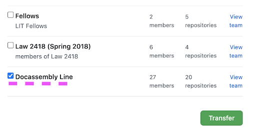

<!-- original: https://docs.google.com/document/d/1pj1DFIhzzwB6raeCytnmPSR41WfNvG-T9GYPsf1wOsA/edit -->

Issues that come up when integrating the docassemble playground with Github and, perhaps, git. Github itself has decent documentation for its own features.

## About this guide 

### Anatomy

Our goal is for each section to have these in order:
1. A title
1. Words that someone might search for when trying to find information
1. A quick summary of the steps needed to do the task
1. Step-by-step instructions with images when needed

Also:

:::note
Notes you may come back to as you develop your knowledge and have extra bandwidth.
:::

:::info
Some info it might be good to pay extra attention to.
:::

:::caution
Warnings about common problems and maybe even ways to fix them.
:::

:::warning
Things you may regret not reading
:::

<!-- TODO: Maybe we need danger too. There are lots of little things to warn pepole about, but there are also bigger things. -->

---

## Why?

Github lets you collaborate with your team more easily, helps other people help you if you run into problems, saves working code so you can come back to it if new edits break something (a savepoint), and lets others find your code if they want to do something similar.

These are some thing Github lets you do and why you might want them.

### Branches/Commits
*   You made some changes to your group’s code and you want to test them in the whole interview without changing the working version.
*   You made some changes to your group’s code and you want to test them in the whole interview, but you don’t control the master branch.
*   Keep one definitely working version that you can come back to if needed
*   Multiple people, each working on different features.
*   Trying out each other’s code without messing up your own code.
*   Working on a different feature yourself without messing up other code.
*   Working on a whole different way of doing the current feature without losing the work you’ve done.
*   Seeing what’s changed between versions of your code when you lose track.
*   Can get reviews/tests from other people to make sure code is working before adding it to the main/master working branch.

### Issues
*   Tracking tasks that need doing.
*   Tracking decisions that have been made.
*   Filtering these things easily for relevant issues.
*   Assigning tasks to specific people/filtering tasks to find the tasks you’re assigned to.

### Community
*   People with more experience can pull your code in more easily to experiment with it and troubleshoot more effectively.
*   When your time is over, other people can take up the code to continue developing it.

---

## Initial Setup

### Get a docassemble account

1. Find server administrator
1. Aive them your email
1. Ask them to [invite you to the server](https://docassemble.org/docs/users.html#invite) with developer privileges
1. When you get an invitation email, follow the link to the server
1. Make sure you can sign in

### Join GitHub

1. Make sure you have a [GitHub account](https://github.com/join)
1. If this is a new GitHub account, adjust settings to [keep your email address private](https://docs.github.com/en/github/setting-up-and-managing-your-github-user-account/setting-your-commit-email-address#setting-your-commit-email-address-on-github) and [make sure your email does not get stored when you send your code to GitHub](https://docs.github.com/en/github/setting-up-and-managing-your-github-user-account/blocking-command-line-pushes-that-expose-your-personal-email-address).

### Join your organization
1. Make sure your organization [invites you to their GitHub Organization](https://docs.github.com/en/github/setting-up-and-managing-organizations-and-teams/inviting-users-to-join-your-organization) or [invites you to their Team](https://docs.github.com/en/github/setting-up-and-managing-organizations-and-teams/adding-organization-members-to-a-team).
1. Follow the link in your email to accept the invitation.
   
### Connect GitHub to your docassemble account

1. Open docassemble  and select “Profle”from the drop down menu 
1. In the User Profile screen, tap “Other Settings” and tap “GitHub integration” from the drop down menu. 
1. Tap “Configure”. 
1. Tap to authorize.
1. It will restart the server. That is expected behavior.
1. Once you see this screen you can return to the Playground using the menu under your email address. 
1. Select ‘Manage Projects’ from the top left dropdown that says ‘Playground’
1. Make a new project. Name all alphanumeric.
1. Tap your new project. 
1. The Playground will open the project. 

---

## Get a new Project onto GitHub

How to start a new form and make sure it’s on GitHub (“commit” (upload)  a “Package” to GitHub for the first time)

### Create your project
1. From the Playground screen tap the drop down next to “Playground” and tap “Manage Projects”
1. Write a unique name for your Project

:::caution
Follow [the Project naming rules](name_formats.md#docassemble-projects-pascalcase) or you will get an error: a unique name that starts with an alphabetical letter and uses only alphanumeric characters.
:::
<!-- (TODO: Add link to creating a package) -->
<!-- (TODO: Add link to pushing the package) -->

1. Once you create your Project tap the Project name
1. Either upload your generated `.yml` file by tapping "Upload" or tap "Add" to make a new file
1. If you have made a new file
   1. Name your file the same name as your form, but all lowercase and replace spaces with underscores
   1. Add some text. `---` is always a good choice
   1. Save the file
1. Your save options should change below the code area to indicate the save was successful
1. Create your package
1. Push your empty package to GitHub

### Template Files: Upload the PDF or DOCX file that your code fills out
1. While in the Project you’ve created, go to the Playground
1. Tap “Folders” and then “Templates” 
1. You’ll want your PDF or DOCX file to be named properly. If you use the wizard, the name will be in your yaml file.
1. Your file will be in the list below of available templates. 

---

Once you have some of your code and your template documents ready you can push to GitHub for the first time and create a repository everyone can use.

---

### Create your repository to make your code available

1. Return to the Project docassemble Playground and tap “Folder” then “Packages”.

:::note
A **Package** bundles code, metadata, dependencies and your PDF’s or .DOCX files into one place for you and others to access. You get to pick and choose the files that you want to go into that particular file.
:::

<!-- TODO: Add caution about name? Or maybe just note? Bleh. Don't want 'caution box fatigue' -->
<!-- TODO: when add pics, add this disclaimer for package name: 1. Because I used the form name to name my project, my package name will look the same, but it doesn’t have to. -->
<!-- TODO: Advanced note:  This description will show up in GitHub. -->
<!-- TODO: Advanced note: If you make changes to the files or re-upload your PDF or DOCX to your Templates folder, as long as you use the same name, everything updates by itself. If you change the name, you will need to select that file in here again.  -->
<!-- Advanced note: A good commit message also helps you find your place when you need look back through your code -->
<!-- TODO: Add... note?: Avoid the “install package” checkbox. Leave it alone. -->
<!-- TODO: Add... caution?: Never hit “Install”. Leave it alone. -->
<!-- TODO: Add advanced: One convention for commit messages is to write them as if they were an item in a todo list. **Example:** “Fix #19, update income question” - start with a verb (link to committing and to issues sections) -->

2. Return to the Project docassemble Playground and tap “Folder” then “Packages”.
1. Use the form name to name your Package. Again, you can use only alphanumeric characters (A through Z and 0 through 9 - the same naming rules as in Projects)
1. “docassemble-” plus this will be the name of your repository.
1. If you are working on a court form, you should use the form name for your Package.
1. **Example:** Marriage without Delay form is named “MarriageWithoutDelay”.
1. Add a description of what the form is.
1. Scroll down to the boxes further down the page. Use cmd/ctrl + click to select the files you want to have in your repository. For example, we would select your_new_project.yml and your template file (the PDF or DOCX).
1. Scroll down to the bottom and tap Save.  
1. Once your package saves, the GitHub button will appear.
1. Tap GitHub.
1. Commit message - tell the group what you are doing. A common first commit message is “Initial commit”.
1. Click ‘Commit’.
1. Look at the bottom of the Package screen again. Above the ‘Github’ button will be links to your new repository ‘published on Github’. That’s a link to the repository for this Package.

### Transfer ownership to your organziation

After transferring, You will still be able to access it/change it/edit it afterwards. Your organization might need to [give permissions](https://docs.github.com/en/github/setting-up-and-managing-organizations-and-teams/repository-permission-levels-for-an-organization) to other people who need to work on the code.

1. [Transfer ownership of your repository to your organization](https://docs.github.com/en/github/administering-a-repository/transferring-a-repository).

:::caution
**Complications**
If you get a pink error message that says you don't have permissions, you have not been added as a member of the GitHub organization. See how to [join your organization](#join_your_organization).

:::

<!-- TODO: Transferring before divorcing a fork from upstream will cause an error -->

2. If your organization has teams, pick which teams can have access to this repository.

3. Check your organization's GitHub page to make sure your project appears there.
1. Give the administrator the new link to the repository and ask them to [give the rest of the team permissions on it](https://docs.github.com/en/github/setting-up-and-managing-organizations-and-teams/managing-team-access-to-an-organization-repository).

### Making issues

Keywords: Tasks/todo lists, bugs, features, documentation, review, milestone

<!-- TODO: Add link to maturity model -->

Quick reference: [Make an issue](https://docs.github.com/en/github/managing-your-work-on-github/creating-an-issue) and <a href="https://docs.github.com/en/github/managing-your-work-on-github/managing-labels">add labels if appropriate</a>. If you know who will work on it, <a href="https://docs.github.com/en/github/managing-your-work-on-github/assigning-issues-and-pull-requests-to-other-github-users">assign them to the issue</a>. <a href="https://docs.github.com/en/github/managing-your-work-on-github/creating-and-editing-milestones-for-issues-and-pull-requests">Create milestones</a>, like MVP, and <a href="https://docs.github.com/en/github/managing-your-work-on-github/associating-milestones-with-issues-and-pull-requests">add them to issues</a>.

**In an issue, we want:**

1. Documentation of decisions and why they were made (language choices, question-type/order/flow decisions, …) and who was involved in the discussion. When different people work on the form, we don’t want to duplicate work that’s already been done or to re-interrogate old ground/rationales without the context.
1. Everything that still needs to be researched, answered, done to move this forward, items for MVP (minimum viable product), and potential post-MVP improvements: 
1. Open questions, what needs SME (subject matter expert) consultation, who to talk to
1. Concrete things to change

Give all the links possible! All context!

## Sharing new edits to your code

Keywords: Experiment with code while still protecting working code, make new features, committing (saving) to a new branch, committing (saving) to an existing branch, checking/reviewing someone else’s code, combining code.

:::tip
You **will** make mistakes. You will accidentally include stuff you didn’t mean to include or push to the wrong branch. The great thing is that you can’t break things permanently. That's what git prevents. You won’t believe it right now, but you’ll come to find it comforting over time.
:::

### Making a new branch for a new goal or bug fix

Make a new branch when you first start working on a feature/goal, like an income questions, or fixing a bug in old code.

A branch can be for just one commit.

**Summary**
1. Make at least one change.
1. Folders > Packages > GitHub
1. In the branches dropdown, select `New Branch`
1. Give the branch a [snake_case](name_formats.md#snake-case) name. There are no other requirements.

:::note
A branch name reminds you and your collaborators, at a glance, what topic, problem, of feature the branch is for. 1-3 words separated by underscores is usually a good guideline. **Example:** `income_questions` or `income_calculations`
 
**More advanced:** Include the issue number and type of goal of the branch. **Example:** `116_fix_income_calculations` or `42_feature_deductables`.
:::

5. Add a commit message. You have to put something here. There are no other requirements. A commit message describes the specific changes you just made that are working towards the goal of the branch.

<!-- TODO: link to committing and to issues sections -->

:::note
You can write commit messages as if they were an item in a todo list. It helps to start with a verb. **Example:** `Close #19, update cash income question`.
:::

6. Tap ‘Commit’
1. Rejoice!

<!-- TODO: Add link to looking at branches on github -->
<!-- TODO: Add link to comparing branches on github -->
You will now be able to see your new **branch** on GitHub! If you want, you can compare your branch to any other branch and see the exact differences.

<!-- TODO: Add link to making branches off of branches from within github? -->
<!-- TODO: Add link to making branches off of branches from within docassemble? (add section) -->
<!-- TODO: Link to definition of 'base branch' -->

<!-- You can also make a branch off of *that* new branch if you want. There’s nothing special about the main branch. They’re all just branches. You pull from `some_branch`, edit code, then ‘commit’ to a ‘New branch’ we’ll call `yet_another_branch` and you’ve done it. `some_branch` is now the **base** branch of `yet_another_branch`. -->

:::note
**Branches vs. Commits**
**Branches** should encapsulate specific goals, like adding a set of questions or creating automated tests for one path in your interview.

**Commits** should encapsulate one particular action in a branch. One commit might be adding one question or getting one part of the code working, even if other parts still need some work. Together, individual commits add up to the complete feature. A commit might fix typos, improve readability of the first three questions, or add the question about debt.
:::

:::note
**Linking and closing issues with commits and PR descriptions**
If you reference a GitHub issue number in a specific way in your commit message, the issue will automatically get a link to the commit. **Example:** `Fix income typos, #15` or `Fix income typos, addresses #15`
 
You can also [close issues with your commits](https://docs.github.com/en/github/managing-your-work-on-github/linking-a-pull-request-to-an-issue#linking-a-pull-request-to-an-issue-using-a-keyword) when they get merged into the 'main' branch. **Example:** `Add all financial questions, fixes #15`
:::

Here’s where we left off. This is the code we pushed in our first commit. 

Make at least one change. 

**Example:** New comment added. 
   
   Tap “Folders” > “Packages”

   The Package you created in your first commit should appear here. 

   Scroll to the bottom of this screen until you see your buttons and tap “GitHub”. 

   In the branche dropdown, select “New branch”.

   Give the branch a name with no spaces. It doesn’t matter what you name-it.

:::note
Our convention for formatting: All lowercase alphanumeric separated by underscores.

One convention for branch names: They’re to remind you and your collaborators basically what it’s for at a glance, so one to three words separated by underscores is usually a good guideline. **Example:** income_questions or income_calculations.

**More advanced:** The  issue number and type of action you’re doing and. **Example:** 116_fix_income_calculations or 42_feature_deductables.
:::

*This is an example of creating a new branch that relates to an “issue” created in GitHub, (issue 12). This branch is created to work on the task in issue 12, develop review screens, which is a late stage part of the interview development. *
   
  
  
   A similar  message should appear at the top of the page when you have successfully commit the package to GitHub. 

### Commit to an already existing branch (Savepoint) - EARLY AND OFTEN

aka. Savepoints, saving your progress, bookmark where your code is at right now.

After you’ve made a new branch, you can commit to it until you’re done with your goal/feature or bug fix.

:::tip
**COMMIT EARLY AND OFTEN** (bears repeating). GitHub can’t help you if you don’t use it.
:::

**When to commit**

For now, create a daily alarm in your phone to commit all code that you haven’t yet committed that day.

In general, you commit working code. You might also commit broken code to make it easier for other people to help you. You can make a new branch for broken code if you want to keep one branch for working code only.

1. Make at least one change (edit or add a file).
1. Folders > Packages > GitHub
1. In the branches dropdown, select the branch you want to add your changes to.
1. Commit message: Describe what your commit does

<!-- **Most important:** It doesn’t actually matter what you put here. It can be more useful or less useful. You just have to put something here. -->

One convention for commit messages: It’s meant to be like a todo list item so that when you look back on your list of commits you could construct a todo list of what needed to get done. If commits need to get peeled back, these might help you recover the tasks that need doing. **Example:** Update court codes

Tap ‘Commit’
Rejoice!

See your **commit** on GitHub! If you want, you can see them one at a time and see very clearly what changes you made so you can make sure they were the changes you wanted.

### Combining code

When you have two branches and you want to combine them/bring them back together.

You will:

Even when it’s your own code, you make a ‘pull request’, requesting to combine code

Someone will review the changes that are being proposed, either accepting the changes or requesting further changes

When all is well, they will combine that code by merging it into the base branch (often ‘master’)

Remember to clean up after (deleting the branch, deleting the project you used for that branch, etc.)

### Combining code - requesting

aka. Merging your code, combining code, making a PR, a pull request, a merge request.

If you tap “2 branches” (it won’t always be ‘2’) and you will see all branches committed to the repository.

<!-- Here is the one we committed.  -->

Tap “New pull request” 

Add in a comment to tell your team what is going on.

If it’s to do with an issue, use ‘#’ and then the issue number and GitHub will make a link to that issue automatically. **Example:** #23

Explain to them what they need to test.

Then tap “Create pull request 

   Once you’ve created the pull request, tap Reviewers.

   Add the GitHub username of your team member who will test your work to make sure it’s working as intended (review).

   Message the person you’ve made the reviewer in Slack to let them know you’ve assigned them as a reviewer. 

### Reviewing someone else’s code

Don’t let pull requests hang around too long. Other code will get edited and merge conflicts will crop up.

There can be two parts to this.

1. Required: Testing their code
   1. If the base branch hasn’t changed in the meantime (for example, no one has edited the master branch) (we will try to cover this later)
   1. Note: Sometimes it can help to look at the PR file comparison tab in github to see what code has been changed.
   1. In their PR the person should have left a link to their interview there. Go to that link and test the behavior that is affected by the  changes in their code or
   1. If you want to be able to see what’s going on in more detail, pull (upload) their code into your Project. Run it and test the code that is affected by their changes.
   1. If it works
      1. In the ‘Files’ tab, write a review saying what you tested and the results and select ‘Approve’
      1. Merge their branch
      1. In Slack, tell them to delete the branch and the Playground Project they had for it.
   1. If it doesn’t work
      1. In the ‘Files’ tab, write a review that describe what you saw that you think needs changing
      1. Select ‘Request Changes’
      1. In Slack, tell them about the review
1. Pull (upload) their code into your Project
1. Run it and test the code that is affected by their changes

<!-- Clarifying: Comparing the code on GitHub   -->
<!-- Pictures from GitHub as to where to see the comparison. -->
<!-- TODO: Add pictures -->
:::note
You can make comments on specific lines of code. (pictures)
:::
:::note
P.S. You can make a PR with someone’s branch even if they’re not there.
:::

### Getting Github code in your Playground (pulling into a Project)

aka. Uploading your code to the Playground, uploading someone else’s code to the Playground, reviewing, pulling, getting your old code back, seeing someone else’s code, working on someone else’s code
   
  
:::warning
**WARNING:** All the files in the repository will replace files of the same name in this Project. Imagine being on your computer, copying a bunch of files to a folder, and getting the message “This file already exists in this folder. Do you want to replace it?”. It’s the same thing, but docassemble doesn’t give you that warning.
:::

1. Make a new Project
1. Go to your Playground then Folders > Packages
1. In the menu of blue text at the top, tap ‘Pull’
1. Get the web address (url) of the repository you want to get the code from (need example) \
1. Pick the branch you want to pull from
1. Tap ‘Pull’
1. Go back to your Playground and play! That is, test the functionality in the interview that the code could affect. 

**Once you’ve made a new project**

1. In your new Project, select Folders, then Packages. 
1. In the menu at the top, tap “Pull”
1. Grab the URL from GitHub for the repository you are pulling from. 
1. Back in docassemble, paste the URL where it asks for the GitHub URL
1. Drop down the menu for GItHub Branch and select the branch you are going to review. Here we are reviewing a branch called “Teammate Code”
1. Tap “Pull”
1. Return to the Playground and you should see the code you’ve pulled in. 
1. The .yml file will hopefully be something other than test as it is here, you will see updates or new code, indicated here by the squiggly 1. bracket. 
1. “Save and Run” this code, test it for what your teammate has been working on in this section. 

### Combining code - accepting changes

aka. Merging/merge, pulling/pull, adding someone else’s changes to your code

1. That person should have made a pull request with their branch.
1. Test their code.
1. Optional, but decent practice: In GitHub, leave a review message and approval, or ask for changes (in the ‘files changed’ tab). (bandwidth: add 1. comments on lines)
1. If you approve of it, hit ‘Merge pull request’ at the bottom of the ‘conversations’ tab.
1. Hit ‘Confirm merge’ finish.
1. You or they should delete their branch.
1. You and they should delete the Playground Project you created for the branch.

In your GitHub repository, tap “Pull request”

You will see a list of pull request for the repository, tap on the one you’ve finished testing. 

<!-- Here the pull request is “Add examples in questions” -->

A screen similar to this will appear, you can tap “Files changed” to do a review of what in the code was changed. 

This is a side by side comparison of the code.  

Tap “Review changes”

Provide information in the review. 

If you are not ready to merge the code because you have a question or hesitation, select “Comment”. 

If the code is working and looks good, it is ready to merge and select “Approve”.

If you found an error or think something needs to change before merging, select “Request changes” 

Tap “Submit review”

If you’ve approved the code, move forward in the steps. 

Finishing your review will automatically move you back to the Conversation tab seen here. 

If you are ready to merge: 

Mid way on the screen is the “Merge pull request” option 

Tap it.

To make sure, it asks again. 

Tap “Confirm merge” 

The box, once a green icon is now purple, and you’ve successfully merged the pull request. 

You will end up with tons of branches and forget what is what. Once its merged tap “Delete branch.”

You will see a message similar to this once complete. 

The final step is to delete the Project in the Dev App.

### ‘Merge conflicts’ when combining code

aka. Errors combining two branches, trouble merging, trouble combining, resolve merge conflicts, fixing merge conflicts between two branches

Two kinds of merge conflicts

1. Github allows you to ‘resolve’ the conflict:
   1. Use a [diff checker](https://www.diffchecker.com/) (difference checker) to show you the differences between the conflicting files.
   1. Use the Github interface to - carefully - edit code or (maybe better) follow the procedure outlined below for situations where GitHub does not offer this option.
   1. Upload to your repository and test whatever could be affected by the changed code (for example, email sending if the changed code influenced emails, even if your code was working on just a new question)
1. Github is unable to help you resolve the issue (it doesn’t offer the option):
   1. Compare the code of the two branches in GitHub or use a different [diff-checker](https://www.diffchecker.com/) (difference checker) to show you the differences between the conflicting files.
   1. Pick and choose the changes you want to bring over and manually move them to the playground.
1. Open your files in the conflicting branch.
1. Copy and paste them into the right-hand side of the diff checker.

### The main branch changed while I was working on a different branch

aka. I want to see how my changes will work in the interview, merge conflicts, updating to master, updating to the base branch, catching up to the base branch, combining two branches

1. The start is the same whether you have merge conflicts or not.
1. Make a new branch from the base branch.
1. Make a PR from the requesting branch to that branch.
1. Fix merge conflicts.
1. Review.
1. Make a PR to the base branch.
1. Merge it.
1. Version created earlier:
1. Your **base** branch is often your repository’s ‘master’, but not always. It’s the branch you want to add the new code to. For this exercise, 1. we’ll assume it’s ‘master’.
1. If other people changed code and merged it into the master branch already, you might want to make sure that this new code will work with the changes now in the master branch. This is what you do.

1. Make another branch off of the master branch.
1. Merge the new code into that branch.
1. Do the usual tests with that code.
1. When it’s ready, merge that newest branch into master (by making a pull request into master).
1. If your team has agreed on this convention, delete the branch.
1. Delete the Project on your Playground.
1. Close the issues associated with the changes (if they haven’t been closed automatically through magical means you can read about in another, more bandwidth, section)

We’re still thinking about what to do If they update their code in the meantime and you need to see the combination/merged version.

## Errors when committing/pushing from docassemble

1. Look at the bottom of the error on the page. Also, ask us for more details if your issue isn’t on here or if this is not enough information.
1. Text in the page: **Detached head** - this is a red herring. This is actually a natural part of the process.
1. Text at the bottom of the screen:** access to this repository** - you don’t have permission to push the code to the repository. Make sure the person or organization that owns the repository has given you ‘write’ permissions. If it’s SuffolLITLab, give David or Quinten the link to the repository and ask them to ‘give the team permissions to write to the repository.’
1. Text at the bottom of the screen:** nothing to commit, working tree clean** - this means that no changes were detected in your project. This might happen if:

1. You did not add the file you edited to your package by cmd/ctrl + clicking it on the packages page and then saving (in your docassemble Playground Packages page). Make sure the **name of the file you changed** is **exactly the same** as a name that is currently selected on the Packages page.
1. You actually haven’t made any changes to those files. What was the last edit you made?
    1. Find a diff checker, like [https://www.diffchecker.com/](https://www.diffchecker.com/).
    1. Go to github and get the file you think has changed.
    1. Copy the text in it.
    1. Put it in the left side of the diff checker
    1. Go to the Playground to the file you think you’ve changed.
    1. Copy the text and put it in the right side of the diff checker.
    7. Press the button to compare the text.
1. You’re making a new branch, but you haven’t edited any files (if you think you have edited files, see the above as well).
1. In your project, you pulled from a branch recently and didn’t make any edits to those files. When was the last time you pulled?

### I made edits, but docassemble says I can’t push to Github

See section about one reason docassemble might not be able to see that.

## Advanced/Needs bandwidth

### Issues

*Github documentation is usually easy to find online. Also, there are link to github documentation in the above text, this will just be a place to collect related links.*

**Closing issues with commits**

See [the GitHub documentation](https://docs.github.com/en/github/managing-your-work-on-github/linking-a-pull-request-to-an-issue#linking-a-pull-request-to-an-issue-using-a-keyword).

When you make your commit message, or somewhere in the comments of your commit message, use this formula:

The word ‘fixes’ then the ‘#’ then, with no space, the issue number.

**Ex:** Fixes #22

<!-- **Adding a link to an issue in your commit or PR**

Do not use a closing keyword. Just use the issue number alone in your PR description. Ex: #22. GitHub should note the connection in the relevant issue.

**In an issue, add a reference/link to a PR**
TODO

**In an issue, add a reference/link to a commit**
TODO

**Assign someone to an issue**
TODO

**Add a label to an issue**
TODO

**Add a milestone to an issue**
TODO

### Branches

**Making a new branch without any new content** (TODO)

This has to be done on GitHub. GitHub documentation might help.
 -->

### Extra information Github can show you

<!-- **Comparing code** -->

**Am I in the right branch?**

1. Look at the last commit and its date (pic needed). Does that match up with what you remember?
1. Compare the file you have in the playground with the file in that branch of the repository.
1. If not, try a different branch

### Pick just some files from a package to make a new repository

aka. Make a new package, cherry picking some files to make a package, select individual files

1. Pull in the repository with the files you want
1. On the Packages page, select the old Package
1. If you want these new files in your current Package:
1. Select the files you want from the new Package
1. Hit ‘Save’
1. Commit
1. If you want to get rid of other files from the repository you pulled in, unselect them in the Packages page and delete the files one by one in the Playground.
1. If you pull again from the repository of the files you deleted, you will get all the old files back again.

### I don’t have control of the master branch but want to work on the code anyway

aka. forking a repository, making a PR from a forked repository, working with someone else’s repository.

1. First of all, you should get them to transfer it to SuffolkLITLab and then get David or Quinten to give ‘write’ permissions to the doc assembly line team.

:::tip
**Important!** First fork the repository (make your own copy) in GitHub so you have it in your account. This will make sure Github automatically knows that your code is connected to that original code.
:::

2. Get that fork’s code into your Playground.
1. Edit it.
1. Make a PR in the usual way.
