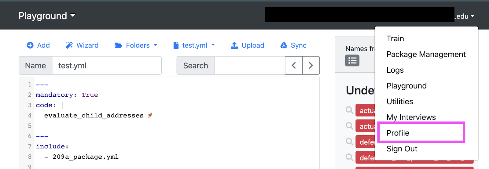
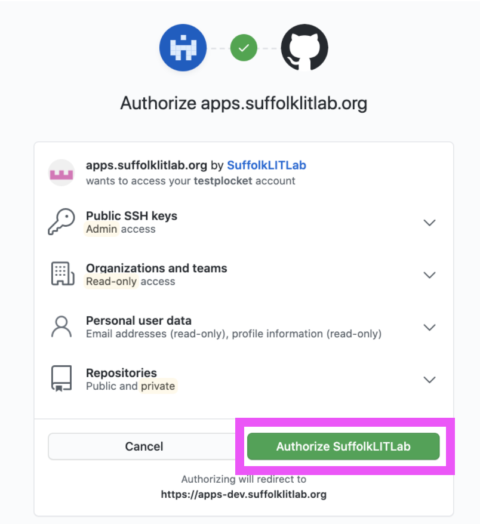

<!-- original: https://docs.google.com/document/d/1pj1DFIhzzwB6raeCytnmPSR41WfNvG-T9GYPsf1wOsA/edit -->

Ways to use GitHub in combination with docassemble. GitHub itself has decent documentation for its own features.

## Why?

GitHub lets you collaborate with your team more easily, helps other people help you if you run into problems, saves working code so you can come back to it if new edits break something (a savepoint), and lets others find your code if they want to do something similar.

These are some thing GitHub lets you do and why you might want them.

### Branches and commits
* Avoid introducing breaking changes to the working code.
* Work on multiple features/changes at the same time, keeping each isolated from the others. Either collaborators can work that way or one individual and isolate specific issues to work on.
* Try implementing a feature multiple different ways.
* Try out and review each others' code without messing up your own code.
* Clearly see what has changed between versions of your code when you lose track.
* Get reviews/tests from other people to make sure code is working before adding it to the main/master working branch.

### [Issues](https://docs.github.com/en/github/managing-your-work-on-github/about-issues)
* Track tasks that need doing and add context to them.
* Track decisions that have been made.
* Search the tasks when looking for relevant information.
* Assign tasks to specific people.
* See the tasks that were assigned to you specifically.

### Community
* People with more experience can pull your code in more easily to experiment with it and troubleshoot more effectively.
* When your time on the project is over, other people can take up the code to continue developing it.

## Setup

### Get a docassemble account

1. Find server administrator.
1. Give them your email.
1. Ask them to [invite you to the server](https://docassemble.org/docs/users.html#invite) with developer privileges.
1. When you get an invitation email, follow the link to the server.
1. Make sure you can sign in.

### Join GitHub

1. Make sure you have a [GitHub account](https://github.com/join)
1. If this is a new GitHub account, adjust settings to [keep your email address private](https://docs.github.com/en/github/setting-up-and-managing-your-github-user-account/setting-your-commit-email-address#setting-your-commit-email-address-on-github) and [make sure your email does not get stored when you send your code to GitHub](https://docs.github.com/en/github/setting-up-and-managing-your-github-user-account/blocking-command-line-pushes-that-expose-your-personal-email-address).

### Join your organization
1. Make sure your organization [invites you to their GitHub Organization](https://docs.github.com/en/github/setting-up-and-managing-organizations-and-teams/inviting-users-to-join-your-organization) or [invites you to their Team](https://docs.github.com/en/github/setting-up-and-managing-organizations-and-teams/adding-organization-members-to-a-team).
1. Follow the link in your email to accept the invitation.
   
### Connect GitHub to your docassemble account

**Summary**
1. Go to your docassemble "Profile" > "Other Settings" > "GitHub integration"
1. Authorize docassemble to access your GitHub account

**Details**

Open docassemble  and select "Profle"from the drop down menu.

Tap "Other Settings" and then "GitHub integration" from the drop down menu.

Tap "Configure".

Tap to authorize your docassemble server on GitHub. It will restart the server.

Once the server is done you can return to the Playground using the menu under your email address.

### Make issues

Keywords: Tasks, todo lists, bugs, features, documentation, milestones

<!-- TODO: Add link to maturity model? -->

#### When to make an issue

You can make an issue to:
1. Document a decision. It is useful to include who was involved in the discussion and why that decision was made. Some example decisions might be about language choices, question-type, order, and flow. When new people come to work on the form we don't want to duplicate work that's already been done or to re-interrogate old decisions without the context of why they were made.
1. Add a new task. For example, problems that needs to be researched or programmed. Research could involve consulting a specific SME (subject matter expert) and you, or someone commenting on the issue, could note their name.
1. Categorize and organize tasks. For example, MVP items, version 2 improvements, and bugs.

Give all the links possible! All context!

#### What to do with issues

See the GitHub docs about:
1. [Making an issue](https://docs.github.com/en/github/managing-your-work-on-github/creating-an-issue).
1. [Assigning the task to yourself or another member](https://docs.github.com/en/github/managing-your-work-on-github/assigning-issues-and-pull-requests-to-other-github-users).
1. [Adding labels](https://docs.github.com/en/github/managing-your-work-on-github/managing-labels).
1. [Creating milestones](https://docs.github.com/en/github/managing-your-work-on-github/creating-and-editing-milestones-for-issues-and-pull-requests).
1. [Adding a milestone to an issue](https://docs.github.com/en/github/managing-your-work-on-github/associating-milestones-with-issues-and-pull-requests) (you can only have one milestone one per issue).

## New forms

### Go to the Playground

### Create a new project

Create a new project. See [the docassemble docs on how to create new Projects](https://docassemble.org/docs/playground.html#projects).

:::caution
Follow [the Project naming rules](name_formats.md#docassemble-projects-and-packages-pascalcase) or you will get an error: a unique name that starts with an alphabetical letter and uses only alphanumeric characters.
:::
<!-- (TODO: Add link to creating a package) -->
<!-- (TODO: Add link to pushing the package) -->

**Summary**
1. Go to "Playground" > "Manage Projects" and create a new Project and [name it appropriately](name_formats.md#docassemble-projects-and-packages-pascalcase).
1. Go back to "Playground" and upload your files or make a new file. The name of the YAML file should be the [name of your form](name_formats.md#form-files-stored-in-docassemble-snake-case).
1. Go to "Folder" > "Packages" and save your package. Its name should be based on the form name and [follow conventions](name_formats.md#docassemble-projects-and-packages-pascalcase).
1. [Commit/push the package to GitHub](https://docassemble.org/docs/packages.html#github).

**Details**

In the Playground, tap the top left dropdown and select "Manage Projects".

Make a new Project and [name it appropriately](name_formats.md#docassemble-projects-and-packages-pascalcase).

Tap your new Project's name.

The Playground will open the Project with a default "test.yml" file. Either [add a new file](#create-a-new-yaml-file) or upload your generated `.yml` file by tapping "Upload".

[Create your Package and push it to GitHub](#create-a-new-repository).

### Create a new YAML file
**Summary**
1. Go to the Playground, tap "Add", and give the file [an appropriate name](name_formats.md#form-files-stored-in-docassemble-snake-case).

**Details**

[Go to the Playground](#go-to-the-playground) and tap "Add".

Give the file [an appropriate name](name_formats.md#form-files-stored-in-docassemble-snake-case) and add some text to the file. Even `---` is enough. Then save the file.

Your save options should change below the code area to indicate the save was successful.

### Upload a YAML file
See the [docassemble docs about Playground YAML files](https://docassemble.org/docs/playground.html#interview_files).

### Upload a package
See the docassemble docs to [use a zip file to upload a package](https://docassemble.org/docs/playground.html#packages).

### Template Files: Upload the PDF or DOCX file that your code fills out
See the docassemble docs about [uploading template files](https://docassemble.org/docs/playground.html#templates).

**Summary**
1. Navigate to Playground > "Folders" > "Templates" and upload your file.

**Details**

[Go to the Playground](#go-to-the-playground) and make sure you're in the right Project.

Tap "Folders" and then "Templates".

Your file will be in the list below of available templates.

### Create a new repository
aka. Create a new Package, commit or upload a new Package to GitHub for the first time.

This is about creating a brand new Package from new files. If you are creating a new Package from the files of an old Package, we hope to develop a section for that in the future.

A docassemble **Package** bundles code, metadata, dependencies, and your PDF's or DOCX files into one place for you and others to access. You get to pick and choose the files that you want to go into that particular Package.

Also see docassemble docs about [pushing a Package to GitHub by committing](https://docassemble.org/docs/packages.html#github) and [about Packages in general](https://docassemble.org/docs/packages.html).

:::caution
Sometimes docassemble will not create a new repository on GitHub. If your Package name matches the name of a Package that is already in your GitHub repository or in a repository of an organization you belong to, docassemble will try to push to that repository instead of creating a new repository.

In most cases, you will get a "merge conflict" error when this happens.
:::

**Summary**
1. Go to "Playground" > "Folders" > "Packages".
1. Give your new Package a name.
1. Save it.
1. Commit to GitHub.

<!-- TODO: use pic where project name is different than form name. -->
<!-- TODO: Advanced note: If you make changes to the files or re-upload your PDF or DOCX to your Templates folder, as long as you use the same name, everything updates by itself. If you change the name, you will need to select that file in here again.  -->
<!-- Advanced note: A good commit message also helps you find your place when you need look back through your code -->
<!-- TODO: Add... note?: Avoid the "install package" checkbox. Leave it alone. -->
<!-- TODO: Add... caution?: Never hit "Install". Leave it alone. -->
<!-- TODO: Add advanced: One convention for commit messages is to write them as if they were an item in a todo list. **Example:** "Fix #19, update income question" - start with a verb (link to committing and to issues sections) -->

**Details**

[Switch to the correct Project](https://docassemble.org/docs/playground.html#projects) if you need to. Once in the Playground, tap "Folder" then "Packages".

[Name your Package](name_formats.md#docassemble-projects-and-packages-pascalcase) based on your document file name. **Example:** The name of the marriage_without_delay.pdf package would be "MarriageWithoutDelay".

Scroll down to the boxes further down the page. Use cmd/ctrl + click to select the YAML files and documents you want to have in your repository. For example, here we would select plaintiff_s_motion_to_modify.yml and plaintiff_s_motion_to_modify.pdf.

Scroll down to the bottom and tap Save.

If you have [configured your GitHub account](#connect-github-to-your-docassemble-account), once your package saves and the page reloads the GitHub button will appear near the Save button. Tap GitHub.

You **must** write a message describing what this commit is for. Usually it sums up the purpose of the changes you have made to the code. This is the first commit message, though, and a common first commit message is "Initial commit". When your message is ready, tap "Commit".

Look at the bottom of the Package screen again. Just above the Github button will be links to your new repository.

You can also read the [docassemble docs on pushing your package to GitHub by committing](https://docassemble.org/docs/packages.html#github)

### Transfer ownership to your organziation

After the repository's ownership is transferred, only people who have permissions in your organization will be able to work on the code. Your organization can [give people permissions through GitHub](https://docs.github.com/en/github/setting-up-and-managing-organizations-and-teams/repository-permission-levels-for-an-organization).

Read the GitHub docs on [transfering ownership of your repository](https://docs.github.com/en/github/administering-a-repository/transferring-a-repository#transferring-a-repository-owned-by-your-user-account).

<!-- TODO: Transferring before divorcing a fork from upstream will cause an error -->

If your organization has teams, pick which teams can have access to this repository.

Check your organization's GitHub page to make sure your project appears there. You may have to ask give the administrator the new link to the repository and ask them to [give the rest of the team permissions on it](https://docs.github.com/en/github/setting-up-and-managing-organizations-and-teams/managing-team-access-to-an-organization-repository).

:::caution
If you get a pink error message that says you don't have permissions, you have not been [added as a member of that GitHub organization](#join_your_organization).

:::

## Sharing new edits to your code

You **will** make mistakes. You will accidentally include changes you didn't mean to include or push to the wrong branch. The great thing is that you can't break things permanently. GitHub uses `git` and that's what it's for. Someone more experienced may need to lend a hand, but it's all there. Your gut won't believe it right now, but you will come to trust the process.

### Making a new branch for a new goal or bug fix

Make a new branch when you first start working on a feature or goal. For example, income questions or a bug fix.

**Summary**
1. Make at least one change. Edit code or include a new file with cmd/ctrl + click.
1. Tap "Folders" > "Packages" > "GitHub" <!-- TODO: Should we break these paths out into their own sections? -->
1. In the branches dropdown, select `New Branch`
1. Give the branch a [snake_case](name_formats.md#snake-case) name.
1. Commit your changes.

You will now be able to see your new branch on GitHub! If you want, you can [compare your branch to any other branch](https://docs.github.com/en/github/committing-changes-to-your-project/comparing-commits) and see the exact differences.

<!-- TODO: Move the naming conventions here to the name formats doc? -->
:::note Branch name
A branch name reminds you and your collaborators, at a glance, what topic, problem, of feature the branch is for. 1-3 words separated by underscores is usually a good guideline. **Example:** `income_questions` or `income_calculations`
 
**More advanced:** Include the issue number and type of goal of the branch. **Example:** `116_fix_income_calculations` or `42_feature_deductables`.
:::

:::note Commit message
A commit message describes the specific changes you just made that are working towards the goal of the branch. You can write a commit message as if it is an item in a todo list. It helps to start with a verb. **Example:** `Close #19, update cash income question`.
:::

<!-- TODO: Add link to making branches off of branches from within GitHub? -->
<!-- TODO: Add link to making branches off of branches from within docassemble? (add section) -->
<!-- TODO: Link to definition of 'base branch' -->

<!-- You can also make a branch off of *that* new branch if you want. There's nothing special about the main branch. They're all just branches. You pull from `some_branch`, edit code, then 'commit' to a 'New branch' we'll call `yet_another_branch` and you've done it. `some_branch` is now the **base** branch of `yet_another_branch`. -->

#### Branches vs. commits
**Branches** should encapsulate specific goals, like adding a set of questions or creating automated tests for one path in your interview.

**Commits** should encapsulate one particular action in a branch. One commit might be adding one question or getting one part of the code working, even if other parts still need some work. Together, individual commits add up to the complete feature. A commit might fix typos, improve readability of the first three questions, or add the question about debt.

<!-- Here's where we left off. This is the code we pushed in our first commit.  -->
<!-- 
:::note
Our convention for formatting: All lowercase alphanumeric separated by underscores.

One convention for branch names: They're to remind you and your collaborators basically what it's for at a glance, so one to three words separated by underscores is usually a good guideline. **Example:** income_questions or income_calculations.

**More advanced:** The  issue number and type of action you're doing and. **Example:** 116_fix_income_calculations or 42_feature_deductables.
:::

*This is an example of creating a new branch that relates to an "issue" created in GitHub, (issue 12). This branch is created to work on the task in issue 12, develop review screens, which is a late stage part of the interview development. *
 -->
<!-- A similar  message should appear at the top of the page when you have successfully commit the package to GitHub.  -->

### Commit again - EARLY AND OFTEN

aka. Savepoints, saving your progress, bookmark where your code is at right now.

After you've made a new branch, you can commit to it until you're done with your goal/feature or bug fix.

:::tip
**COMMIT EARLY AND OFTEN** (bears repeating). GitHub can't help you if you don't use it.
:::

**When to commit**

When you first start, create a daily alarm in your phone to commit all code that you haven't yet committed that day.

In general, you commit working code. You might also commit broken code to make it easier for other people to help you. You can make a new branch for broken code if you want to keep one branch for working code only.

1. Make at least one change (edit or add a file).
1. Folders > Packages > GitHub
1. In the branches dropdown, select the branch you want to add your changes to.
1. Commit message: Describe what your commit does (see below for more guidance)
1. Tap 'Commit'
1. See your **commit** on GitHub!

<!-- TODO: Add the below back in when we have images as the GitHub docs on this currently do not show something useful (https://docs.github.com/en/github/committing-changes-to-your-project/differences-between-commit-views):

If you want, you can see them one at a time and see very clearly what changes you made so you can make sure they were the changes you wanted. -->

<!-- **Most important:** It doesn't actually matter what you put here. It can be more useful or less useful. You just have to put something here. -->

One convention for commit messages: Write it as if it were a todo list item. When you look back on your list of commits you should be able to construct a todo list of what needed to get done. If commits need to get peeled back, these might help you recover the tasks that need doing. **Example:** Update court codes

### Request others merge your code

aka. Merging your code, combining code, making a PR, a pull request, a merge request.

<!-- 1. If you tap "2 branches" (it won't always be '2') and you will see all branches committed to the repository. -->
<!-- Here is the one we committed.  -->

1. In GitHub, go to the 'Pull requests' tab
1. Tap "New pull request" 
1. Give it a title that sums up what the changes accomplished
1. In the description [add a checklist](https://docs.github.com/en/github/managing-your-work-on-github/about-task-lists#creating-task-lists) of things the reviewer needs to check or test
1. If this PR is related to an issue, use '#' and then the issue number in the description and GitHub will make a link to that issue automatically. **Example:** #23
1. Explain to the reviewer what they need to test
1. Then tap "Create pull request 
   1. Once you've created the pull request, tap Reviewers.
   1. Add the GitHub username of your team member who will test your work to make sure it's working as intended (review).
   1. Message the person you've made the reviewer to let them know you've assigned them as a reviewer.

### Reviewing someone else's code
(WIP)

Don't let pull requests hang around too long. Other code will get edited and merge conflicts will crop up.

You must test the code. The requester should have left notes on what needs to be tested in the description of the pull request (PR).

1. [Pull the code](#get-github-code-into-your-playground) into a [new Project](#create-a-new-project) in your Playground
1. Test the behavior that is affected by the changes in their code or
1. If it works as expected
  1. [Write a review](https://docs.github.com/en/github/collaborating-with-issues-and-pull-requests/reviewing-proposed-changes-in-a-pull-request#submitting-your-review) saying what you tested and the results and select 'Approve'
  1. Merge their branch
  1. Depending on your agreed upon practices, delete the branch. Near the bottom of the pull request, click Delete branch.
1. If it does not work as expected
  1. [Write a review](https://docs.github.com/en/github/collaborating-with-issues-and-pull-requests/reviewing-proposed-changes-in-a-pull-request#submitting-your-review) that describes what you saw that you think needs changing
  1. Select 'Request Changes'
  1. Let the requester know about your review
1. [Delete the Project](https://docassemble.org/docs/playground.html#projects) you created for the review

Sometimes it can help to look at the pull request (PR) [file comparison tab](https://docs.github.com/en/github/collaborating-with-issues-and-pull-requests/about-comparing-branches-in-pull-requests) in GitHub to see what code has been changed.

<!-- Clarifying: Comparing the code on GitHub   -->
<!-- Pictures from GitHub as to where to see the comparison. -->
<!-- TODO: Add pictures -->
:::note
1. You can [make comments connected to specific lines of code](https://docs.github.com/en/github/collaborating-with-issues-and-pull-requests/commenting-on-a-pull-request#adding-line-comments-to-a-pull-request).
1. If you have write permissions on the repository, you can make a pull request with someone's branch even if they're not there.
:::

### Get GitHub code into your Playground

aka. Uploading your code to the Playground, uploading someone else's code to the Playground, reviewing, pulling, getting your old code back, seeing someone else's code, working on someone else's code
   
  
:::warning
**WARNING:** All the files in the repository will replace files of the same name in this Project. Imagine being on your computer, copying a bunch of files to a folder, and getting the message "This file already exists in this folder. Do you want to replace it?". It's the same thing, but docassemble doesn't give you that warning.
:::

1. Make a new Project
1. Go to your Playground then Folders > Packages
1. In the menu of blue text at the top, tap 'Pull'
1. Get the web address (url) of the repository you want to get the code from (need example) \
1. Pick the branch you want to pull from
1. Tap 'Pull'
1. Go back to your Playground and play! That is, test the functionality in the interview that the code could affect.

**Once you've made a new project**

1. In your new Project, select Folders, then Packages.
1. In the menu at the top, tap "Pull"
1. Grab the URL from GitHub for the repository you are pulling from.
1. Back in docassemble, paste the URL where it asks for the GitHub URL
1. Drop down the menu for GitHub Branch and select the branch you are going to review. Here we are reviewing a branch called "Teammate Code"
1. Tap "Pull"
1. Return to the Playground and you should see the code you've pulled in.
1. The .yml file will hopefully be something other than test as it is here, you will see updates or new code, indicated here by the squiggly 1. bracket.
1. "Save and Run" this code, test it for what your teammate has been working on in this section.

### Combining code - accepting changes

aka. Merging/merge, pulling/pull, adding someone else's changes to your code

1. That person should have made a pull request with their branch.
1. Test their code.
1. Optional, but decent practice: In GitHub, leave a review message and approval, or ask for changes (in the 'files changed' tab). (bandwidth: add 1. comments on lines)
1. If you approve of it, hit 'Merge pull request' at the bottom of the 'conversations' tab.
1. Hit 'Confirm merge' finish.
1. You or they should delete their branch.
1. You and they should delete the Playground Project you created for the branch.

In your GitHub repository, tap "Pull request"

You will see a list of pull request for the repository, tap on the one you've finished testing.

<!-- Here the pull request is "Add examples in questions" -->

A screen similar to this will appear, you can tap "Files changed" to do a review of what in the code was changed.

This is a side by side comparison of the code.  

Tap "Review changes"

Provide information in the review.

If you are not ready to merge the code because you have a question or hesitation, select "Comment".

If the code is working and looks good, it is ready to merge and select "Approve".

If you found an error or think something needs to change before merging, select "Request changes" 

Tap "Submit review"

If you've approved the code, move forward in the steps.

Finishing your review will automatically move you back to the Conversation tab seen here.

If you are ready to merge: 

Mid way on the screen is the "Merge pull request" option 

Tap it.

To make sure, it asks again.

Tap "Confirm merge" 

The box, once a green icon is now purple, and you've successfully merged the pull request.

You will end up with tons of branches and forget what is what. Once its merged tap "Delete branch."

You will see a message similar to this once complete.

The final step is to delete the Project in the Dev App.

### 'Merge conflicts' when combining code

aka. Errors combining two branches, trouble merging, trouble combining, resolve merge conflicts, fixing merge conflicts between two branches

Two kinds of merge conflicts

1. GitHub allows you to 'resolve' the conflict:
   1. Use a [diff checker](https://www.diffchecker.com/) (difference checker) to show you the differences between the conflicting files.
   1. Use the GitHub interface to - carefully - edit code or (maybe better) follow the procedure outlined below for situations where GitHub does not offer this option.
   1. Upload to your repository and test whatever could be affected by the changed code (for example, email sending if the changed code influenced emails, even if your code was working on just a new question)
1. GitHub is unable to help you resolve the issue (it doesn't offer the option):
   1. Compare the code of the two branches in GitHub or use a different [diff-checker](https://www.diffchecker.com/) (difference checker) to show you the differences between the conflicting files.
   1. Pick and choose the changes you want to bring over and manually move them to the playground.
1. Open your files in the conflicting branch.
1. Copy and paste them into the right-hand side of the diff checker.

### The main branch changed while I was working on a different branch

aka. I want to see how my changes will work in the interview, merge conflicts, updating to master, updating to the base branch, catching up to the base branch, combining two branches

1. The start is the same whether you have merge conflicts or not.
1. Make a new branch from the base branch.
1. Make a PR from the requesting branch to that branch.
1. Fix merge conflicts.
1. Review.
1. Make a PR to the base branch.
1. Merge it.
1. Version created earlier:
1. Your **base** branch is often your repository's 'master', but not always. It's the branch you want to add the new code to. For this exercise, 1. we'll assume it's 'master'.
1. If other people changed code and merged it into the master branch already, you might want to make sure that this new code will work with the changes now in the master branch. This is what you do.

1. Make another branch off of the master branch.
1. Merge the new code into that branch.
1. Do the usual tests with that code.
1. When it's ready, merge that newest branch into master (by making a pull request into master).
1. If your team has agreed on this convention, delete the branch.
1. Delete the Project on your Playground.
1. Close the issues associated with the changes (if they haven't been closed automatically through magical means you can read about in another, more bandwidth, section)

We're still thinking about what to do If they update their code in the meantime and you need to see the combination/merged version.

## Errors when committing/pushing from docassemble

1. Look at the bottom of the error on the page. Also, ask us for more details if your issue isn't on here or if this is not enough information.
1. Text in the page: **Detached head** - this is a red herring. This is actually a natural part of the process.
1. Text at the bottom of the screen:** access to this repository** - you don't have permission to push the code to the repository. Make sure the person or organization that owns the repository has given you 'write' permissions. If it's SuffolLITLab, give David or Quinten the link to the repository and ask them to 'give the team permissions to write to the repository.'
1. Text at the bottom of the screen:** nothing to commit, working tree clean** - this means that no changes were detected in your project. This might happen if:

1. You did not add the file you edited to your package by cmd/ctrl + clicking it on the packages page and then saving (in your docassemble Playground Packages page). Make sure the **name of the file you changed** is **exactly the same** as a name that is currently selected on the Packages page.
1. You actually haven't made any changes to those files. What was the last edit you made?
    1. Find a diff checker, like [https://www.diffchecker.com/](https://www.diffchecker.com/).
    1. Go to GitHub and get the file you think has changed.
    1. Copy the text in it.
    1. Put it in the left side of the diff checker
    1. Go to the Playground to the file you think you've changed.
    1. Copy the text and put it in the right side of the diff checker.
    7. Press the button to compare the text.
1. You're making a new branch, but you haven't edited any files (if you think you have edited files, see the above as well).
1. In your project, you pulled from a branch recently and didn't make any edits to those files. When was the last time you pulled?

### I made edits, but docassemble says I can't push to GitHub

See section about one reason docassemble might not be able to see that.

## Advanced/Needs bandwidth

### Close an issue with a PR

See the GitHub docs on [closing an issue with a PR](https://docs.github.com/en/github/managing-your-work-on-github/linking-a-pull-request-to-an-issue). It will only take effect when merging into your default branch (usually the one called 'main'). Example: `Add all financial questions, fix #15`

You can also just link an issue to a PR or commit by simply omitting the closing keywords shown in the GitHub documentation. Just use the pound sign (`#`) and the number of the issue.

<!-- **Adding a link to an issue in your commit or PR**

Do not use a closing keyword. Just use the issue number alone in your PR description. Ex: #22. GitHub should note the connection in the relevant issue.

**In an issue, add a reference/link to a PR**
TODO

**In an issue, add a reference/link to a commit**
TODO

**Assign someone to an issue**
TODO

**Add a label to an issue**
TODO

**Add a milestone to an issue**
TODO

### Branches

**Making a new branch without any new content** (TODO)

This has to be done on GitHub. GitHub documentation might help.
 -->

### Extra information GitHub can show you

<!-- **Comparing code** -->

**Am I in the right branch?**

1. Look at the last commit and its date (pic needed). Does that match up with what you remember?
1. Compare the file you have in the playground with the file in that branch of the repository.
1. If not, try a different branch

### Pick just some files from a package to make a new repository

aka. Make a new package, cherry picking some files to make a package, select individual files

1. Pull in the repository with the files you want
1. On the Packages page, select the old Package
1. If you want these new files in your current Package:
1. Select the files you want from the new Package
1. Hit 'Save'
1. Commit
1. If you want to get rid of other files from the repository you pulled in, unselect them in the Packages page and delete the files one by one in the Playground.
1. If you pull again from the repository of the files you deleted, you will get all the old files back again.

### I don't have control of the master branch but want to work on the code anyway

aka. forking a repository, making a PR from a forked repository, working with someone else's repository.

1. First of all, you should get them to transfer it to SuffolkLITLab and then get David or Quinten to give 'write' permissions to the doc assembly line team.

:::tip
**Important!** First fork the repository (make your own copy) in GitHub so you have it in your account. This will make sure GitHub automatically knows that your code is connected to that original code.
:::

2. Get that fork's code into your Playground.
1. Edit it.
1. Make a PR in the usual way.
