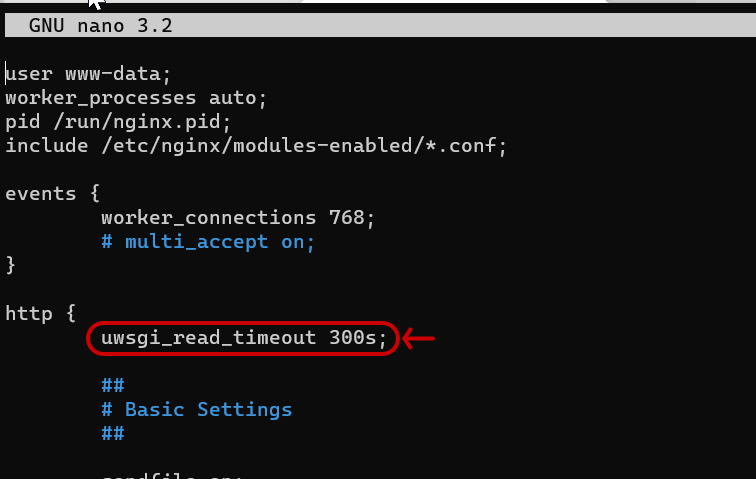

Before you get started, make sure that you have [installed
Docassemble](https://suffolklitlab.org/legal-tech-class/docs/practical-guide-docassemble/setup-server)
on a server that you maintain.

Installing the Assembly Line covers the following basic steps:

1. Install the docassemble.ALDashboard package
2. Run the installation script
3. Customize and install the
   [ALGenericJurisdiction](https://github.com/SuffolkLITLab/docassemble-ALGenericJurisdiction/)
   package with branding and question wording to match your needs.
4. Use the Weaver tool to automate your labeled PDF or DOCX forms.

## Install ALDashboard

[ALDashboard](https://github.com/SuffolkLITLab/docassemble-ALDashboard) contains
several features, but most importantly, it includes a menu-driven installation
script for the Assembly Line.

It will help you:

1. install all required and optional Assembly Line packages
2. verify and configure short links, configuration changes, and API
   configurations

To install ALDashboard:

1. visit the "Package Management" menu on your Docassemble server when you are
   logged in as a server administrator
1. Type `docassemble.ALDashboard` into the input box labeled `Package on PyPI`
   
1. Click the **Update** button.

## Run the installation script

Once ALDashboard is successfully installed, edit this link to replace
`YOUR_SERVER` with the URL to your own Docassemble server and visit it.

```
https://YOURSERVER.com/start/ALDashboard/menu
```

Click the icon labeled "Install Assembly Line"


You will be asked to set up multiple APIs during the installation process.
If you do not have accounts yet, you can use the default choices for those
requests and return to them later.

Specifically, you will be asked to setup:

* [Google Maps, Places, and Google Geocoding APIs](https://docassemble.org/docs/config.html#google)
* [VoiceRSS](https://docassemble.org/docs/config.html#voicerss)
* [Twilio SMS](https://docassemble.org/docs/config.html#twilio)
* an [email server](https://docassemble.org/docs/config.html#mail) of your choice (we recommend Sendgrid)

You will also be asked to create a GitHub private access token on a new
GitHub account. This account should NOT be your primary account as it will
be used for automation.

Walk through the guided menus to complete the installation. You can safely
install all recommended packages and use all default configuration choices.
If you do not know the answer, you can return and manually edit your
configuration later.


## Customize the ALGenericJurisdiction repository

[ALGenericJurisdiction](https://github.com/SuffolkLITLab/docassemble-ALGenericJurisdiction/)
is a docassemble package that includes an example of how to modify questions and customize
them for your own jurisdiction or organization.

To use this package, [pull it into your own Docassemble playground](https://docassemble.org/docs/playground.html#packages).

Next, edit the YAML files to fit your own organization's needs. You may also choose to
add a custom CSS theme.

Now, create a new package from the [Playground packages menu](https://docassemble.org/docs/playground.html#packages).
Select the files that you customized and push them to your own Github repository.
Give the package a meaningful name, like LouisianaSharedBranding.

:::info Copy, do not fork
It is important to copy and create a new package. Do not
fork the ALGenericJurisdiction package as Docassemble makes it
challenging to rename a package.
:::

## Docker-level server configuration changes we recommend

### Increase nginx timeouts to 5 minutes

Sometimes, long-running Docassemble processes can "timeout." The default 
experience in Docassemble is to show the server's built-in error page,
which can be confusing for your end user.

We recommend that you increase the nginx timeout for uwsgi from 60 seconds
(default) to 5 minutes to reduce the frequency that users run into this 
ugly error screen.


Unfortunately, this error page can only be changed by sshing into the
server and then entering the docker container.


1. SSH to the server running Docker.
1. Type `docker exec -ti [TAB] /bin/bash` (literally tap the 'tab' key at the
   indicated point) to get an interactive prompt inside your docker container.

Install a text editor and open the nginx configuration file as follows:

```
apt update
apt install nano
nano /etc/nginx/nginx.conf
```

Add the following exact text to the `http` section: `uwsgi_read_timeout 300s;`



Type CTRL+O, CTRL+X to save and exit the configuration file.

Type the following commands to restart the nginx process:

```
supervisorctl restart nginx
```

### Replace the nginx 504 gateway timeout page

The default `nginx` timeout screen is a little menacing. It also does not give
you an indication that you can refresh the screen to try again, but often that
lets you get past the timeout. But you can customize it.

Here is a [custom HTML 504 gateway timeout
page](https://github.com/SuffolkLITLab/docassemble-ALToolbox/blob/main/docassemble/ALToolbox/data/static/custom_504.html)
that you could install with your own branding and that you can use to replace
the `nginx` default. It adds a "Reload" button that may allow your user to move
past the error string.

First:

1. SSH to the server running Docker.
1. Type `docker exec -ti [TAB] /bin/bash` (literally tap the 'tab' key at the
   indicated point) to get an interactive prompt inside your docker container.

Install a text editor:

```
apt update
apt install nano
```

Create a directory to store your custom configuration files:

```
mkdir /usr/share/nginx/html/errors
```

Open a new nano editor:

```
nano /usr/share/nginx/html/errors/custom_504.html
```

Copy and paste the contents  [custom HTML 504 gateway timeout
page](https://github.com/SuffolkLITLab/docassemble-ALToolbox/blob/main/docassemble/ALToolbox/data/static/custom_504.html)
into the open `nano` editor on your server.

Type CTRL+O CTRL+X to save and close the editor.

Edit the `nginx` configuration file to point to your new custom error page:

```
nano /etc/nginx/nginx.conf
```

Add this line of code to the configuration file, inside the main `http` `{}`
brackets: `error_page 504 /errors/custom_504.html;`

Type CTRL+O CTRL+X to save and close the editor.

Restart the nginx process:

```
supervisorctl restart nginx
```