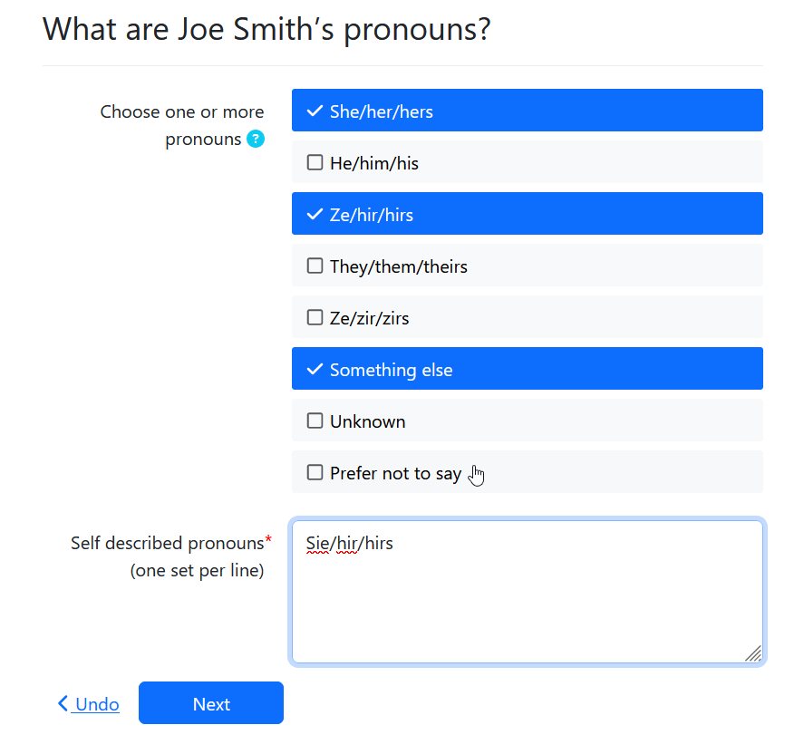

import Tabs from '@theme/Tabs';
import TabItem from '@theme/TabItem';

## What are pronouns?

A pronoun is a word that is used in place of a person's name. Common pronouns include he/she/them.
We all use pronouns every day. Because gender identity, sex assigned at birth, and gender expression can differ,
explicitly stating your pronouns can help avoid mistakes in pronoun usage.

A recent study showed that [surveys that asked for pronouns](https://www.frontiersin.org/articles/10.3389/fpsyg.2022.873442/full)
significantly increased the respondent's comfort in responding to the survey.

### Pronouns are public while gender identity may be private

Pronouns are simply the words we want people to use to describe us. They may but may not always
reveal information about our gender identity.

## Should court forms ask for pronouns?

In many contexts where it would not be relevant or appropriate to ask for a person's gender,
it may be appropriate to provide a space for the person to share their pronouns.

Gender is demographic information that should only be requested when the court has a need
for the litigant's demographic data. Pronouns may be relevant any time that the court needs
to address or refer to the litigant. Having the litigant's pronouns
may help the judge address the litigant respectfully.

Not everyone feels safe sharing their pronouns. A court form with an optional "Pronouns" 
field may be a more comfortable place for a litigant to share pronouns than in a public hearing.

### Considerations

* Pronouns aren't relevant to all contexts. It's important to not burden the litigant with questions
  that do not serve a purpose.
* Pronouns should be optional. Not all litigants want to share their pronouns. Some may not feel safe 
  doing so.

## How to ask for a litigant's pronouns

1. Label the question "Pronouns", not "preferred pronouns." "Preferred" may not validate the 
   litigant's identity.
1. Provide help and context so the question is clear and doesn't confuse litigants who may not be
   familiar with the topic of pronouns and why they should be shared.
1. Offer inclusive choices. The Assembly Line team settled on these choices:

* she/her/hers
* he/him/his
* they/them/theirs
* ze/hir/hirs (pronounced zee / here / heres)
* ze/zir/zirs (the "i" is a short "i" as in "sir")

Remember, pronouns may be different from gender.
Do not try to use one question to get both. One person may have one gender identity
and multiple sets of pronouns.

4. **Always** include an option for someone to describe their own pronouns.
1. Allow a litigant to select multiple sets of pronouns.

The Assembly Line team also chose to add these additional options:

* Something else (the self-described option)
* Unknown
* Prefer not to say

We also choose to randomize the pronoun sets to avoid any pronoun hierarchy. We keep the
"something else", "unknown" and "prefer not to say" options at the end.

### Adding gender fields in Docassemble
<Tabs>
  <TabItem value="Assembly Line Example" label="Assembly Line Example" default>

```yaml
sets:
  - person.pronouns
id: gender
question: |
  What is ${ person }'s pronouns?
fields:
  - code: |
      person.pronoun_fields(show_help=True)
```      

  </TabItem>
  <TabItem value="Vanilla Docassemble" label="Vanilla Docassemble">

```yaml
---
id: pronouns
question: |
  What are your pronouns?
fields:
  - Choose one or more pronouns (optional): users[0].pronouns
    datatype: checkboxes
    code: |
      random.sample([
          {"she/her/hers": "She/her/hers" },
          {"he/him/his": "He/him/his" },
          {"they/them/theirs": "They/them/theirs" },
          {"ze/hir/hirs": "Ze/hir/hirs" },
          {"ze/zir/zirs": "Ze/zir/zirs"},
      ], 5) + [
        {"self-described": "Something else"},
        {"unknown": "Unknown"}
      ]
    none of the above: Prefer not to say
    required: False
    help: |
      A pronoun is a word that can be used in place of your name. For example: he, she, or they.
      Learn more at [pronouns.org](https://pronouns.org/).
  - Self-described pronouns: users[0].pronouns_self_described
    datatype: area
    show if: users[0].pronouns["self-described"]
```

  </TabItem>
  <TabItem value="preview" label="Preview">

  

  </TabItem>
</Tabs>

