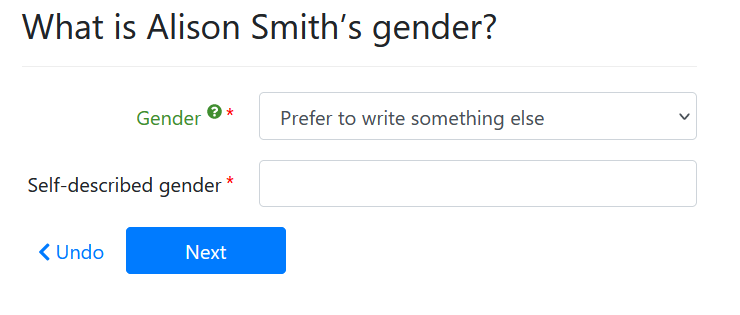

import Tabs from '@theme/Tabs';
import TabItem from '@theme/TabItem';

## Provide gender choices that respect identity

The job of an automator is often to make an existing court form more accessible
and welcoming. Gender is a topic that is often not relevant on a form, and on
forms that require it, paper forms are often restrictive.

We recommend:

1. asking for gender using inclusive language
1. providing information that lets the user understand the consequences of selecting
   an inclusive option that cannot be printed on the output document

The following gender options are ones that we researched and identified as 
striking a balance of inclusivity and representative of real-world forms 
in jurisdictions that have adopted inclusive language:

* Female
* Male
* Nonbinary (note spelling which is the most accepted usage, without a hyphen)
* Prefer to write something else
* Prefer not to say
* Unknown

We also recommend including this warning language if the form does not provide a 
place to write in an inclusive option:

> Some forms require you to select either "Male" or "Female". If you do not select
> "Male" or "Female", your form may include an empty checkbox.

We intentionally avoid the use of the word `other` which is dehumanizing and not
inclusive. However, some forms do use `other`, and it may be appropriate to
use any option that is not `Female` or `Male` to check an `Other` box, depending 
on the use and value of requesting gender on the form.

For example: when identifying a respondent in an abuse protection order
petition, using a gender description that matches the apparent gender of the
respondent is something the petitioner should consider to aid police in serving
the petition.

### Fixing bad forms

We do not hesitate to edit forms that request gender in an unhelpful way when
the same information could be provided in an inclusive way. We feel this
reflects the user's options when working with a paper form.

For example:

* we remove "he/she" checkboxes when the name of the petitioner or respondent
  could replace it.
* we add a space for the user's self-described gender in other circumstances

### Adding gender fields in Docassemble
<Tabs>
  <TabItem value="Assembly Line Example" label="Assembly Line Example" default>

```yaml
sets:
  - person.gender
id: gender
question: |
  What is ${ person }'s gender?
fields:
  - code: |
      person.gender_fields(show_help=True)
```      

  </TabItem>
  <TabItem value="Vanilla Docassemble" label="Vanilla Docassemble">

```yaml
---
id: gender
question: |
  What is ${ person }'s gender?
subquestion: |
  **Note**: Many forms require you to specify "Female" or "Male."
  
  If you answer something other than "Female" or "Male", we may not be able
  to check any box on your form. This may delay your case.
fields:
  - no label: person.gender
    choices:
      - Female: female
      - Male: male
      - Nonbinary: nonbinary
      - Prefer not to say: prefer-not-to-say
      - Prefer to write something else: self-described
      - Unknown: unknown
  - Gender: person.gender
    show if:
      variable: person.gender
      is: "self-described"
```

  </TabItem>
  <TabItem value="preview" label="Preview">

  

  </TabItem>
</Tabs>

