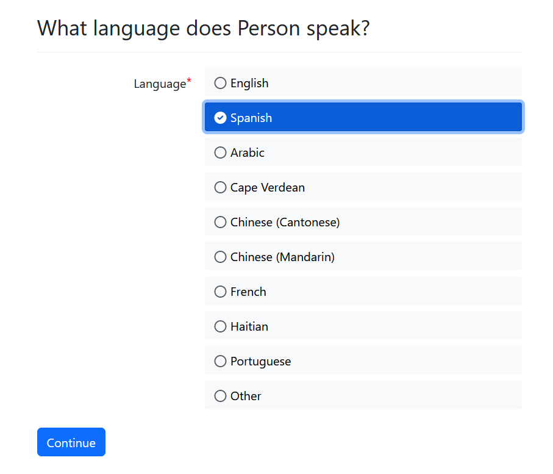

import Tabs from '@theme/Tabs';
import TabItem from '@theme/TabItem';

The information on this page describes an input that allows the user to 
report the language spoken by that user or a different participant in the
case to the court or tribunal.

## Provide language choices that match your region's most spoken languages

It can be hard for a user to interact with a long list of language choices. 
About 7 is ideal. For Massachusetts forms, we default to 9 options, giving
space for both Mandarin and Cantonese, to reflect the heterogeneity of 
immigrant single-language populations in Eastern Massachusetts.


### Sort in alphabetical order, excluding the two most popular languages
Ordinarily, your list of languages should be alphabetized, leaving room for the
two most dominant languages in your region at the top, outside of the
alphabetized sort. Any other order will cause your user extra effort to read. If
the second most popular language is very uncommon, we recommend placing it in
its alphabetical sort rather than as the second option.

Put the "other" option at the end of the list.

## Avoid using a drop-down menu for language

You can safely provide about 7 choices using a radio button input. This style of
input is much easier to interact with, especially on a mobile device, and lets 
the user identify the appropriate option at a glance.

## When possible, store the language name using the ISO 2 or 3 letter code

The `language_name()` function will translate the [ISO 639-1
](https://en.wikipedia.org/wiki/List_of_ISO_639-1_codes) or [ISO
639-3](https://en.wikipedia.org/wiki/ISO_639-3) code back into its full written
form. It is best to avoid translation issues by storing the code rather than a
human-readable version of the name.

## Do not use the native language version of the language name in ordinary circumstances

Your language picker may be used by an advocate or attorney, or it may be used
by the litigant to report the language spoken by someone else. Therefore, you
should default to displaying the language name in the language that the
interview is currently being used in, rather than in its native version.

However, in some circumstances you may know that the litigant and not an
advocate will be reporting their *own* spoken language. In that case, you can
display the language's name in the person's native language.

This advice does not apply to a selector that allows the user to choose the
language that they will answer questions in the guided interview with. When
allowing the user to change the guided interview's language, use the native
language name.

### Adding language fields in Docassemble
<Tabs>
  <TabItem value="Assembly Line Example" label="Assembly Line Example" default>

```yaml
sets:
  - person.language
id: language
question: |
  What language does ${ person } prefer to speak?
fields:
  - code: |
      person.language_fields()
```      

  </TabItem>
  <TabItem value="Vanilla Docassemble" label="Vanilla Docassemble">

```yaml
sets:
  - person.language
id: language
question: |
  What language does ${ person } prefer to speak?
fields:
  - Language: person.language
    datatype: radio
    choices:
      - English: en
      - Spanish: es
      - Arabic: ar
      - Cape Verdean: kea
      - Chinese (Cantonese): yue
      - Chinese (Mandarin): cmn
      - French: fr
      - Haitian: ht
      - Portuguese: pt
      - Other: other
  - Other language: person.language_other
    show if: 
      variable: person.language
      is: other
```        


  </TabItem>
  <TabItem value="preview" label="Preview">

  

  </TabItem>
</Tabs>