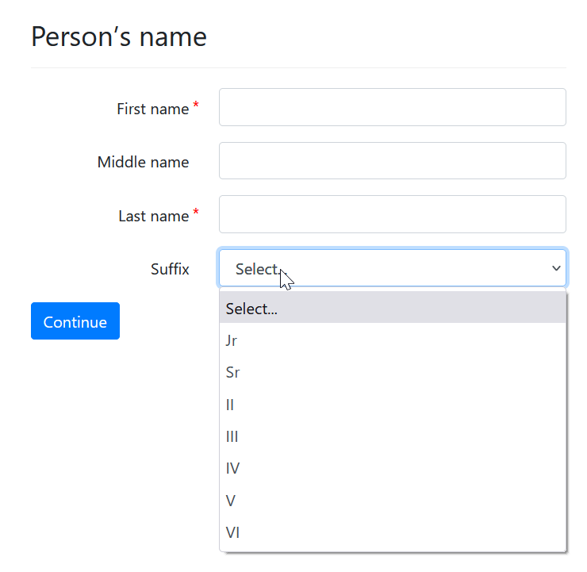

import Tabs from '@theme/Tabs';
import TabItem from '@theme/TabItem';

## Ask for names in parts

We recognize that ["names are
hard"](https://www.kalzumeus.com/2010/06/17/falsehoods-programmers-believe-about-names/).

However, in our experience, forms still expect that litigants will provide names
in at least 2 parts: a last name (surname) and a first name (given name).

We settled on using 4 standard name parts:

Model "name" question:

> What is your name?
>
> First name: 
>
> Middle name (optional): 
>
> Last name: 
>
> Suffix: [Dropdown menu]  

In some countries, names also commonly have a prefix. Add a prefix if needed in
your country or culture.

<Tabs>
  <TabItem value="Assembly Line Example" label="Assembly Line Example" default>

```yaml
---
id: person's name
sets:
  - person.name.first
  - person.name.last
question: |
  Person's name
fields:
  - code: |
      person.name_fields()
```      

  </TabItem>
  <TabItem value="Vanilla Docassemble" label="Vanilla Docassemble">

```yaml
---
id: person's name
question: |
  Person's name
fields:
  - First name: person.name.first
  - Middle name: person.name.middle
    required: False
  - Last name: person.name.last
  - Suffix: person.name.suffix
    code: |
      name_suffix()
    required: False
```

  </TabItem>
  <TabItem value="preview" label="Preview">

  

  </TabItem>
</Tabs>

### Optional: omit suffix

You may choose to omit the `suffix` field:

<Tabs>
  <TabItem value="Assembly Line Example" label="Assembly Line Example" default>

```yaml
---
id: person's name
sets:
  - person.name.first
  - person.name.last
question: |
  Person's name
fields:
  - code: |
      person.name_fields(show_suffix=False)
```      

  </TabItem>
  <TabItem value="Vanilla Docassemble" label="Vanilla Docassemble">

```yaml
---
id: person's name
question: |
  Person's name
fields:
  - First: person.name.first
  - Middle: person.name.middle
    required: False
  - Last: person.name.last
```

  </TabItem>
</Tabs>

### Use a single field to get the name of a business

If the entity is a business, multiple name fields should
be replaced with one name field.

Make the question dynamic if you are not sure.

<Tabs>
  <TabItem value="Assembly Line Example" label="Assembly Line Example" default>

```yaml
---
id: person's name
sets:
  - person.name.first
  - person.name.last
question: |
  Person's name
fields:
  - code: |
      person.name_fields(person_or_business="unsure")
```      

  </TabItem>
  <TabItem value="Vanilla Docassemble" label="Vanilla Docassemble">

```yaml
---
id: person's name
question: |
  Person's name
fields:
  - Is this a person or business?: person.person_type
    input type: radio
    choices:
      - Business or organization: business
      - Person: individual
  - First name: person.name.first
    show if:
      variable: person.person_type
      is: "individual"
  - Last name: person.name.last
    show if:
      variable: person.person_type      
      is: "individual"
  - Suffix: person.name.suffix
    code: |
      name_suffix()
    show if:
      variable: person.person_type      
      is: "individual"
    required: False      
  - Name of business or organization: person.name.first
    show if:
      variable: person.person_type
      is: business
```

  </TabItem>
</Tabs>

