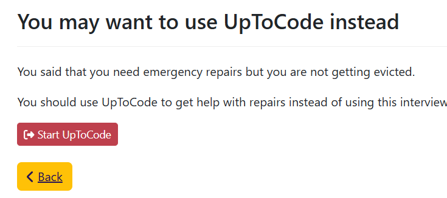
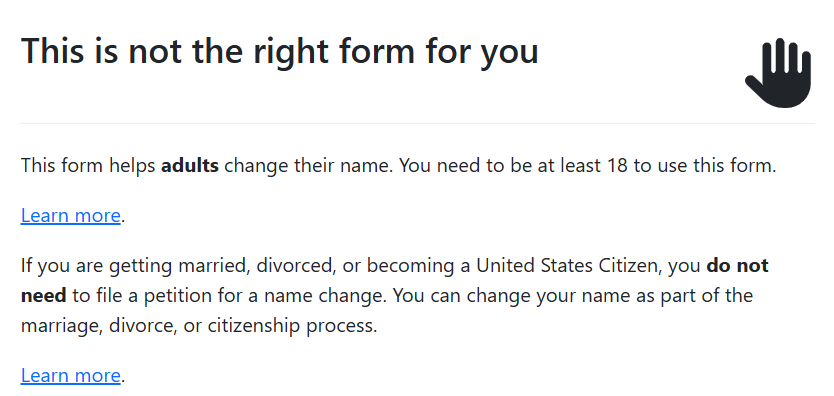
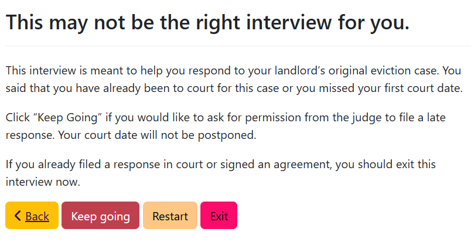

## Every interview needs to make a choice

If your interview handles every situation, you probably don't need an exit screen.
But in the real world, your interview needs to make choices.

For example: CourtFormsOnline's adult name change interview only handles adult name changes.
If the user is under 18, they are screened out. A separate interview handles minor name
changes.

Making choices about which situations your interview will handle allows you to release
the interview into the world.

## When to use an exit screen

As part of the introductory screens of your interview,
you should explain any rules or limits that would prevent a user
from qualifying to use your interview.

In many cases, it can also help to explicitly ask qualifying
questions.

### What to include in an exit screen

1. A clear message that the person does not qualify.
2. Consider a visual indicator, such as a raised hand, a stop sign, a warning triangle.
3. Explain why the person does not qualify. Include specific information related to 
   the responses that they gave.
4. Include a next step, such as starting the interview over or visiting a website with an alternative
   solution.

### A "hard" exit screen

"Hard" exit screens stop the user from continuing. They should
always offer an alternative choice.

Consider offering a choice that allows the user to revise their response
or start the interview over.

This exit screen in MADE appears when the user chooses a common
housing-related problem that is **not** an eviction:

This exit screen in a name change interview appears when the user
wants to change their name, but the form does not handle their situation:

### A "soft" exit screen

This exit screen in MADE appears when the tenant is trying to stop
an eviction but the eviction hasn't been filed in court yet:

Soft exit screens are a good option to slow the user down and make sure
that they are making the right choice.

## Should you let the user continue instead?

An exit screen enforces the choices that the developer made when deciding
the scope of the interview. It can also enforce clear legal rules or
business logic.

When someone uses a paper form, they can turn in something that isn't
legally sufficient. But when they use a computer tool, they usually
expect more enforcement.
