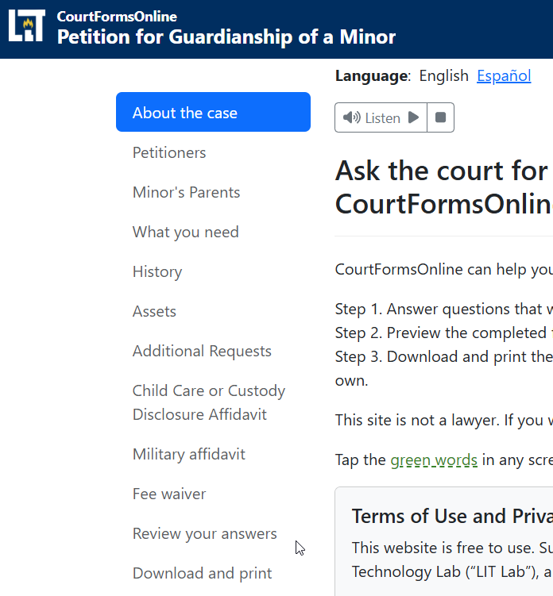
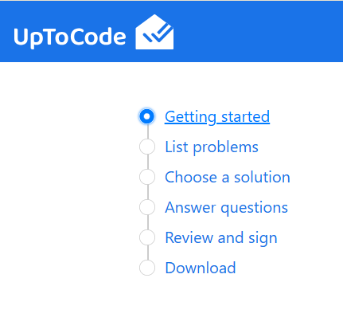
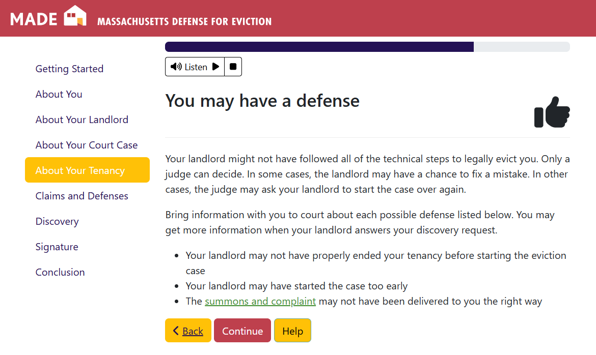
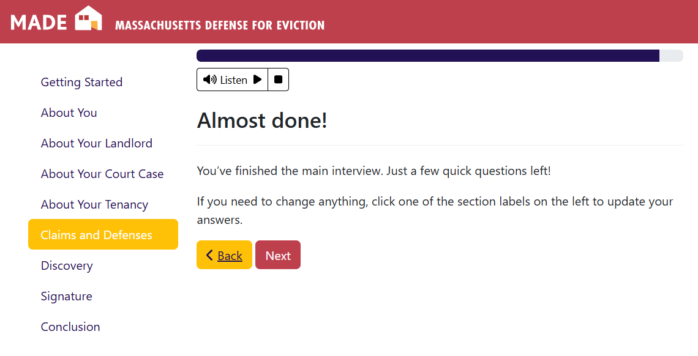
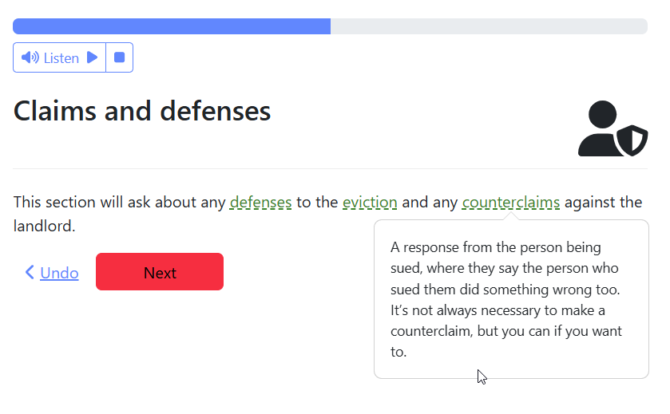
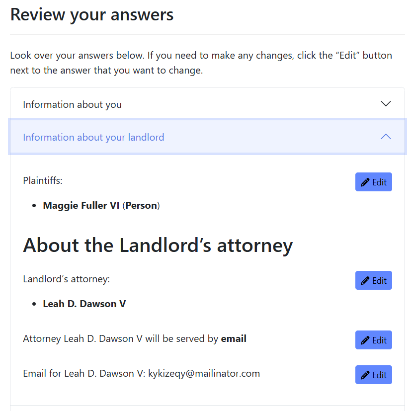

## Add navigation

All but the shortest interviews should also include some way to tell the user
how long the process will take and where they are in the process.

Use navigation sections with clear titles that give the user these cues.

For example, consider the navigation for a hypothetical form that allows a user
to request the court to waive fees:

1. Introduction
1. Can I get a fee waiver?
1. My name
1. My claim/defenses
1. My information
1. Information about the other side
1. Review
1. Signature
1. Download and next steps

In a HotDocs interview, these sections will correspond 1 to 1 to pages and
titles of pages in the interview. In Docassemble, you must add these sections
separately.

In a Docassemble interview, consider using the sections to allow the user to
edit and review their answers as they use the interview. This requires
additional work but may build the user's confidence as they use your website.

Example of Docassemble's standard navigation:

A custom navigation style mimicing Google's material UI:

## Use signposting on longer interviews

On longer interviews, it may not be enough to use the sections on the left
to orient the user.

One way to orient the user is to use "signposts". Signposts are screens
that do not ask any questions, but instead tell the user what questions are
coming next.

Consider adding signposts:

1. on longer interviews to remind the user that they are making progress
1. to tell the user when they are about to ask questions about a very different topic
1. to give the user a chance to reflect on the answers that they gave in another
   long section and to correct any mistakes before continuing down a long new branch
   of questions
1. when the user may be getting tired, especially to let them know that they are
   close to finishing

Example mid-interview signpost to encourage the user. This signpost also summarizes the work that the user
just completed and gives them a preview of the results.

Example signpost towards the end of the interview. Sections are of variable length in this interview, so a signpost here
helps convey to the user that the end is approaching,
even though there are a few small sections left.

Example signpost at the beginning of a new, longer section to help explain a switch in
the style and information required for the upcoming questions:

On very short interviews, signposts may not be needed.

## Review progress

In all but the shortest interviews, the user will find it very cumbersome
to use the "undo" or "start over" button to fix a mistake in their interview.

CourtFormsOnline's current style encourages the author to use an in-line
review screen that always appears during the course of the interview. This may be
unecessary in a very short interview with linear logic.

Review screens can be very time consuming to build and maintain because editing
one response can set off a chain reaction of dependent changes. We do not have data
yet on how common edits are, but we suspect the most common edits focus on typos
in names, addresses, and so on, rather than substantive questions. We encourage
authors to focus on these most likely to change and easiest
to implement review screens. You can let the user know that they have to start over
for certain changes. For example: a change that triggers a whole new series of questions.

Example of a comprehensive review screen showing accordion sections. Note that each area of the review screen
summarizes the answers the user has already given, and has an edit button once per each "screen" of the interview:

