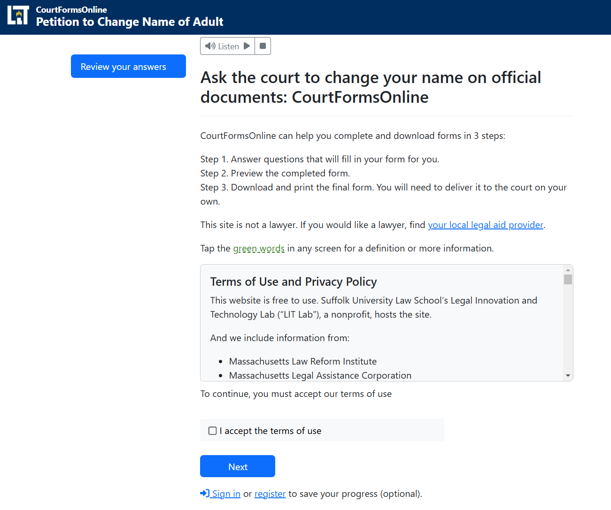
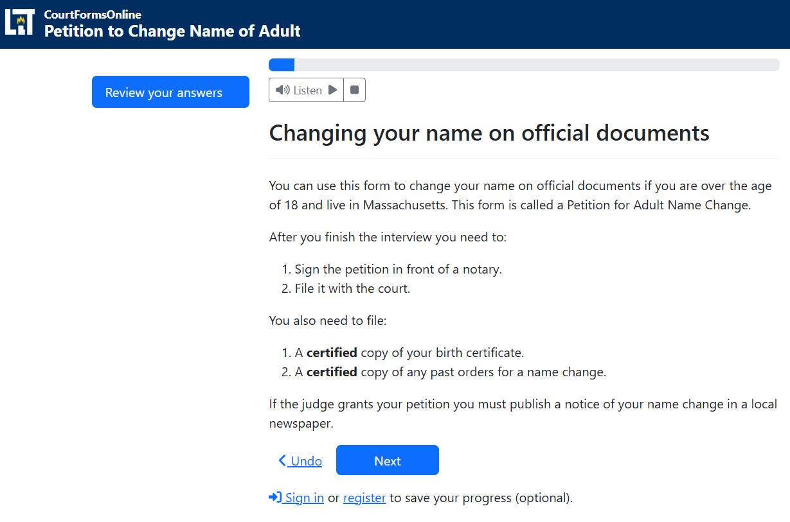
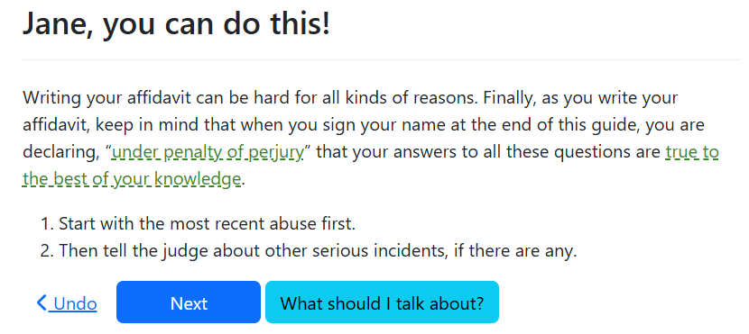
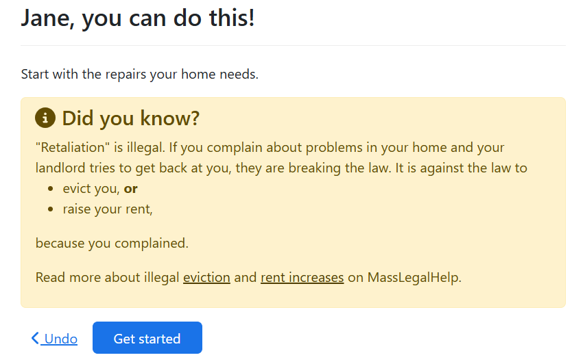

## Structuring your guided interview

We have found that a guided interview needs the following
overall structure:

1. an introduction screen
1. a screen that tells users what to expect and what they need to know or have
   before starting to answer questions
1. a screen or series of screens that tells the user if they qualify to use the form
    - include a clear exit message if the user does not qualify to use the form
1. screens asking for basic information, such as name and address
1. screens that let the user ask for what they need from the court and tell
   their substantive story
1. a preview screen where the user can review their work and correct mistakes
1. a signature screen
1. a clear ending screen that allows the user to:
    - download the form
    - understand how to file the form with the court
    - understand how to serve the other party

### Start with an intro screen

Your interview should start with a short screen that identifies the interview,
gives the user context, and tells them anything that they need to have in front
of them before they begin.

#### Separating the terms of use from the "before you start" information

CourtFormsOnline.org's style is to use two intro screens:

1. A general-purpose intro screen that just states the name of the form
   and includes a terms of use checkbox.
2. A tailored intro screen that helps the user know what to expect and what they need
   to know.

  
  

#### Make the user feel welcome, but don't say "welcome!"

**Welcome** is a cliche that is best to avoid on an introductory screen.
If the user may be particularly uncomfortable, affirmations can be appropriate!

Keep them actionable and focused on what might make the user nervous to complete
the interview.

[Read more about avoiding the word "welcome"](https://www.nngroup.com/articles/top-ten-guidelines-for-homepage-usability/)

Example affirmation in an interview supporting domestic violence survivors.
This appears just before the emotionally hardest part of the interview, the
affidavit where the survivor describes the abuse:

Example affirmation in a tool to help tenants sue their landlord. This
comes at the beginning of the interview to help tenants overcome
worries that their landlord will unfairly retaliate against them
for reporting housing problems:

### Keep screening questions early in the interview

Screening questions are questions that tell the user if they are using the right
app. You want your user to answer as few questions as possible before you screen
them out of the interview to avoid wasting their time.

### Group similar questions together by topic

Ask for related information at a similar time and in a logical order in your
interview. Try to approximate the way you would ask those questions in a
face-to-face interview.

Do not jump around from topic to topic.

### Ask expected questions before asking surprising ones

Keep your user's trust by asking for questions they expect before asking for
more surprising or unusual information.

### Save the more sensitive questions for later in the interview

Let your user see the value and pattern of the easiest to answer questions
before asking them for sensitive information, like a social security number
or an address.

Sometimes there is a very good reason for asking for a sensitive question
early in the interview. For example:

1. You may want to ask an address to show the user a list of courts that serve
their address.
1. You may want to let the user tell their story in a protection from abuse
order before asking for less urgent information, like child support orders
and pet protection.

But you may be able to ask a few simpler questions, like the user's name
and family information, before diving right into questions that will be emotionally
challenging.

Do not ask for personal information if you do not need it.

## Placing your form in context to a larger process

In addition the content in the interview itself, a guided interview should also
have:

1. a landing page that gives users context before they click a link to start the
   interview. Learn more about [creating effective landing pages](../authoring/landing_pages.md).
1. help at appropriate points inside the interview that allows users to answer
   questions with confidence
1. a document they can print and take with them that tells them what to do after
   they have finished using the website, which we call a "next steps" document.

## Read more

[Get the questions in order](https://service-manual.nhs.uk/content/how-to-write-good-questions-for-forms/get-the-questions-into-order)
