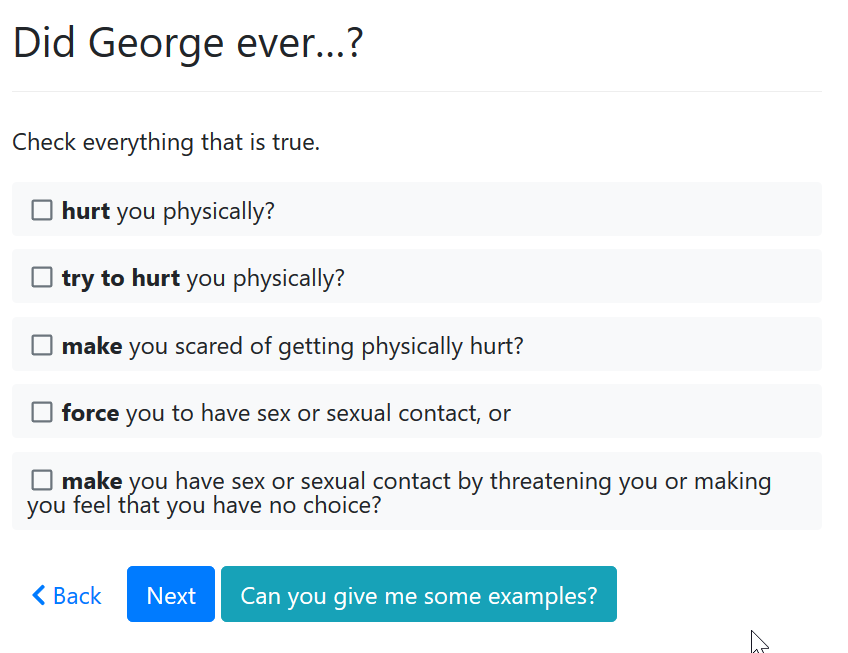

<!-- original: https://docs.google.com/document/d/1B-_6A5OKZ0b3s8z2S14KdRQsK7ga4nmjjthJiaZMiB8/edit#heading=h.cvtj6d8ezh8x -->

## Plain language and readability

### Use sentence case, not Title Case for page headings

Title case capitalizes each word in a sentence. It is harder to read and not idiomatic for websites.

### Only use all capital letters for acronyms

For example, the Department of Children and Families (DCF), Transitional Assistance for Families and Dependent Children (TAFDC). 

### Use bold for emphasis. Do not use italics, underlines, or all capital letters

Bold text is easy to identify and read.
Italics are hard to read. Capital letters are similarly difficult to read. When you are on a webpage, underlines should always mean a link to a new page.

### Write in active voice, not passive voice

[https://writingcenter.ashford.edu/active-vs-passive-voice](https://writingcenter.ashford.edu/active-vs-passive-voice)

This is the part I find most useful: **What are some tips to locate and avoid passive voice?**

**Does it make sense?**

If you can say the subject, action, and object in the order they appear in the sentence and it makes sense, you have written in active voice. For instance, you can say “Sally drove car” [re: Sally drove the car off the cliff] and can understand the meaning. However, if you say “Car driven Sally” [re: The car was driven off the cliff by Sally] it does not make sense; this scenario would indicate that you wrote the sentence in passive voice.

**Look for “by” phrases**

For example, “by Sally” or “by the dog” might be a sign that the sentence is passive voice.

**Look for a form of “be”**

Look for words like is, was, were, are, or been. These words might signal passive voice.

### Write out the word “or” rather than using a / to separate related concepts or and/or.

Avoid “and/or” all together. Avoid  this Janus-faced term. It can often be replaced by and or or with no loss in meaning. Where it seems needed {take a sleeping pill and/or a warm drink}, try . . . or . . . , or both {take a sleeping pill or a warm drink, or both}. But think of other possibilities {take a sleeping pill, perhaps with a warm drink}. [Chicago Manual of Style](https://www.chicagomanualofstyle.org/book/ed17/part2/ch05/psec250.html)

### Other than the “question” field, use headings sparingly and appropriately

For screen readers, we need to keep heading levels consistent and in the appropriate priority order on the screen. (level 1, 2, etc)

In general we have 2 levels of priority for text: the **question** text which is heading level 2. Then the **subquestion** text which is usually not formatted with any headings. If you use any headings inside the **subquestion**, make sure they are only heading level 3 or smaller. Avoid using headings in the subquestion unless absolutely necessary to group a large amount of text.

### Keep headings short

A heading should only be about one line of text on the screen.

### Keep text short in general

Some users struggle to read large amounts of text on the screen. Keep the text short and to the point. You can add additional information with help buttons.

### Avoid using ‘please’

Omit the word “please” when asking for information.

“Describe” instead of “Please describe”.

### Use “need” not “want” when referring to the protections or relief the plaintiff requests

When someone goes to court it’s because they **need** something, not want it. The word “need” is more empowering.

### Avoid adverbs, especially intensifiers, where possible (e.g. ‘very’)

Intensifiers weaken instead of strengthen our arguments. Use facts to persuade instead.

See: [https://sites.utexas.edu/legalwriting/2017/01/17/intensifiers-part-2-replace-and-specify/](https://sites.utexas.edu/legalwriting/2017/01/17/intensifiers-part-2-replace-and-specify/) 

### Avoid contractions (can’t, don’t)

Write out the words instead, like “cannot” or “do not”.

### Avoid idioms (‘get the hang of it’, ‘sit tight’)

Other examples: Up in the air, on the ball, rule of thumb.

### Use simple words

[https://plainlanguage.gov/guidelines/words/use-simple-words-phrases/](https://plainlanguage.gov/guidelines/words/use-simple-words-phrases/) (there are other useful sections on the left)

### Say what to do. Avoid saying what not to do.

It is usually easier to understand rules as a positive rather than a negative.

Examples

**Stay away from:** Be careful not to leave information out of your description.

**Use:** Use lots of details in your description.

### Ask one question at a time

A compound question asks the user to answer more than one thing in the same question. 

Examples:

**Stay away from: **Do you currently have a case in the Probate and Family Court or are you planning to file one?

**Consider: **Tell us about your cases \

- [ ] I have a case in the Probate and Family Court now.

- [ ] I am planning to file a case in the Probate and Family Court.

## Organizing your interview structure

### Start with an intro screen

Your interview should start with a short screen that identifies the interview, gives the user context, and tells them anything that they need to have in front of them before they begin.

### Keep screening questions early in the interview

Screening questions are questions that tell the user if they are using the right app. You want your user to answer as few questions as possible before you screen them out of the interview to avoid wasting their time.

### Ask for only a few fields on each screen

A good rule of thumb is to ask for no more than about 5 pieces of information on each screen. However: each screen should have a logical collection of related fields. If you have more than 5 very closely related pieces of information, you could bend this rule.

### Show your user all of the information that they need to make the correct choice

Use the order of questions and the set of fields that is visible on the screen to guide your user to make correct choices. For example: if you ask your user to describe what happened, and then you have a follow-up question to describe how they were harmed by what happened, it would be annoying to your user to have already answered the “harm” question in the more general response and then have to re-write their response.

### Group like questions together

Ask for similar information at a similar time and in a logical order in your interview. Try to approximate the way you would ask those questions in a face-to-face interview.

### Be thoughtful about when you ask for personal information

It is often a good idea to demonstrate to your user the value of what you are doing before you ask them for personal information. For example, you might tell them if they qualify for help before getting their name or birthdate. In other cases, that would be a confusing flow, or you may want to be able to address the user by name as early as possible in the interview. Just make sure you have a good reason for your choice.

### Make sure required fields are answerable

Docassemble is linear, so use required fields if you need the information to appear on the form. The user can’t easily jump around to fill in information later. However, make sure that questions that can’t be answered with the information that your user has in front of them are optional.

If your form requires information that the user may not have in their possession, make sure that the user knows what they are going to need very early on so they can stop and get the information. Don’t wait until the interview is almost finished to tell them they need a crucial document.

### Provide graceful “I do not know” options when possible

Paper forms are flexible in this way. If a form asks for a date, like a birthdate, the user can write in an estimate. Your interview should provide that flexibility. Show a date input. If the user may not know the date, provide a checkbox that allows the user to write in a longhand description of the date instead (e.g. ‘last summer’).

When you give the user a list of options that requires them to make a choice, give an “I do not know” choice among the options if you can.. Make sure your form can deal with that uncertainty with an appropriate and safe default.

### Make sms messages separate from email messages

1. SMS messages function better when they are short with short urls.

    SMS has a character limit per message and it will “page” (create a new message) ones that are too long. Assume one message to be 160 characters long (https://www.twilio.com/docs/glossary/what-sms-character-limit). That works well on some phones, but not others. All the messages will get there, but sometimes in the wrong order and might break the URL into parts.

    It’s good to keep URLs short and on the first page. There is a way to shorten urls, so do ask about that.

2. SMS messages also can’t use hyperlinks and formatting.

## Other content resources

How to write [good legal stuff](https://www.law.indiana.edu/instruction/tanford/web/reference/how2writegood.pdf)

Readable [Info Sheet](https://www.masslegalservices.org/system/files/library/Create%20a%20Readable%20Info%20Sheet%20in%206%20Steps.pdf)

Make it Readable [cheat sheet](https://cheatography.com/stevem/cheat-sheets/make-it-readable/)
[UK.gov](http://uk.gov/) style guide - [online](https://www.gov.uk/guidance/content-design/writing-for-gov-uk#date-ranges)

En rules or em dashes ([google search](https://www.google.com/search?client=safari&rls=en&q=en+rules+or+em+dashes&ie=UTF-8&oe=UTF-8) for this)

Mass Legal Services [page](https://www.masslegalservices.org/content/making-legal-information-readable-more-plain-language) w/ info Caroline wrote

MailChimp [style guide](https://styleguide.mailchimp.com/word-list/)

[Gerunds and Participles](https://www.geist.com/writers/writers-toolbox/gerunds-and-participles-avoid-ing-words/): Avoiding -ING words

## Choosing the right interview interface elements

### Radio buttons vs dropdown menus

Prefer radio buttons when the user always needs to interact with it, unless there are many choices. Radio buttons are easier to interact with than drop down menus, especially on a mobile phone. Rule of thumb: under 7 options should be a radio button.

Keep drop down menus when the interface would be cluttered and especially if the information in the drop-down menu is optional and part of a long list of fields that need to be grouped on the same screen.

An example of a drop-down menu that’s acceptable is for name.suffix. This isn’t interacted with often and is an optional field. Using radio buttons could be visually busy with minor benefits.

### Buttons vs Next

We have chosen to use one-click buttons for yes/no when it’s appropriate to ask only one question on a screen rather than yes/no/radio with a “next” button. Although this is inconsistent, it is easier to interact with on a mobile phone. Worth revisiting with user testing.

### Collecting items in a list

#### Guiding Principles

Try to gather items in a list in a way that would be natural to do in a conversation. For example: if you ask about income, you might naturally ask: do you work? Do you have any other jobs? Do you have any pension income? If you ask about children, it may be more natural to ask: do you have any children? How many? And then ask for the information of each child one at at a time. In other circumstances, it may be simpler to let someone interact with a button to add additional items, one at a time where they can see the full list they have entered at the same time that they add new items.

#### Ask for total number of items up front

This is the preferred method for gathering items in a list. It requires the fewest clicks and least explanation for users. It’s relatively intuitive although it does require entering information on multiple screens.

#### Ask for items with “is there another” after each item

This is another simple method but very “clicky”. After each item, the user needs to answer “are there any more?” It’s also important to reflect back the number of currently gathered items so someone does not get lost in trying to remember which items they have already told the system about.

It works well when the number of items is not important to the user. For example, people usually know the number of children they have. They can count the number of bank accounts or income sources they have, but it’s not a number they have in their mind already.

Consider adding a table or list of the children at the end as a summary/check that they did the entry correctly.

#### Ask for items with the “list collect” feature

Appropriate when adding multiple items is not likely, the user does not necessarily know the total number of items in advance or asking for a total number would be awkward, and there are only a few fields necessary to collect each item. Interface is a little rough but can save the user time and clicks.

### Help text

Help text is any form of just-in-time explanation that assists a user with providing the correct input on the screen.

#### Guiding Principles

**Reduce the need for supplemental help text** through appropriate labeling and thoughtful grouping of inputs on each screen.

**Keep information the user always needs to read on the screen.** Don’t hide it behind a click.

**Keep the question and subquestion short** to help limited literacy users. Some users want to read everything on the screen. Keep the information on the screen relevant to what they need to answer the question.

**Avoid giving a treatise and asking the user of the interview to learn a rule and apply it** to their own facts; instead, ask purely factual questions and apply the rule for the user whenever possible.

#### Green Text / terms

**Best for:** short definitions of terms that some but not all users may already be familiar with. Terms of art that we do not want to rephrase.

Docassemble’s “terms” feature allows you to click on a word and receive help in a small popup.

Pros: it is unobtrusive and easy to use. You can still view the other text on the screen so the answer appears in context. 

Cons: you can only fit a small amount of text. It is not immediately clear that the text is clickable. It should not be used for critical information.

#### Green Button / help button

**Best for:** optional help information that is more important than contained in “green text”. Also must be appropriate to help with the whole screen, not just a single option or term.

The screen-specific “help” button is modal and the label can be customized. When you click on the button, it takes you to a separate screen. You click “Back” to return to the page content.

Pros: it is highly discoverable. It is clearly an interface element you can click on to interact with. You can view a large amount of text at one time without distraction.

Cons: it is modal. This removes the surrounding context on the screen. The user needs to remember their question while viewing the help text.

Help button labels should be in the form of a question.

#### Field-specific help buttons

Field and option-specific help buttons appear either as question mark icons on the left or right of the option. It may also highlight the field label with green text.

#### Field hints/placeholder text (discouraged)

Avoid using the **hint** modifier. Hints create placeholder text where the user is expected to type. This type of input is confusing for many users.

