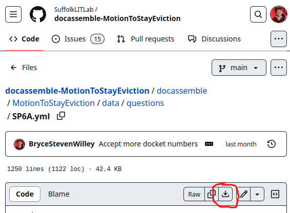

## Overview

Writing a review screen is very important to docassemble interviews. As the "back" button undoes an interview's progress,
it's critical that people can edit answers they made early in the interview, without having to re-enter things later.

Review screens are also critical for interviews to be fully WCAG compliant; for legal applications like the AssemblyLine was born from,
[WCAG 2.1 success criterion 3.3.4](https://www.w3.org/TR/WCAG21/#error-prevention-legal-financial-data) requires that

> a mechanism is available for reviewing, confirming, and correcting information before finalizing the submission

in short, requiring a review screen to be present at the end of your interview, that allows the user to correct the information they entered.

### Step 0: Complete the rest of the interview!

Large changes to an interview's logic will require large changes to the review screen as well. Therefore, it's best to have mostly completed
your interview before starting to make the review screen.

### Step 1: ALDashboard Review Screen Generator

Download the primary YAML files of your interview. You can download the YAML file either:

* from the [docassemble playground](github#go-to-the-playground), clicking on the "Download" button below the YAML editor, or
* from GitHub. For example, for the [Motion to Stay Eviction](https://github.com/SuffolkLITLab/docassemble-MotionToStayEviction/), you can navigate
  to [the primary YAML file, SP6A.yml](https://github.com/SuffolkLITLab/docassemble-MotionToStayEviction/blob/main/docassemble/MotionToStayEviction/data/questions/SP6A.yml), and click the "download raw file" button.

  

You should download all of the YAML files where you define variables used in your interview. The more YAML files you download, the more content you might have to
cut from the generated review screen.

Once you have the YAML files, go to [the ALDashboard's review screen generator](https://apps-dev.suffolklitlab.org/start/ALDashboard/review_screen_generator), and upload your YAML files. You should leave the two checkboxes ("create revisit screens", and "point section blocks to review screen") checked. The next screen will have your review blocks! Make a file called `review.yml` in your playground, and copy the content from the review screen generator into it. Then, add a block in your main interview near the end like this:

```yaml
include:
  - review.yml
```

### Step 2: Understanding the Generated Review Screen

A first quick note is that the generated YAML might look different than how you're used to writing YAML files. The generated YAML uses lots of `|-`,
which keeps the full text after, but removes the last newline. In short, something like this:

```yml
---

event: |-
  review_intro

code: |-
  review_form

```

is the same as this:

```yml
event: review_intro
code: |
  review_form
```

and I'd recommend changing the YAML to how you normally write it, to be more concise [^1] The remainder of the examples will use the more concise YAML notation.

There are a few sections of the generated review screen YAML:

1. There are the events. These blocks look like this:
    ```yml
    event: review_intro
    code: |
      review_form
    ---
    event: review_prior_case
    code: |-
      review_form
    ---
    ...
    ```

    These blocks take each section from your interview and make it so that if a user clicks on them, they are brought to the review page. In our experience, this
    works best, so that all of the information that is asked for in the interview can be edited in the same place, and the user doesn't have to remember
    which section they entered it in.

2. The main review block. The block looks like this:

    ```yml
    id: review screen
    event: review_form
    question: |
      Review your answers
    review:
      - Edit: users.revisit
        button: |
          **Users**

          % for item in users:
          - ${ item }
          % endfor
      ...
      - Edit: has_existing_case
        button: |
          **Do you have an existing Michigan family court case?**

          Do you have an existing Michigan family court case?: ${ word(yesno(has_existing_case)) }
    ```

    Most notably is that there is a `review` attribute instead of a `fields`. Each element under the `review` attribute
    is a different section, generated from screens in the interview, with the subquestion and values of the fields shown.

    Each element in the review can have the following dictionary attributes:

    * `Edit` adds an "Edit" button next to the information on the review screen. It's value is the name of the variable that will be edited when the button is clicked.
    * `label` lets you change the text on the "Edit" button
    * `fields` lets you add multiple fields that are re-asked to the user for a section on the review screen.
      * `recompute` lets you also re-calculate other variables, not necessarily re-asking them, but letting them be filled by `code` blocks. These won't be generated, but will come in handy later.
    * `button` is the actual content of that section of the review screen, similar to a `subquestion` attribute.

3. The revisit screens. These blocks look like this:

    ```yml
    id: revisit users
    continue button field: users.revisit
    question: |
      Edit your answers about Users
    subquestion: |
      ${ users.table }

      ${ users.add_action() }
    ---
    ...
    ```

    Each block has the table and lets people edit items in the lists.

4. The generated tables for the lists.

    ```yml
    table: children.table
    rows: children
    columns:
      - Birthdate: |
          row_item.birthdate if hasattr(row_item, 'birthdate') else ''
    edit:
      - birthdate
    ```

### Step 3: Edits to the Review Screen Generator

You'll want to change some aspects of the generated review screen. Note that if any errors happen in a specific edit element on the review screen, that element won't appear. It also won't appear if the attribute or variable to be edited doesn't exist. You should make sure that it does.

Some common issues to the generated review screen that I personally have run into before:

1. Add tables for people lists, like `users` or `other_parties`. The below block is a good start.

```yml
generic object: ALPeopleList
table: x.table
rows: x
columns:
  - Name: |
      row_item.name if defined('row_item.name.first') else ''
  - Address: |
      row_item.address if defined('row_item.address.address') else ''
  - Phone number: |
      row_item.phone_numbers()
edit:
  - name.first
  - address.address
  - phone_number
delete buttons: False
```

2. Remove tables for attachments and other non-people objects, if any were generated. Tables are only needed for information that the user enters themselves, which the review screen generator can't determine yet.
3. Remove edit questions about kickout screens. Sometimes, you will have questions that do set a variable in the interview, but it's only use is to kickout a user if their problem isn't covered by the form. Here's an example of one:

```yml
---
id: Is this a probate case
question: |
  Are you Filing in a Probate Case?
subquestion: |
  Is the case a probate case? Examples of probate cases include cases to distribute property after someone dies, guardianships, and conservatorships. 
fields:
  - Is your case a probate case?: probate_case
    datatype: yesnoradio
---
event: probate_case_exit
question: |
  You cannot continue to use the tool.
subquestion: |
  Based on your answer, you can't use this tool to make a Notice of Hearing and Motion. Probate cases have different procedural rules than other cases. You may want to speak to a lawyer.
  
  If you made a mistake, click the **Undo** button. Otherwise, click the **Exit** button to return to Michigan Legal Help.
buttons:
  - Exit: exit
    url: https://michiganlegalhelp.org
```

If editing the value of a variable like this would only lead the person to a kickout screen and not change any other logic of the interview, then the generated review section should be removed.


### Step 4: Things to add to the review screen

1. You'll find that certain variables often depend on each other, either explicitly or implicitly. For example, if you have a variable called `hearing_date_and_time` that you set to `hearing_date + " " + hearing_time`, you should recompute that field whenever the user edits the hearing date or time. You can do something like this to update the variable whenever you edit the hearing date:

```yml
  - label: Edit
    fields:
      - hearing_date
      - recompute:
        - hearing_date_and_time
    button: |
      ...
```

Another example of when two variables are implicitly dependent would be if you asked the user if the plaintiff or defendant is paying child support. If the user changes what side of the case they are on, their answer to what side is paying might change too! You can use a review entry that looks like this to edit both.

```yml
  - label: Edit
    fields:
      - user_ask_role
      - who_paid
```

2. As mentioned in step 2, if a variable doesn't exist or any errors occur when showing a section of the review screen, that whole section won't be shown. If some of the fields on a screen or optional, then their absence can cause their section of the review screen to not appear. Use `showifdef` on optional fields, or fields that use `show if`, to prevent this issue.
3. While writing the review screen, you will likely have to redo your interview logic, so that it doesn't make assumptions about the presence or absence of variables, just their values, which I'd encourage. From the docassemble documentation:

> For example, if you ask “Do you want to include your cell phone number?” and then you ask “What is your cell phone number,” the user’s cell phone number will be defined. If the user then changes the answer to the “Do you want to include your cell phone number?” question, then you will have a situation where the user’s cell phone number is defined but it should not be used.

See [the last paragraph of this section of the docassemble documentation](https://docassemble.org/docs/documents.html#template%20code) for more info.

[^1]: Changing the whitespace and types of strings that are used by the review screen generator isn't possible at the moment.